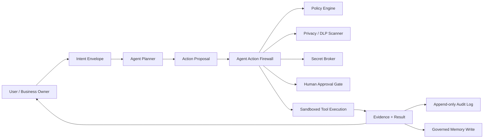
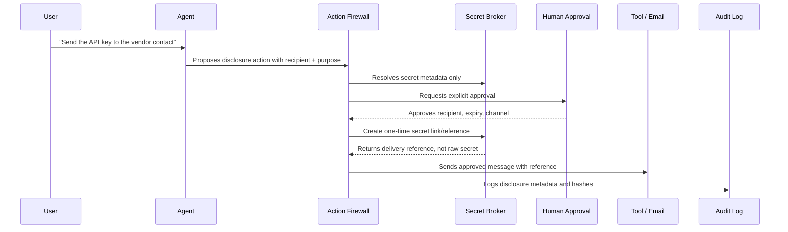
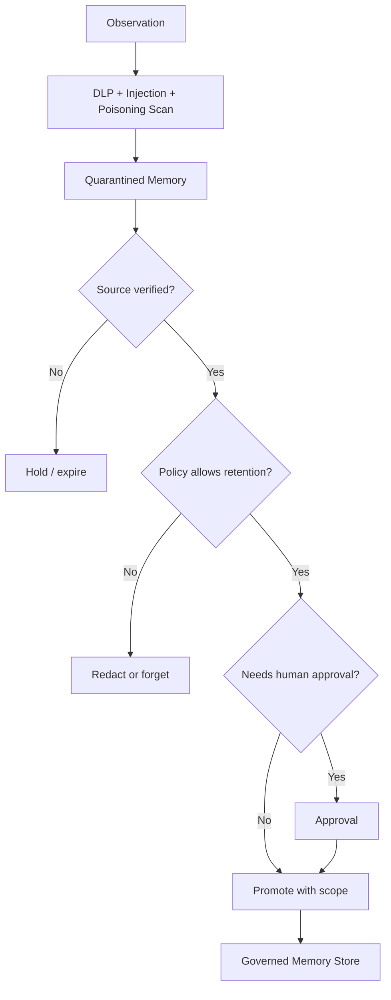
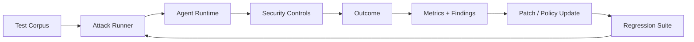
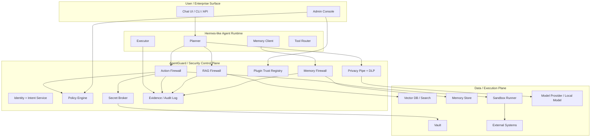

# Enterprise Agentic Security Findings

## 1. Purpose

This document synthesizes the six uploaded AI/security sources into an enterprise-grade security findings document for **agentic tools** such as **Hermes Agent**, **OpenClaw-like local assistants**, **Claude Code / Codex-style CLIs**, **OpenCode-style coding agents**, and **MCP-enabled agent runtimes**.

The practical goal is not only to "use agents safely" but to define **what should be forked, wrapped, patched, or redesigned** so that an agentic runtime can be accepted in serious enterprise environments.

The central conclusion is simple:

> An enterprise agent must not be treated as a trusted assistant. It must be treated as an untrusted proposer operating behind an action firewall, a privacy boundary, a memory boundary, and a policy-controlled execution boundary.

For Hermes-like systems, this means the secure product is not merely "Hermes with better prompts." It is Hermes plus an **authority spine** that controls model egress, tool calls, memory writes, secret handling, inter-agent communication, plugins, audit, and human approvals.

---

## 2. Source Basis

This document is synthesized from these uploaded files:

| Source | Main value extracted for this document |
|---|---|
| `Privacy and Security for Large Language Models.pdf` | LLM privacy risks, RAG-specific exposure, privacy-preserving training, secure deployment, adversarial attacks, LLM agent attacks, red-teaming, membership/data extraction risks. |
| `AI Trust, Risk and Security Management.pdf` | AI TRiSM lifecycle framing: trust, risk, security, transparency, traceability, accountability, resilience, privacy-preserving techniques, risk measurement and monitoring. |
| `Architecting Enterprise AI Strategies.pdf` | Enterprise architecture, readiness gaps, LLMOps, guardrails, RAG as governed memory, agentic maturity, human oversight, agentic stack, controllability. |
| `AI Strategy and Security.pdf` | Secure-by-design AI, agentic AI threats, API security, least privilege, zero trust, LLM firewalls, input validation, model/data change management, governance, standards, MLSecOps. |
| `LLMs in Enterprise.pdf` | Enterprise LLM patterns, RAG design, production deployments, monitoring, observability, connected LLM systems, human-in-the-loop workflows, responsible AI, auditability. |
| `The enterprise in 2030.pdf` | Enterprise agents as future operating units, AI-first workflows, orchestration layer, governance as differentiator, AI safety engineers and agent supervisors as new roles. |

### Important interpretation note

The files give strong conceptual and engineering direction, but this document does **not** claim to be a line-by-line audit of the Hermes Agent codebase. To turn this into a code-level fork plan, the next step is to inspect the actual Hermes repository and map these controls to concrete modules, hooks, and call paths.

---

## 3. Executive Findings

### Finding 1: Agentic security is an action-boundary problem, not only a prompt problem

Traditional LLM safety focuses on prompts and responses. Agentic tools add real capabilities: file access, shell execution, browser automation, email, credentials, APIs, memory, schedulers, plugins, and inter-agent delegation. The dangerous moment is not when the model says something wrong. The dangerous moment is when a model-generated plan becomes a real-world action.

**Enterprise implication:** every meaningful action must pass through a policy-controlled action boundary. The model may propose. It must not directly execute.

### Finding 2: RAG and memory make agents more useful and more dangerous

The sources repeatedly show RAG as the enterprise pattern for grounding answers in current, governed knowledge. But RAG also creates a new attack surface: vector database exposure, retrieval leakage, document attribution leakage, stale data, poisoned documents, source ACL failures, and indirect prompt injection through retrieved content.

**Enterprise implication:** memory and RAG must be governed as security-sensitive infrastructure. Retrieval is not just search; it is a permissioned decision path.

### Finding 3: Tool access must be capability-based, not plugin-trust-based

Hermes-like agents often expose skills/tools as callable functions. In enterprise, a plugin or skill cannot be trusted merely because it is installed. Each tool must declare capabilities, data classes touched, network destinations, side effects, required secrets, rollback support, and approval level.

**Enterprise implication:** tool calls should be mediated by a signed capability manifest and an action firewall.

### Finding 4: Secrets require a dedicated broker, not redaction alone

The user may sometimes intentionally share a credential, token, password, customer identifier, or sensitive record through an agent-mediated workflow, such as sending an email on behalf of the user. Simple `[REDACTED_SECRET]` logic is not enough because some workflows require controlled disclosure.

**Enterprise implication:** raw secrets should never be sent to the model. Delivery should happen through a secret broker using references, one-time links, scoped tokens, approval policies, and auditable disclosure records.

### Finding 5: Inter-agent communication is a new internal attack surface

Multi-agent systems create risks that single chatbots do not have: unauthorized delegation, hidden peer-to-peer escalation, memory poisoning, agent-to-agent prompt injection, role inheritance bugs, and opaque emergent coordination.

**Enterprise implication:** agent-to-agent communication must use identity, signed intent envelopes, schema validation, authority scopes, lineage IDs, and replayable audit traces.

### Finding 6: Enterprise acceptance requires governance artifacts, not just runtime controls

The sources converge on lifecycle risk management, AI inventory, model cards, dataset documentation, audit logs, impact assessments, monitoring, red-teaming, and continuous compliance.

**Enterprise implication:** an enterprise-secure fork must produce evidence. If it cannot prove what happened, why it happened, who authorized it, what data was used, and what tool acted, it will fail enterprise review.

---

## 4. Design Doctrine

### 4.1 The core doctrine

The agent is not the authority. The agent is a proposer.

All authority should live in a separate control plane:



### 4.2 Mandatory design principles

| Principle | Meaning for a Hermes-like fork |
|---|---|
| Agents are untrusted proposers | The model can draft plans and arguments, but all execution is mediated. |
| Deny by default | Tools, memory, files, network, email, and credentials are unavailable unless explicitly granted. |
| Least privilege per task | Permissions are scoped to the current user, goal, data class, tool, time window, and environment. |
| Model-never-sees-raw-secrets | Secrets are referenced, brokered, or delivered outside the model context. |
| Memory is not truth by default | New memory starts quarantined and only becomes authoritative after validation. |
| Retrieval is permissioned | RAG retrieval must enforce user/document ACLs before prompt assembly. |
| Every action is replayable | Logs must reconstruct plan, context, policy decision, tool input/output, approval, and result. |
| Fail closed at power boundaries | If policy, audit, DLP, sandbox, or identity checks fail, high-impact actions are denied. |
| Humans own consequences | HITL checkpoints are required for irreversible, privileged, external, or regulated actions. |
| Fork only where boundaries cannot be enforced externally | Prefer wrappers/sidecars first, but patch core paths that bypass the control plane. |

---

## 5. Threat Model for Enterprise Agentic Tools

### 5.1 Assets

| Asset | Why it matters |
|---|---|
| Credentials and tokens | Can enable unauthorized email, cloud, code, SaaS, database, or infrastructure access. |
| Enterprise documents | May include confidential IP, customer records, regulated data, security procedures, and contracts. |
| Memory store | Can influence future actions and can be poisoned or over-retained. |
| Tool registry | Defines what the agent can do; compromise here becomes capability escalation. |
| Agent plans | Plans can contain hidden or unsafe intent even when final text looks normal. |
| Audit logs | Required for incident response, compliance, root-cause analysis, and non-repudiation. |
| Model/provider egress | Prompts, files, embeddings, and responses can leak sensitive data to external providers. |
| Plugins/skills | Supply-chain and privilege-escalation route. |
| Schedulers/background jobs | Can persist unsafe behavior after the visible session ends. |
| Email/browser/shell/file tools | High-risk power tools with external side effects. |

### 5.2 Adversaries

| Adversary | Example behavior |
|---|---|
| External attacker | Injects malicious instructions into websites, PDFs, emails, tickets, repos, or RAG documents. |
| Malicious insider | Tricks an agent into exporting records, creating access reports, or sending secrets. |
| Compromised plugin | Bypasses normal tool gateways or exfiltrates data directly. |
| Poisoned knowledge base | Adds malicious documents designed to be retrieved later. |
| Over-permissioned agent | Uses legitimate credentials beyond intended task scope. |
| Confused deputy | Agent performs an action because it confuses user intent, retrieved content, or tool output. |
| Rogue sub-agent | Invokes other agents/tools without authorization or inherits privileges dynamically. |
| Supply-chain attacker | Publishes a model, dataset, dependency, or plugin with hidden backdoor behavior. |

### 5.3 High-priority attack scenarios

| Scenario | Risk | Required control |
|---|---:|---|
| Indirect prompt injection in webpage/email/PDF tells agent to exfiltrate secrets | Critical | Content provenance, instruction/data separation, DLP, tool policy, output scanner. |
| Agent sends email with raw API key because user asked it to "share credentials" | Critical | Secret broker, controlled disclosure workflow, explicit recipient approval, one-time link/reference. |
| Plugin calls network directly and bypasses model gateway | Critical | Plugin sandbox, egress firewall, signed plugins, mandatory tool gateway, core patch if needed. |
| RAG retrieves confidential document because vector search ignores ACLs | Critical | Pre-retrieval ACL filtering, document labels, source policy, citation sanitization. |
| Agent memory is poisoned with malicious instruction disguised as user preference | High | Memory quarantine, promotion workflow, memory influence limits, provenance-bound memory. |
| Sub-agent invokes privileged agent and escalates permissions | High | Agent identity, delegation scopes, signed intent envelopes, no dynamic privilege inheritance. |
| Agent executes shell command generated from untrusted repo README | High | Sandbox, command risk scoring, command allowlist/denylist, human approval, rollback. |
| Agent exports full customer access report after vague user request | High | Data minimization, purpose binding, ABAC, approval, row/field-level masking. |
| Model reveals system prompt, tool schema, hidden policy, or internal credentials | High | Prompt firewall, response firewall, secret isolation, system prompt minimization. |
| Continuous self-improvement loop trains on unsafe production incidents | Medium/High | Offline evaluation, dataset versioning, poisoning scans, approval before model/memory promotion. |

---

## 6. Findings by Security Domain

## 6.1 Governance and Enterprise Architecture

### Finding

Enterprise AI adoption fails when AI is treated as a pilot tool instead of an architectural capability. The uploaded sources repeatedly frame enterprise AI as a lifecycle system: strategy, data readiness, governance, risk management, operationalization, monitoring, and continuous improvement.

### Required enterprise edits

For a Hermes-like tool, add or wrap the runtime with:

1. **AI system inventory**
   - Agent name and version.
   - Model providers and model versions.
   - Enabled tools/plugins.
   - Data classes accessible.
   - Network destinations.
   - Memory stores.
   - Known owners and approvers.

2. **Agent risk tiering**
   - Low: summarize local notes, draft text.
   - Medium: read internal docs, create local files, perform code edits.
   - High: send email, access SaaS, run shell commands, modify repos, write tickets.
   - Critical: production infrastructure, customer data export, credential disclosure, payment/finance/legal/HR/health actions.

3. **Delegation authority registry**
   - Which users can authorize which agents.
   - Which agents can call which tools.
   - Which actions require manager/security/legal approval.
   - Which actions are never allowed.

4. **Lifecycle evidence**
   - Model cards for model/provider choices.
   - Dataset/source cards for RAG and memory sources.
   - Tool cards for each capability.
   - Risk assessments and red-team results.
   - Change records for prompt, model, memory, and tool changes.

### Fork/edit implication

If Hermes has no first-class concept of enterprise inventory, tool risk tiers, and delegation authority, add them outside first as a sidecar registry. If plugins can bypass that registry, patch the core plugin/tool execution path.

---

## 6.2 Agent Identity and Non-Human Identity Control

### Finding

Enterprise agents need identities, not just process names. A multi-agent runtime must distinguish users, agents, sub-agents, tools, service accounts, plugins, and scheduled jobs.

### Required controls

| Control | Requirement |
|---|---|
| Agent identity | Every agent and sub-agent gets a stable identity. |
| Session identity | Every run links to a user, tenant/workspace, goal, and approval context. |
| Tool identity | Every tool call includes tool ID, version, plugin ID, and signer. |
| Credential identity | Every secret reference links to a vault object and approved purpose. |
| Delegation chain | Every sub-agent call includes parent intent and inherited limits. |
| NHI rotation | Agent service credentials rotate and expire. |
| Revocation | Admin can revoke agent/tool/session capabilities instantly. |

### Recommended intent envelope

```yaml
intent_id: uuid
requested_by: user_or_service_id
agent_id: hermes.agent.researcher
session_id: uuid
business_goal: "Draft a customer-safe incident summary"
authorized_scope:
  data_classes: [internal, confidential]
  tools: [rag.search, file.write, email.draft]
  denied_tools: [email.send, shell.exec, cloud.admin]
  network: [approved_domains_only]
  max_autonomy_level: A2
risk_tier: medium
expires_at: timestamp
human_approver: optional_user_id
policy_version: sha256
```

### Fork/edit implication

Patch the planner/executor boundary so every model-generated action must carry an intent envelope. Without it, audit and policy decisions become guesswork.

---

## 6.3 Prompt, Response, and Context Firewalling

### Finding

Prompt injection, jailbreaks, system prompt extraction, data extraction, and indirect prompt injection remain core risks. But in an agent, the prompt firewall must inspect more than user chat. It must inspect retrieved content, tool outputs, file contents, browser pages, email bodies, commit messages, logs, and memory snippets.

### Required firewall layers

| Layer | What it scans | Main purpose |
|---|---|---|
| Prompt firewall | User input and task goal | Detect malicious or unsafe intent. |
| Retrieval firewall | RAG documents and memory snippets | Prevent poisoned or unauthorized context from entering prompt. |
| Tool-output firewall | Shell/browser/API/file outputs | Prevent indirect prompt injection from untrusted observations. |
| Response firewall | Model output before user/tool/action | Block leakage, harmful content, unsafe instructions. |
| Action firewall | Tool arguments and side effects | Decide whether to execute, require approval, or deny. |

### Required prompt/context rules

1. Treat all external content as **data**, never instructions.
2. Clearly separate system policy, user intent, retrieved evidence, and tool output.
3. Strip or neutralize executable instructions from untrusted content.
4. Never place raw secrets into model context.
5. Scan prompt, response, embeddings input, retrieved chunks, and tool arguments.
6. Block or approve any attempt to reveal system prompts, policy text, tool credentials, hidden memory, or unrestricted data exports.

### Fork/edit implication

If Hermes sends prompts directly to providers, patch or wrap all provider calls through a single model egress gateway. If any tool result is directly appended to the next model context, insert a retrieval/tool-output firewall before context assembly.

---

## 6.4 Tool Use and Action Firewall

### Finding

The action boundary is the most important enterprise control. Agentic tools become dangerous when they can directly call shell, browser, email, cloud APIs, databases, ticketing systems, or file operations without an independent authority check.

### Required action manifest

Every tool call should be converted into an action manifest before execution:

```yaml
action_id: uuid
intent_id: uuid
agent_id: string
tool_id: string
tool_version: string
tool_vendor_or_plugin: string
requested_operation: string
arguments_hash: sha256
arguments_classification:
  contains_secret: false
  contains_pii: true
  data_classes: [confidential, customer]
side_effects:
  external_write: true
  sends_message: true
  modifies_files: false
  modifies_infrastructure: false
risk_score: 82
required_approvals: [user, security]
rollback_plan: "revoke sent link; delete draft; notify recipient if sent"
execution_environment: sandbox_profile.email_low_privilege
policy_decision: pending
```

### Policy decision model

| Decision | Meaning |
|---|---|
| Allow | Execute automatically. |
| Allow with constraints | Execute with masking, reduced fields, read-only mode, or sandbox limits. |
| Require approval | Pause and ask authorized human. |
| Rewrite | Transform arguments to safer equivalent. |
| Deny | Refuse execution and log reason. |
| Quarantine | Hold artifact/memory/plugin until reviewed. |

### Action risk examples

| Action | Default enterprise policy |
|---|---|
| Read public docs | Allow with logging. |
| Summarize internal doc | Allow if user has document access. |
| Write local draft file | Allow in sandbox. |
| Modify repository code | Require repo-scoped approval or allowed branch sandbox. |
| Run shell command | Require risk classifier; deny destructive commands by default. |
| Send email | Draft by default; send requires explicit approval. |
| Use credential | Secret reference only; raw secret denied. |
| Export customer records | Require purpose, minimization, approval, and masking. |
| Create cloud resource | Require approval and cost/policy checks. |
| Delete data | Require high assurance approval and rollback. |

### Fork/edit implication

Patch the Hermes tool executor so tools cannot be invoked directly from model output. The executor should only accept policy-approved action manifests.

---

## 6.5 Secret and Credential Handling

### Finding

Redaction alone is insufficient because enterprise workflows sometimes require intentional disclosure. A secure system must support both **non-disclosure** and **controlled disclosure**.

### Secret handling invariants

1. Raw secrets must never enter model prompts, embeddings, logs, memory, or vector stores.
2. Tools receive secrets only through scoped runtime injection.
3. If the task is to share a secret, the model still does not see the raw secret.
4. Disclosure requires recipient, purpose, expiry, channel, and approval.
5. All disclosure events are audit logged.
6. Secret references expire and can be revoked.
7. Logs store secret references and hashes, not secret values.

### Controlled disclosure workflow



### Required credential broker features

| Feature | Requirement |
|---|---|
| Secret references | Use `secret://vault/path#version` or opaque IDs. |
| JIT access | Inject credentials only at execution time. |
| Scope binding | Secret usable only for approved tool, destination, and time window. |
| One-time disclosure links | For intentional sharing, prefer expiring links over raw values. |
| Recipient binding | Link can be bound to approved recipient identity where possible. |
| Break-glass mode | Requires elevated approval and post-incident review. |
| Secret scanner | Scans prompts, responses, tool args, logs, memory writes, embeddings input. |
| Revocation | Immediate revocation path for leaked or mistaken disclosure. |

### Fork/edit implication

If Hermes exposes environment variables, `.env` files, API keys, browser sessions, SSH keys, or OAuth tokens to tools, patch tool execution to use a brokered credential interface. Do not rely on prompt instructions telling the agent to be careful.

---

## 6.6 RAG, Knowledge Base, and Memory Security

### Finding

RAG is useful because it separates knowledge from model weights and allows current, attributable information. The same separation creates new attack paths: vector leakage, poisoned retrieval, hidden sensitive documents, citation leakage, stale sources, and metadata exposure.

### Required RAG controls

| Stage | Control |
|---|---|
| Ingestion | Malware scan, DLP scan, classification, source authenticity, deduplication, provenance metadata. |
| Chunking | Respect natural boundaries; prevent secrets from being embedded; label each chunk with ACLs. |
| Embedding | Avoid embedding raw secrets; consider private embeddings/noise for sensitive corpora. |
| Storage | Encrypt vectors and metadata; enforce tenant/user/document ACLs. |
| Retrieval | Apply ACLs before vector search where possible; otherwise filter before prompt assembly. |
| Ranking | Prefer authoritative, fresh, audited sources; downrank untrusted or stale content. |
| Prompt assembly | Separate evidence from instructions; include source labels and policy constraints. |
| Citation | Sanitize titles/paths/metadata that may reveal sensitive names. |
| Feedback | Track retrieval failures, stale source reports, and hallucination corrections. |

### Memory classes

| Class | Description | Can influence actions? |
|---|---|---:|
| M0: Raw observation | Tool output, webpage, email, file, shell output. | No. |
| M1: Quarantined memory | Candidate memory extracted from observation. | No. |
| M2: User-approved memory | Explicitly approved user preference or fact. | Limited. |
| M3: Source-backed memory | Memory linked to verified document/source. | Yes, within scope. |
| M4: Operational policy memory | Enterprise policy or rule. | Yes, high authority. |
| M5: Learned heuristic | Derived from repeated outcomes. | Advisory only. |
| M6: Deprecated/blocked memory | Known wrong, unsafe, expired, or revoked. | No. |

### Memory promotion workflow



### Required memory fields

```yaml
memory_id: uuid
class: M1
created_at: timestamp
created_by_agent: string
source_type: email | file | webpage | tool | user | api | ticket
source_uri_hash: sha256
content_hash: sha256
semantic_fingerprint: string
classification: internal | confidential | regulated | secret
acl: [user_ids, group_ids, roles]
retention_policy: string
expires_at: timestamp
influence_budget: low | medium | high
promotion_status: quarantined | approved | blocked | expired
poisoning_score: number
policy_version: sha256
```

### Fork/edit implication

Patch Hermes memory writes so the agent cannot directly write durable memory. All memory writes must pass through memory classification, DLP, provenance, poisoning checks, retention policy, and optional approval.

---

## 6.7 Inter-Agent and MCP/A2A Security

### Finding

Connected LLM systems and multi-agent workflows can improve task completion and specialization, but they create coordination risk. Enterprises need standardized, auditable, permissioned communication between agents.

### Required inter-agent controls

| Control | Requirement |
|---|---|
| Signed agent messages | Every agent-to-agent message is signed by sender identity. |
| Explicit objective | Message states task objective and parent intent. |
| Authority scope | Message states what authority is delegated and what is forbidden. |
| Tool scope | Receiver cannot invoke tools outside delegated scope. |
| Context provenance | Message lists context sources and memory references. |
| Confidence and uncertainty | Message includes confidence or uncertainty metadata. |
| No hidden channels | Agents cannot use unlogged side channels or ad hoc protocols. |
| Dialogue logging | Full inter-agent conversation is captured for replay. |
| Critic/evaluator agents | Evaluation agents judge outputs, but do not automatically grant authority. |
| Cross-tenant isolation | No cross-tenant context sharing without explicit policy. |

### Secure agent message schema

```yaml
message_id: uuid
parent_intent_id: uuid
sender_agent_id: string
receiver_agent_id: string
sender_signature: string
objective: string
allowed_actions: [rag.search, summarize, draft]
denied_actions: [email.send, shell.exec, secret.read]
context_refs:
  - memory_id: uuid
  - document_chunk_id: uuid
confidence: 0.74
uncertainty_reason: "source conflict"
requires_human_review: true
lineage_id: uuid
created_at: timestamp
expires_at: timestamp
```

### Fork/edit implication

If Hermes supports messaging or multi-agent collaboration, patch the message bus to require signed structured messages. Free-form agent-to-agent prompts should not carry authority.

---

## 6.8 Sandboxing and Runtime Isolation

### Finding

Agentic tools often touch files, shells, browsers, emails, local credentials, and plugins. Enterprise deployment requires measured isolation, not just user trust.

### Required sandbox profiles

| Profile | Allowed | Denied by default |
|---|---|---|
| `read_only_research` | Read approved docs, RAG, web search if allowed. | File writes, shell, email send, secrets. |
| `local_draft` | Write to workspace draft folder. | External network writes, secrets. |
| `code_edit_sandbox` | Edit repo branch/worktree, run tests. | Push, deploy, access production secrets. |
| `shell_limited` | Allowlisted commands, no destructive flags. | `rm -rf`, credential stores, network exfil. |
| `browser_untrusted` | Visit web with content firewall. | Download execution, credential autofill. |
| `email_draft_only` | Draft email. | Send without approval, attachments from sensitive paths. |
| `enterprise_action` | Approved SaaS/API actions. | Anything outside scoped OAuth/tool grants. |

### Required sandbox capabilities

1. Ephemeral workspace per task.
2. File system allowlist and denylist.
3. Network egress policy.
4. Secretless default environment.
5. Command logging and output capture.
6. Resource limits.
7. Artifact capture and hash.
8. Rollback or cleanup hook.
9. Deterministic replay for high-risk actions where possible.

### Fork/edit implication

If Hermes tools execute in the host environment by default, route tool execution through a sandbox runner. If any built-in tool cannot be sandboxed, classify it as high risk and require explicit approval or disable it for enterprise mode.

---

## 6.9 Plugin, Skill, and Supply Chain Security

### Finding

Enterprise agentic systems depend on third-party tools, models, datasets, frameworks, and plugins. These become supply-chain risk.

### Required plugin controls

| Control | Requirement |
|---|---|
| Plugin signing | Only signed plugins are allowed in enterprise mode. |
| SBOM | Each plugin provides dependencies and versions. |
| Capability manifest | Plugin declares tools, side effects, data classes, network destinations. |
| Static scan | Dependency and secret scanning before enablement. |
| Runtime sandbox | Plugin cannot access host directly unless granted. |
| Network egress control | Plugin can contact only approved destinations. |
| Version pinning | Production plugins pinned and reviewed before upgrade. |
| Kill switch | Admin can disable plugin globally. |
| Direct-send bypass detection | Plugin cannot call model provider, email, network, or vault outside gateway. |

### Plugin manifest example

```yaml
plugin_id: hermes.skill.gmail
version: 1.4.2
publisher: verified_internal
signature: sigstore_or_enterprise_ca
capabilities:
  - email.draft
  - email.send
side_effects:
  external_message: true
  attachment_access: true
data_classes:
  - internal
  - confidential
required_secrets:
  - oauth.gmail.send
network_destinations:
  - gmail.googleapis.com
risk_tier: high
approval_required_for:
  - email.send
  - attachment.send
sandbox_profile: email_draft_only
```

### Fork/edit implication

Patch the plugin loader and skill registry if they do not enforce signed manifests and gateway-only execution. A plugin system without mandatory manifests is not enterprise-ready.

---

## 6.10 Secure APIs, Model Providers, and Egress

### Finding

AI-specific attacks often use APIs. Enterprise agentic systems need zero-trust API access, encryption, minimal data return, model/provider isolation, and model-weight protection where self-hosted.

### Required model egress controls

1. Provider calls pass through an AI gateway.
2. Prompts are classified before egress.
3. Sensitive fields are redacted/tokenized before model call.
4. Rehydration happens after response validation.
5. Embedding calls are scanned like model calls.
6. Provider routing is policy-based by data class and jurisdiction.
7. No direct provider API keys inside agent/plugin process.
8. Logs retain hashes, classifications, and decisions, not raw sensitive prompts unless specifically approved and encrypted.

### Provider policy example

| Data class | Allowed provider mode |
|---|---|
| Public | External provider allowed. |
| Internal | Approved enterprise provider allowed. |
| Confidential | Private endpoint or self-hosted only. |
| Regulated | Region-locked approved endpoint only. |
| Secret | Never sent to model. |

### Fork/edit implication

Patch provider adapters so there is no direct path from Hermes planner/tool/plugin to the LLM provider. All model and embedding calls must pass through the egress gateway.

---

## 6.11 Observability, Audit, and Evidence

### Finding

Enterprise security requires evidence. LLM observability must go beyond uptime and latency. It must track prompt misuse, output quality, hallucination, source grounding, tool decisions, policy decisions, approvals, memory writes, and user impact.

### Required audit event types

| Event | Required fields |
|---|---|
| `session.started` | user, agent, workspace, risk tier, policy version. |
| `prompt.received` | classification, hashes, DLP findings. |
| `model.called` | provider, model, data class, prompt hash, response hash. |
| `rag.retrieved` | query hash, source IDs, ACL decision, ranking, freshness. |
| `tool.proposed` | action manifest, risk score. |
| `policy.decided` | allow/deny/approval/rewrite, rule IDs. |
| `approval.requested` | approver, reason, expiry. |
| `approval.decided` | approver, decision, time, comments. |
| `tool.executed` | sandbox ID, inputs hash, outputs hash, exit status. |
| `secret.disclosed` | secret ref, recipient, purpose, expiry, approver. |
| `memory.proposed` | source, classification, poisoning score. |
| `memory.promoted` | approval, scope, retention. |
| `incident.flagged` | rule, severity, linked events. |

### Metrics that matter

| Metric | Why it matters |
|---|---|
| Tool-call deny rate | Detect unsafe agent behavior or poor prompts. |
| Approval override rate | Detect over-blocking or risky human approvals. |
| Secret exposure prevented | Measures DLP/secret broker effectiveness. |
| Prompt injection attempts | Tracks attack pressure. |
| RAG unauthorized retrieval attempts | Detects ACL or probing issues. |
| Stale source usage | Measures knowledge freshness. |
| Hallucination/grounding failure rate | Measures answer reliability. |
| Memory poisoning detections | Tracks memory integrity. |
| High-risk action count | Tracks enterprise exposure. |
| Mean time to revoke capability | Measures response readiness. |

### Audit log storage requirements

1. Append-only or tamper-evident storage.
2. Cryptographic hashes for key artifacts.
3. Encryption for sensitive logs.
4. Retention policy by data class.
5. Searchable for investigations.
6. Exportable for GRC review.
7. Replayable action lineage.

### Fork/edit implication

Patch core runtime to emit structured events at planning, model call, retrieval, memory, tool proposal, policy decision, approval, and execution points. Logging only final chat messages is insufficient.

---

## 6.12 Red-Teaming and Evaluation

### Finding

The sources emphasize that LLM security cannot be proven by normal accuracy metrics. Agentic security needs adversarial testing at the exact boundaries where harm occurs: prompt, retrieval, memory, tool call, secret handling, plugin bypass, inter-agent messaging, and external action.

### Required benchmark families

| Benchmark | Example tests |
|---|---|
| Prompt injection | Direct jailbreak, system prompt extraction, role override. |
| Indirect prompt injection | Malicious webpage, email, PDF, repo README, ticket. |
| Secret exfiltration | Ask model/tool to reveal, email, log, or embed secrets. |
| RAG poisoning | Poisoned document retrieved for common enterprise query. |
| Memory poisoning | Fake user preference or policy written to long-term memory. |
| Tool misuse | Dangerous shell command, mass export, unauthorized SaaS action. |
| Agent delegation | Sub-agent tries to escalate or call forbidden tool. |
| Plugin bypass | Plugin attempts direct network/provider/vault access. |
| Data minimization | Agent returns excessive fields or records. |
| Approval bypass | Agent rephrases action to avoid approval. |
| Monitoring bypass | Encoded payloads, split secrets, screenshots, attachments. |

### Required security targets for v0.1/v1.0

| Target | Suggested threshold |
|---|---:|
| Direct secret exfiltration prevention recall | >= 95% for known direct paths. |
| High-risk tool call policy coverage | 100% of registered high-risk tools. |
| Tool calls with audit event | 100%. |
| Memory writes through governance path | 100%. |
| Provider calls through egress gateway | 100%. |
| Plugin direct-send bypasses allowed | 0. |
| Unauthorized RAG retrieval | 0 known policy bypasses in test corpus. |
| High-risk actions without approval | 0. |

### Evaluation process



### Fork/edit implication

Build tests against the runtime boundaries, not only model prompts. A Hermes fork should ship with a security regression suite that runs against tool execution, memory writes, provider calls, and plugin loading.

---

## 7. Target Architecture: Enterprise-Hardened Hermes-Like Runtime

### 7.1 Control-plane architecture



### 7.2 Trust boundaries

| Boundary | Must be enforced by |
|---|---|
| User to agent | Identity, session, tenant/workspace policy. |
| Agent to model | Privacy pipe, provider egress gateway. |
| Agent to RAG | RAG firewall, source ACLs, provenance. |
| Agent to memory | Memory firewall, retention, poisoning detection. |
| Agent to tools | Action firewall, policy engine, sandbox. |
| Tools to external systems | Scoped credentials, egress firewall, audit. |
| Plugin to runtime | Signed plugin registry, sandbox, capabilities. |
| Agent to agent | Signed intent envelopes, delegation policy. |
| Runtime to logs | Tamper-evident audit storage. |

---

## 8. Fork/Edit Strategy for Hermes-Like Tools

## 8.1 Preferred approach

Use a **sidecar/wrapper-first approach** for upgradeability, but apply **minimal mandatory core patches** wherever the original runtime can bypass the security control plane.

### Layered strategy

| Layer | Preferred method | When to fork/patch core |
|---|---|---|
| Model calls | Provider wrapper / local proxy | If direct provider calls remain possible. |
| Tool execution | Action firewall wrapper | If tools execute directly from planner output. |
| Memory | Memory proxy | If agent can write durable memory directly. |
| RAG | Retrieval proxy | If retrieval bypasses ACL/policy filters. |
| Plugins | Plugin registry wrapper | If loader accepts unsigned/unmanifested plugins. |
| Secrets | Vault/broker integration | If tools read env vars or secrets directly. |
| Audit | Event collector | If runtime lacks hooks for key lifecycle events. |
| Scheduler/jobs | Job wrapper | If background jobs bypass approvals/policy. |
| UI approvals | External approval service | If no pause/resume checkpoint exists. |

## 8.2 Mandatory core patch points

A Hermes-like fork should patch these internal paths if they exist:

1. **Planner to executor boundary**
   - Convert plans into structured action proposals.
   - Reject direct tool execution from raw model text.

2. **Tool registry and invocation**
   - Require tool capability manifests.
   - Route every call through policy and sandbox.

3. **Provider adapters**
   - Force all model and embedding calls through privacy/egress gateway.
   - Remove direct API key exposure.

4. **Memory writes**
   - Route durable memory writes through memory firewall.
   - Add memory class, provenance, retention, and approval state.

5. **RAG retrieval and prompt assembly**
   - Enforce ACLs, provenance, and instruction/data separation.

6. **Plugin loader**
   - Enforce signatures, manifests, dependency scans, and sandbox profiles.

7. **Scheduler/background tasks**
   - Require job intent envelope, expiry, owner, and policy.

8. **Audit hooks**
   - Emit structured events before and after every security-sensitive step.

9. **Credential access**
   - Replace environment-secret access with brokered runtime injection.

10. **Inter-agent messaging**
   - Require signed structured messages with delegation scope.

## 8.3 Anti-patterns to avoid

| Anti-pattern | Why it fails enterprise security |
|---|---|
| "Just add a stronger system prompt" | Prompts do not enforce tool, memory, or credential boundaries. |
| Direct tool execution from LLM JSON | A malicious prompt can produce valid-looking tool calls. |
| Raw secrets in prompt with instruction to hide them | Model may leak, summarize, embed, or log them. |
| RAG without ACLs | Vector similarity can bypass document permissions. |
| Memory without provenance | Agent can learn false or malicious facts. |
| Plugins without manifests | No way to reason about side effects or data access. |
| Logs only at chat layer | Cannot reconstruct tool, policy, memory, or approval decisions. |
| Background jobs without owner/expiry | Persistent agent behavior becomes ungoverned. |
| Human approval as a generic yes/no | Approvers need action, data, recipient, risk, and rollback context. |

---

## 9. Enterprise Control Catalog

### 9.1 Core controls

| ID | Control | Required? | Applies to |
|---|---|---:|---|
| AG-001 | Agent identity and signed intent envelope | Yes | All sessions/actions |
| AG-002 | Central action firewall | Yes | All tools/actions |
| AG-003 | Policy-as-code decision point | Yes | Tools, memory, RAG, secrets |
| AG-004 | Model egress privacy gateway | Yes | Prompts, embeddings, responses |
| AG-005 | Secret broker with no raw model exposure | Yes | Credentials, tokens, passwords |
| AG-006 | RAG ACL and provenance enforcement | Yes | Retrieval, prompt assembly |
| AG-007 | Memory firewall and promotion workflow | Yes | Long-term memory |
| AG-008 | Sandboxed tool execution | Yes | Shell, browser, file, plugins |
| AG-009 | Signed plugin capability manifests | Yes | Skills/plugins/extensions |
| AG-010 | Human approval gates by risk tier | Yes | High/critical actions |
| AG-011 | Append-only audit and replay | Yes | All security events |
| AG-012 | Red-team regression suite | Yes | Release gates |
| AG-013 | AI inventory and ownership | Yes | Governance |
| AG-014 | Continuous monitoring and alerting | Yes | Runtime |
| AG-015 | Third-party asset vetting | Yes | Models, datasets, tools |

### 9.2 Optional advanced controls

| ID | Control | Use when |
|---|---|---|
| AG-101 | Differential privacy for embeddings/retrieval | Sensitive knowledge base with privacy leakage risk. |
| AG-102 | Federated learning | Cross-organization or regulated collaborative learning. |
| AG-103 | Homomorphic encryption / MPC | Extremely sensitive joint computation where data must remain encrypted/partitioned. |
| AG-104 | Multi-model consensus | High-risk reasoning requiring independent checks. |
| AG-105 | Immutable ledger audit | Strong non-repudiation or regulated workflows. |
| AG-106 | Region-aware provider routing | Data residency requirements. |
| AG-107 | Dynamic governance score per agent | Mature multi-agent environments. |
| AG-108 | Formal policy verification | Safety-critical or regulated autonomy. |

---

## 10. Autonomy Levels

| Level | Name | Behavior | Typical enterprise use |
|---:|---|---|---|
| A0 | Read-only assistant | Can answer and summarize only. | Public/internal Q&A. |
| A1 | Drafting assistant | Can create drafts/artifacts in sandbox. | Reports, emails, code drafts. |
| A2 | Approved local actor | Can modify local workspace after policy checks. | Code edits, local files. |
| A3 | External draft actor | Can prepare external actions, not send/commit without approval. | Email drafts, tickets, PRs. |
| A4 | Approved external actor | Can execute scoped external actions after approval/policy. | SaaS updates, repo PRs, limited automations. |
| A5 | Autonomous bounded operator | Can execute within pre-approved runbook and live monitoring. | Low-risk SOC triage, scheduled reports. |

Enterprise default should be **A0-A2** for new agents. **A3-A5** require stronger evidence, approvals, audit, rollback, and monitoring.

---

## 11. Enterprise-Ready User Stories

### 11.1 Safe email send on behalf of user

**User story:** As an employee, I want the agent to draft and send an email, but enterprise policy must prevent accidental data or secret leakage.

**Required behavior:**

1. Agent drafts email.
2. DLP scans body and attachments.
3. Secret broker blocks raw secrets unless controlled disclosure is approved.
4. Recipient domain and identity are checked.
5. If sensitive, approval is required.
6. Send event is logged with hashes and policy decision.
7. If one-time secret link is used, expiry and revocation are logged.

### 11.2 Safe code agent

**User story:** As a developer, I want the agent to edit code and run tests without risking my machine, repository, or secrets.

**Required behavior:**

1. Agent works in isolated worktree/container.
2. No production secrets in environment.
3. Shell commands risk-scored before execution.
4. Destructive commands denied or require approval.
5. Network egress constrained.
6. Diffs are presented for review.
7. PR creation is allowed; direct push to protected branch denied.
8. Full trace of prompts, files read, commands, outputs, and diffs is stored.

### 11.3 Safe enterprise RAG agent

**User story:** As an employee, I want answers from internal documents while respecting access control and freshness.

**Required behavior:**

1. Query is classified.
2. Retrieval only considers documents the user can access.
3. Retrieved chunks include provenance, source date, and classification.
4. Stale or low-confidence sources are flagged.
5. Prompt assembly treats retrieved content as evidence, not instructions.
6. Response includes sanitized citations.
7. Feedback can flag stale/wrong answer.
8. Retrieval and answer are logged.

### 11.4 Safe multi-agent investigation

**User story:** As a SOC analyst, I want multiple agents to investigate an alert, but no agent should escalate privileges or act outside scope.

**Required behavior:**

1. Coordinator creates signed intent envelope.
2. Each sub-agent receives limited scope.
3. Retrieval agent can search logs but cannot take action.
4. Analysis agent can summarize but cannot isolate hosts.
5. Response agent can draft containment recommendation.
6. Containment action requires human approval.
7. All inter-agent messages are logged with lineage.
8. Final report links each conclusion to evidence.

---

## 12. Release Gates

### 12.1 Pre-release checklist

| Gate | Pass criteria |
|---|---|
| Architecture review | Trust boundaries documented; bypass paths identified. |
| Tool registry review | Every tool has manifest, risk tier, sandbox profile. |
| Secrets review | No raw secret path to model, logs, memory, or embeddings. |
| RAG review | ACLs, provenance, stale source handling, citation sanitization. |
| Memory review | Quarantine/promotion/retention/forget flows implemented. |
| Plugin review | Signing, SBOM, runtime sandbox, network policy. |
| Red-team review | Required benchmark families pass thresholds. |
| Audit review | Replayable traces for high-risk actions. |
| Compliance review | Inventory, owners, impact assessments, data classes. |
| Incident response review | Revocation, kill switch, capability rollback tested. |

### 12.2 Definition of enterprise-ready

A Hermes-like fork is enterprise-ready only when:

1. It can prove every model call went through the egress gateway.
2. It can prove every tool call went through the action firewall.
3. It can prove every memory write went through memory governance.
4. It can prove every secret was brokered, not exposed to the model.
5. It can prove every plugin was signed and sandboxed.
6. It can prove every high-risk action had authorization.
7. It can reproduce an end-to-end decision trace.
8. It has red-team tests for prompt, retrieval, memory, tool, secret, plugin, and agent delegation attacks.
9. It has operational runbooks for alerting, revocation, rollback, and incident response.
10. It has named owners for agent behavior, data access, and governance.

---

## 13. Recommended v0.1 Scope

For a local-first v0.1, do **not** start with a giant enterprise SaaS. Start with a tight control plane that can harden local agent runtimes and prove the model.

### v0.1 should include

1. SQLite-backed audit/event store.
2. Local policy engine integration.
3. Tool action manifest format.
4. Before-tool-call and after-tool-call enforcement.
5. Secret scanner and broker interface.
6. Local sandbox runner for shell/file/code actions.
7. Memory write barrier.
8. Provider egress wrapper.
9. Basic approval CLI/TUI.
10. Security regression test corpus.

### v0.1 should not include yet

1. Multi-tenant SaaS.
2. Complex graph database as source of truth.
3. Fully autonomous A5 workflows.
4. Deep model training or fine-tuning.
5. Heavy enterprise admin UI.
6. Complex cross-org federated learning.
7. Production secret sharing without one-time link/reference design.

### v0.1 success criteria

| Capability | Success criteria |
|---|---|
| Tool firewall | Blocks high-risk commands and requires approval for medium/high actions. |
| Privacy pipe | Prevents known direct secret exfiltration paths. |
| Audit | Replays complete chain for each tool execution. |
| Sandbox | Runs code/shell in isolated workspace with captured artifacts. |
| Memory barrier | No direct durable memory writes. |
| Provider gateway | No direct model API calls from plugins/tools. |
| Test suite | Covers at least prompt injection, tool misuse, secret exfil, memory poisoning, plugin bypass. |

---

## 14. ADR Backlog

| ADR | Decision needed |
|---|---|
| ADR-001 | Sidecar-first vs core fork boundary. |
| ADR-002 | Model never sees raw secrets. |
| ADR-003 | Secret delivery via one-time link/reference. |
| ADR-004 | SQLite as local source of truth for v0.1 audit state. |
| ADR-005 | Policy engine choice and policy bundle format. |
| ADR-006 | Action manifest schema. |
| ADR-007 | Sandbox execution profile model. |
| ADR-008 | Memory class and promotion workflow. |
| ADR-009 | RAG ACL enforcement strategy. |
| ADR-010 | Plugin signing and capability manifest format. |
| ADR-011 | Human approval thresholds by risk tier. |
| ADR-012 | Provider egress and embedding privacy policy. |
| ADR-013 | Inter-agent signed message protocol. |
| ADR-014 | Audit log tamper evidence and retention. |
| ADR-015 | Red-team benchmark acceptance thresholds. |

---

## 15. Concrete Hermes-Like Patch Map

Because the Hermes codebase was not included, this is a module-level patch map rather than file-specific diff guidance.

| Runtime area | Security problem | Required change |
|---|---|---|
| Planner loop | Free-form plan may become action | Emit structured proposed actions only. |
| Executor | Direct execution risk | Accept only approved action manifests. |
| Tool registry | Unknown side effects | Require manifests, risk tiers, sandbox profiles. |
| Tool invocation | Bypass policy | Centralize through action firewall. |
| Memory manager | Poisoning/over-retention | Add memory firewall and promotion workflow. |
| Knowledge/RAG | ACL and provenance risk | Add RAG firewall and source policy. |
| Provider adapter | Data egress | Route through privacy/model gateway. |
| Plugin loader | Supply-chain risk | Enforce signing, SBOM, capability declarations. |
| Secret access | Leakage | Replace env/file secret access with broker. |
| Scheduler | Persistent unsafe tasks | Require job intent, owner, expiry, policy. |
| Messaging | Agent-to-agent escalation | Use signed envelopes and delegation scope. |
| UI/CLI | Weak approvals | Show risk, diff, data classes, recipients, rollback. |
| Logs | Insufficient evidence | Structured append-only event model. |

---

## 16. Documentation Set Required for Enterprise Review

A serious enterprise buyer will expect more than a README.

| Document | Purpose |
|---|---|
| `SECURITY_ARCHITECTURE.md` | Trust boundaries, threat model, controls. |
| `DATA_FLOW.md` | Prompt, model, RAG, memory, tool, secret flows. |
| `ACTION_MANIFEST_SPEC.md` | Schema and policy decision lifecycle. |
| `SECRET_HANDLING.md` | Broker, disclosure, redaction, logging, revocation. |
| `MEMORY_GOVERNANCE.md` | Memory classes, promotion, retention, poisoning defense. |
| `RAG_SECURITY.md` | ACLs, provenance, citation policy, stale source handling. |
| `PLUGIN_SECURITY.md` | Signing, manifests, SBOM, sandboxing. |
| `AUDIT_AND_EVIDENCE.md` | Event schemas, replay, retention, tamper evidence. |
| `RED_TEAM_PLAN.md` | Attack corpus, metrics, release gates. |
| `COMPLIANCE_MAPPING.md` | NIST AI RMF, ISO/IEC 42001, ISO/IEC 27001, GDPR/HIPAA/PCI mappings where applicable. |
| `OPERATIONS_RUNBOOK.md` | Monitoring, alerts, revocation, incident response. |
| `ADR/` | Architecture decisions and trade-offs. |

---

## 17. Open Questions Before Implementation

1. Which Hermes capabilities currently bypass central tool invocation?
2. Can provider calls be fully wrapped without patching core?
3. Can memory writes be intercepted externally, or does core need patching?
4. Does Hermes expose hooks before/after tool calls?
5. Does Hermes have a plugin manifest or permission model today?
6. How are scheduled/background tasks represented?
7. Where are credentials currently loaded from?
8. Does Hermes support multiple users/workspaces, or is it single-user only?
9. Which tools are required for the first enterprise profile: coding, SOC, IT, email, browser, or RAG?
10. What is the minimum viable approval surface: CLI, TUI, web, or API?
11. What data classes must v0.1 recognize?
12. What is the first red-team corpus and pass threshold?

---

## 18. Final Recommendation

To make Hermes-like agentic tools credible for enterprise use, the fork should focus less on changing the model and more on changing the **authority architecture** around the model.

The highest-value hardening path is:

1. Build an **Agent Action Firewall**.
2. Route all tool calls through structured **action manifests**.
3. Add a **Secret Broker** that enforces model-never-sees-raw-secrets.
4. Add a **Privacy Pipe** for model and embedding egress.
5. Add **Memory and RAG Firewalls** with provenance, ACLs, and promotion workflows.
6. Add **sandboxed execution** for tools/plugins.
7. Add **signed plugin manifests** and supply-chain controls.
8. Add **signed inter-agent intent envelopes**.
9. Add **append-only audit** and decision replay.
10. Add **red-team regression tests** tied to release gates.

The enterprise product should be positioned as:

> A local-first, policy-controlled security layer for agentic runtimes that turns unsafe agent autonomy into governed, auditable, approval-aware enterprise automation.

That framing is stronger than "a safer chatbot" and closer to what enterprises actually buy: control, evidence, compliance, integration, and confidence that agent actions will not outrun human authority.
