# Hermes Enterprise Security Runtime Blueprint

## 1. Executive Thesis

Hermes already has many ingredients enterprises want from an agentic runtime:
models, tools, plugins, memory, gateway platforms, terminal backends, scheduled
jobs, skills, approvals, and multiple user surfaces. The enterprise problem is
not that Hermes lacks capability. The problem is that enterprise buyers need
capability governed by identity, policy, data boundaries, evidence, recovery,
and safe side-effect handling.

This blueprint proposes an enterprise-focused fork or distribution of Hermes
that treats the model as an untrusted proposer and moves authority into a
separate governance spine.

The product should not be positioned as a safer chatbot. It should be positioned
as:

> A local-first, policy-controlled agentic runtime that turns autonomous tool use
> into governed, auditable, approval-aware enterprise automation.

The fork should stay upstream-shaped. Hermes already has strong engineering
ownership and an active open-source direction; the enterprise distribution should
add mandatory governance at authority chokepoints, not casually replace mature
Hermes subsystems.

v0.6 extends that thesis into the operating model: Hermes Enterprise should let
a company run Hermes on managed infrastructure, assign governed agents to
employees and managers, and inspect sensitive agentic data movement through an
Agentic WAF before work crosses boundaries.

v0.7 groups the operating model into four engines so the product stays serious
without becoming confusing: Agent Access Broker, Agent Builder, Artifact Vault,
and Agent Security Operations.

v0.8 closes blueprint-level gaps that would otherwise surface during
implementation: first-class policy decisions, access grants, incidents,
evaluation evidence, admin change control, tenant/workspace isolation,
connector governance, and resource-abuse limits.

v0.9 tightens runtime practicality: policy and WAF checks need fast
deterministic paths, irreversible actions need staging rather than fictional
rollback, artifact references need governed context hydration, developer
workflows need safe local fast paths, and manifests must be enforced by the
sandbox instead of trusted as self-report.

## 2. Core Doctrine

The agent proposes. The control plane decides. The executor acts only after an
approved, replayable decision.

In the enterprise fork:

1. No model call bypasses the model egress gateway.
2. No tool call bypasses the action firewall.
3. No memory write bypasses memory governance.
4. No secret enters prompts, embeddings, durable memory, or logs as raw text.
5. No plugin is trusted only because it is installed.
6. No high-risk action executes without policy and approval context.
7. No background job runs without owner, intent, expiry, and audit lineage.
8. No gateway platform gets execution authority merely because it can receive a
   message.
9. No employee, manager, or agent receives broad organizational access merely
   because they can reach the Hermes server.
10. No inter-agent handoff crosses user, team, workspace, memory, or data-class
    boundaries without a signed handoff envelope.
11. No inbound prompt, attachment, tool result, memory item, handoff, provider
    request, or outbound message bypasses the Agentic WAF in enterprise mode.
12. No temporary access grant exists without risk decision, expiry, owner,
    policy reference, and audit lineage.
13. No agent is created directly from free-form text without reviewable generated
    contracts, policy, tests, and passport.
14. No sensitive artifact is passed as raw chat context when an artifact reference
    and view policy can be used instead.
15. No admin, manager, or policy author can change runtime authority without
    separation of duties, staged rollout, rollback path, and audit lineage.
16. No tenant, workspace, team, project, or case boundary is crossed without
    explicit assignment, policy, data classification, and evidence.
17. No agent can consume unbounded tokens, tool calls, runtime, storage, network
    egress, or third-party API budget.
18. No break-glass grant remains active without incident owner, expiry, reason,
    post-use review, and revocation evidence.
19. No evaluation result remains valid after a material dependency changes:
    model, provider, prompt, tool, plugin, memory source, RAG source, policy,
    connector, sandbox, or gateway route.
20. No external connector acts for Hermes without a scoped service identity,
    destination policy, least-privilege credential path, and audit trail.
21. No common low-risk action waits on an LLM security judge when deterministic
    triage, cached policy, or a local classifier can decide safely.
22. No irreversible side effect is described as rollbackable unless the workflow
    has explicit staging, idempotency, compensation, or two-phase commit
    semantics.
23. No artifact reference is hydrated into model context without policy,
    view-level authorization, context budget, route decision, and audit.
24. No developer convenience path disables enterprise mode; local fast paths
    must be owner-scoped, sandbox-only, no-egress by default, and logged.
25. No capability manifest is treated as enforcement truth; runtime sandboxing
    must block undeclared filesystem, network, process, secret, and connector
    access.

### 2.1 Product Invariants

The enterprise fork should be judged by invariants, not intentions. Each
invariant must have an enforcement point and a release-blocking test.

| Invariant | Reason | Enforcement point | First phase | Required test |
|---|---|---|---|---|
| Tool calls are never executed directly from raw model output. | Prompt injection can produce valid-looking tool JSON. | Action firewall inside `agent/tool_executor.py` before special-case and generic dispatch. | MVP-0 | Fake malicious tool call is converted to a denied or approval-required action manifest. |
| Every high-risk tool has a capability manifest. | Policy cannot reason about unknown side effects. | Tool registry and toolset exposure. | MVP-0 | High-risk tool without manifest is hidden or denied in enterprise mode. |
| Raw secrets never enter model prompts, embeddings, memory, or audit logs. | Redaction after exposure is too late. | Privacy pipe, secret scanner, memory firewall, audit sink. | MVP-0/MVP-1 | Fake API key absent from provider mock, audit DB, memory payload, and embedding request. |
| Provider calls go through a governed egress path. | Direct keys and direct SDK calls bypass data policy. | Provider call helper wrapper, client factory wrapper, and enterprise provider registry. | MVP-1 | Direct provider path is detected or blocked; governed path emits audit event. |
| Tool results are sanitized before becoming model context. | Untrusted outputs can carry indirect prompt injection or secrets. | Tool-output firewall before message append. | MVP-0 | Malicious shell/browser output is treated as data and cannot trigger a follow-up action. |
| Approvals are bound to exact action manifests. | Generic approval can be replayed for a different action. | Approval service and action hash. | MVP-0 | Changed arguments invalidate prior approval. |
| Durable memory writes pass through memory governance. | Memory can become future hidden authority. | `agent/memory_manager.py` barrier and provider wrappers. | MVP-1 | Memory write bypass fails; quarantined memory cannot influence tools. |
| Gateway users do not inherit CLI-level authority. | Messaging platforms are multi-user and channel-scoped. | Gateway identity binding and slash-command ACLs. | MVP-1 | Unmapped platform user cannot execute high-risk command. |
| Scheduled jobs have owner, intent, expiry, and policy. | Background work can outlive visible approval. | Cron/job wrapper and audit. | MVP-1 | Job without owner or expiry is refused in enterprise mode. |
| Plugins cannot expose enterprise tools without trust metadata. | Installed code is not automatically trusted code. | Plugin trust registry and registry admission. | MVP-1 | Unsigned/unmanifested plugin tool is unavailable. |
| Streaming cannot leak sensitive content before scan. | Tokens may leave before a response firewall can act. | Streaming policy and buffered scanner. | MVP-1 | Sensitive session either disables streaming or buffers until scan passes. |
| Enforcement health is observable. | Policy is meaningless if hooks/wrappers are not active. | Enterprise doctor and startup health gates. | MVP-0 | Doctor reports missing action firewall, audit sink, or provider wrapper as degraded/failing. |
| Every agent is inventoried as a non-human identity. | Enterprises cannot govern what they cannot see. | Agent inventory and lifecycle registry. | MVP-1 | Agent without owner, purpose, risk tier, and expiry cannot run in Team/Enterprise mode. |
| Autonomy is earned by evidence, not granted by default. | Agent behavior can drift and failures occur at machine speed. | Evaluation gates, autonomy ledger, policy review. | MVP-1 | A workflow cannot move from A2 to A3/A4 without evaluation evidence and approval history. |
| Shadow agents, shadow plugins, and shadow MCP servers are treated as incidents. | Unmanaged agents become unmanaged endpoints with data and action access. | Doctor, plugin registry, MCP registry, gateway inventory. | MVP-1 | Unknown agent/plugin/MCP server is denied or quarantined in enterprise mode. |
| Employees use assigned agents, not raw infrastructure authority. | Enterprise users need the Hermes experience without receiving every system permission. | Agent assignment service, gateway/dashboard identity binding, policy engine. | V1 | User without an assignment cannot use an agent, toolset, workspace, or memory scope. |
| Agent-to-agent work uses governed handoffs. | Informal channel posts can leak data or confuse accountability. | Handoff envelopes, Agentic WAF, evidence ledger. | V1 | Agent cannot pass confidential content to an unauthorized agent or channel. |
| Admins can pause, reassign, quarantine, or revoke agents. | Managed fleets need operational control, not only logs after failure. | Agent fleet controller and enterprise dashboard. | V1 | Revoked assignment blocks new sessions and running high-risk actions. |
| The Agentic WAF sees every sensitive boundary. | Prompt injection, DLP, tool misuse, and outbound leakage happen at multiple layers. | Inbound, tool, model, memory, handoff, gateway, and outbound WAF checkpoints. | MVP-1/V1 | Synthetic secrets and sensitive records are blocked across prompt, tool result, handoff, memory, and outbound paths. |
| Low-risk access requests can be automated safely. | Manual approval for everything creates bottlenecks and approval fatigue. | Agent Access Broker with risk scoring, expiry, and audit. | V1 | Low-risk request auto-approves with expiry; medium/high risk escalates correctly. |
| Agents can be created from intent, not only fixed templates. | Rigid templates do not match real enterprise work. | Agent Builder with generated contracts, policy, tests, and passport. | V1 | Natural-language agent request produces reviewable config and cannot activate until approved. |
| Sensitive work moves through artifact references. | Raw chat handoffs over-share data and destroy provenance. | Artifact Vault, handoff envelopes, WAF view policy. | V1 | Unauthorized recipient receives redacted/summary/metadata-only view or denial. |
| Security operations handles WAF, incidents, access, and fatigue together. | Separate dashboards create confusing governance. | Agent Security Operations engine. | V1 | Incident mode freezes risky agent paths and exports evidence without losing lineage. |
| Access grants are revocable objects, not implicit flags. | Approvals without grant lifecycle create stale authority. | Access Grant record, expiry worker, revocation checks. | MVP-1 | Expired or revoked grant cannot authorize a tool, provider, memory, or handoff action. |
| Policy and admin changes are governed changes. | A bad policy update can disable the whole security spine. | Admin RBAC, change control, staged rollout, rollback. | MVP-1/V1 | Policy change requires owner, reviewer, version, impact preview, audit, and rollback. |
| Workspace and tenant boundaries are explicit. | Enterprises will reject a shared runtime if data boundaries are vague. | Workspace isolation policy, data partitioning, KMS/CMK option, tenant tests. | V1 | Cross-workspace memory/artifact/audit access is denied unless policy explicitly grants it. |
| Resource and cost abuse is bounded. | Agent loops can turn into denial-of-wallet or denial-of-service events. | Resource guard, token/tool/runtime/storage/network budgets. | MVP-0/MVP-1 | Infinite-loop, large-context, and mass-tool-call tests pause or deny execution. |
| External connectors are least-privilege integrations. | SaaS connectors can become confused deputies or data-exfil paths. | Connector registry, scoped service identities, destination policy. | MVP-1/V1 | Agent cannot use a connector scope, destination, or account outside its assignment. |
| Runtime checkpoints have a fast path. | Enterprise controls that add seconds to every tool call will be bypassed or disabled. | Runtime triage engine, local detectors, cached policy, LLM evaluator escalation only. | MVP-0/MVP-1 | Low-risk tool-call policy p95 stays within configured latency budget without calling an LLM evaluator. |
| High-risk side effects are staged before commit. | Many real actions cannot be rolled back after external state changes. | Staged execution records, idempotency keys, dry-run/preview, two-phase commit policy. | MVP-0/MVP-1 | Email/send/commit/API mutation cannot execute until preview, approval, idempotency, and final policy pass. |
| Artifact hydration is a governed boundary. | Artifact URIs are safe only until their content is unpacked into model context. | Context Hydration Boundary, Artifact Vault view policy, model route policy. | MVP-1 | Full artifact content can hydrate only for authorized view, route, data class, model, and context budget. |
| Developer fast paths are safe, not silent bypasses. | Friction drives local evasion when routine owner-scoped work is blocked. | Developer Local Fast Path with owner scope, sandbox, no-egress default, audit, and admin policy. | MVP-1 | Owner can run low-risk sandbox action quickly; external send/secret/destructive action still gates. |
| Manifests are enforced by the runtime. | Malicious or wrong manifests can understate side effects. | Sandbox Runner, OS/container policy, network policy, env scrubbing, syscall/capability restrictions. | MVP-0/MVP-1 | Tool declaring no file/network access is blocked when it attempts undeclared file read or outbound network. |

### 2.2 Web Research Basis

The external guidance and enterprise adoption signals point in one direction:
enterprises are not asking only for safer prompts. They need governed autonomy,
evidence, progressive rollout, least privilege, lifecycle management, and
visibility across agent sprawl.

| Source | Relevant signal for this blueprint | Design consequence |
|---|---|---|
| [Five Eyes: Careful adoption of agentic AI services](https://www.cyber.gov.au/business-government/secure-design/artificial-intelligence/careful-adoption-of-agentic-ai-services) | Recommends aligning agentic AI risk with existing security posture, avoiding broad/unrestricted access, using central policy decision points for autonomous actions, phased deployment, and continuous evaluation. | Keep deterministic control plane, no broad tool access, progressive autonomy, runtime policy decisions, reversible rollout, and recovery. |
| [NIST AI RMF](https://www.nist.gov/itl/ai-risk-management-framework) and [NIST AI 600-1 GAI Profile](https://nvlpubs.nist.gov/nistpubs/ai/NIST.AI.600-1.pdf) | Frames AI risk management across govern, map, measure, and manage; the GAI profile emphasizes governance, content provenance, pre-deployment testing, and incident disclosure. | Add evidence mapping, provenance, pre-release security tests, incident events, and lifecycle governance. |
| [OWASP Top 10 for LLM Applications 2025](https://genai.owasp.org/llm-top-10/) | Highlights prompt injection, sensitive disclosure, supply chain, poisoning, improper output handling, excessive agency, system prompt leakage, vector/embedding weakness, misinformation, and unbounded consumption. | Expand regression corpus and map every OWASP risk to an enforcement point. |
| [OWASP Top 10 for Agentic Applications 2026](https://genai.owasp.org/resource/owasp-top-10-for-agentic-applications-for-2026/) | Provides agent-specific risk guidance for systems that plan, act, and coordinate across workflows. | Add agent identity, delegation, tool-use governance, incident handling, and workflow-level evidence instead of treating agents as chat sessions. |
| [OWASP MCP Top 10](https://owasp.org/www-project-mcp-top-10/) | Calls out shadow MCP servers and context over-sharing as protocol-level risks. | Add MCP/tool-server inventory, allowlists, context scoping, and denial of unknown servers. |
| [CSA AI Controls Matrix](https://cloudsecurityalliance.org/artifacts/ai-controls-matrix) | Provides a vendor-agnostic AI control matrix with 243 objectives across 18 domains, mapped to ISO 42001, ISO 27001, NIST AI RMF, NIST AI 600-1, and the EU AI Act. | Treat compliance mapping as a first-class product artifact, not a sales appendix. |
| [ISO/IEC 42001](https://www.iso.org/standard/42001?browse=ics) | Defines an AI management system for policies, objectives, risk assessment, treatment, operation, and continuous improvement. | Add AI management-system evidence: owners, policy, lifecycle, change records, reviews, and continual improvement. |
| [AWS: Four security principles for agentic AI systems](https://aws.amazon.com/blogs/security/four-security-principles-for-agentic-ai-systems/) | Recommends secure lifecycle practices, traditional controls, deterministic controls external to the agent, least privilege, compute isolation, agent identity, gateway-mediated tool access, observability, and earned autonomy. | Validate the action firewall, sandbox, identity, policy gateway, observability, and autonomy model. |
| [AWS Prescriptive Guidance: Security for agentic AI](https://docs.aws.amazon.com/prescriptive-guidance/latest/agentic-ai-security/introduction.html) | Emphasizes risk-aligned design, deterministic execution where possible, shared-memory controls, session isolation, secure development, and infrastructure isolation. | Add threat modeling, resource controls, memory gateway behavior, session/workspace isolation, and secure change management to the build plan. |
| [OWASP RAG Security Cheat Sheet](https://cheatsheetseries.owasp.org/cheatsheets/RAG_Security_Cheat_Sheet.html) | Treats RAG as a system with ingestion, retrieval, context, access-control, prompt-injection, and output-validation risks. | Add Context Hydration Boundary so artifact/RAG content is unpacked through authorization, data classification, trust labels, context budgets, and model-route policy. |
| [Azure Compensating Transaction pattern](https://learn.microsoft.com/en-us/azure/architecture/patterns/compensating-transaction) | Distributed rollback is not automatic; compensation is application-specific and steps should be idempotent. | Replace casual rollback promises with staged execution, idempotency keys, compensation plans, and irreversible-action gates. |
| [AWS temporary elevated access guidance](https://aws.amazon.com/blogs/security/managing-temporary-elevated-access-to-your-aws-environment/) | Temporary access should be scoped, time-bound, justified, and logged so users do not normalize permanent broad access. | Keep break-glass emergency-only and add a separate Developer Local Fast Path for owner-scoped, sandbox-only, no-egress work. |
| [Docker seccomp](https://docs.docker.com/engine/security/seccomp/) and [OWASP Docker Security Cheat Sheet](https://cheatsheetseries.owasp.org/cheatsheets/Docker_Security_Cheat_Sheet.html) | Runtime isolation should restrict Linux capabilities, syscalls, networking, filesystem, secrets, and container privileges. | Treat manifests as declarations and enforce actual behavior with sandbox profiles, seccomp/AppArmor/SELinux where available, env scrubbing, and network policy. |
| [Open Policy Agent policy performance guidance](https://www.openpolicyagent.org/docs/policy-performance) | Authorization systems need predictable policy latency and performance-aware policy design. | Add policy/WAF latency budgets, deterministic fast paths, decision caching, and LLM evaluator escalation only for ambiguous or high-risk decisions. |
| [Microsoft Agent 365](https://www.microsoft.com/en-us/microsoft-agent-365) | Market signal: enterprises want a unified agent control plane for governance, observability, security, least privilege, data protection, and threat protection across tools/frameworks/models. | Position Hermes Enterprise as a runtime-level control plane, not a single-agent fork. |
| [Gartner 2025 agent survey](https://www.gartner.com/en/newsroom/press-releases/2025-09-30-gartner-survey-finds-just-15-percent-of-it-application-leaders-are-considering-piloting-or-deploying-fully-autonomous-ai-agents) | Reports governance, maturity, agent sprawl, vendor trust, hallucination protection, and organizational readiness as blockers; only a small minority strongly agree they have the right governance. | Make buyer trust, readiness, and sprawl control explicit product requirements. |
| [McKinsey State of AI 2025](https://www.mckinsey.com/capabilities/quantumblack/our-insights/the-state-of-ai?form=MG0AV3) | AI and agents are widely piloted but not broadly scaled; workflow redesign and risk mitigation remain gaps. | Tie enterprise rollout to concrete workflows, value metrics, and controlled expansion rather than generic agent access. |
| [IBM Cost of a Data Breach 2025 release](https://newsroom.ibm.com/2025-07-30-ibm-report-13-of-organizations-reported-breaches-of-ai-models-or-applications%2C-97-of-which-reported-lacking-proper-ai-access-controls) | Says AI adoption is outpacing security/governance; shadow AI breach risk and weak AI access controls are already material. | Add shadow-agent discovery, access controls, and posture reporting. |
| [F5 2025 AI readiness research](https://www.f5.com/company/news/press-releases/research-enterprise-ai-readiness-security-governance-scalability) | Finds most enterprises are not highly ready to scale AI securely and face governance/security hurdles. | Add readiness levels and deployment prerequisites before enabling higher autonomy. |
| Saudi enterprise workflow report | Saudi adoption is real and executive trust is relatively high, but workflow scale, measurable impact, LLMOps, automation maturity, Arabic-first requirements, data quality, and governance remain practical gaps. | Add Saudi/GCC market fit, regional workflow templates, Arabic-first controls, PDPL/data-residency posture, BPM integration, and business-value gates. |

### 2.3 Enterprise Buyer Requirements Derived From Research

Enterprise buyers will ask for proof in these categories:

| Buyer requirement | Blueprint response |
|---|---|
| Agent inventory | Agent registry with owner, purpose, version, runtime, model, tools, permissions, data classes, risk tier, and expiry. |
| Identity and access | Human identity, agent identity, delegated identity, short-lived credentials, least privilege, revocation, and approval lineage. |
| Centralized governance | Policy-as-code, control-plane decisions, enterprise doctor, admin review, and policy evidence exports. |
| Data protection | Prompt/context classification, model egress policy, RAG ACLs, memory governance, secret broker, DLP hooks, and storage rules. |
| Tool and action control | Action manifests, capability manifests, sandbox profiles, approval gates, idempotency, staged execution, compensation, and final scan. |
| Observability | Structured audit events, session replay, risk signals, posture metrics, SIEM/OTEL export, and anomaly hooks. |
| Progressive rollout | Autonomy levels, readiness gates, workflow-specific expansion, and rollback from higher autonomy when evidence deteriorates. |
| Vendor and supply-chain risk | Plugin manifests, SBOM, signatures, model/provider risk profiles, dependency scanning, and kill switches. |
| Evaluation and assurance | Red-team corpus, OWASP/NIST/Five Eyes mappings, regression gates, behavioral drift tests, and incident disclosure workflow. |
| Business value and adoption | Workflow templates, KPI definitions, feedback loops, and focused initial use cases instead of broad generic automation. |
| Regional fit | Arabic/English operation, Saudi/GCC privacy context, PDPL-aware data handling, local deployment options, Arabic RAG, and sector-specific workflow packs. |

### 2.4 Saudi/GCC Market Signals

The Saudi report changes the product lens. The region is not waiting for AI to
become acceptable; many leaders already want AI embedded in processes. The open
problem is how to make AI workflows reliable, governed, measurable, Arabic-aware,
and safe enough for regulated and mission-critical operations.

Market signals from the report:

1. Adoption is real but uneven. ICT, finance, education, energy, telecom, and
   large enterprises are furthest ahead.
2. Executive trust and investment appetite are high, but bottom-line impact is
   not yet consistent.
3. Mature deployments are workflow-bound: fraud, KYC/onboarding, predictive
   maintenance, customer support, document processing, analytics, and operations.
4. Automation, BPM, RPA, and process standardization are seen as prerequisites
   for reliable AI workflows.
5. Generative AI use is expanding, but hallucinations, inconsistent responses,
   latency, monitoring gaps, and unclear ownership limit scale.
6. Arabic-first models, Arabic RAG, local data centers, national AI strategy,
   and PDPL-sensitive data handling matter for buyer trust.
7. SMEs and traditional sectors need packaged, low-complexity safe workflows;
   large enterprises need private deployment, integrations, governance, and
   evidence.

Design consequence: Hermes Enterprise should not sell generic autonomy into this
market first. It should sell governed workflow automation with clear outcomes,
regional controls, and proof that agents remain inside enterprise authority.

## 3. Current Hermes Runtime Map

This section maps the generic findings to concrete Hermes areas that matter for
an enterprise fork.

| Runtime area | Current Hermes files or modules | Why it matters |
|---|---|---|
| Agent facade | `run_agent.py` | Public `AIAgent` surface and compatibility layer. |
| Agent initialization | `agent/agent_init.py` | Provider, model, toolset, memory, callbacks, and session setup. |
| Conversation loop | `agent/conversation_loop.py` | Main model loop, prompt assembly, tool-call handling, final response path. |
| Tool execution | `agent/tool_executor.py`, `agent/tool_dispatch_helpers.py` | Boundary where model-generated tool calls become real actions. |
| Tool registry | `tools/registry.py`, `model_tools.py`, `toolsets.py` | Tool discovery, schema exposure, dispatch, and platform toolsets. |
| Provider routing | `providers/`, `agent/transports/` | Model and embedding egress path. |
| System prompt and context | `agent/system_prompt.py` | Stable prompt, volatile context, context files, and prompt-cache preservation. |
| Memory | `agent/memory_manager.py`, `plugins/memory/` | Durable memory, external memory providers, prefetch, and sync. |
| Plugins | `hermes_cli/plugins.py`, `plugins/` | Runtime extension and supply-chain boundary. |
| CLI | `cli.py`, `hermes_cli/commands.py` | Interactive command surface and approval/user-control surface. |
| TUI | `ui-tui/`, `tui_gateway/server.py` | Ink UI and Python JSON-RPC backend. |
| Gateway | `gateway/run.py`, `gateway/platforms/` | Multi-user messaging surfaces with high execution-risk potential. |
| Scheduler | `cron/` | Persistent/background execution authority. |
| Terminal backends | `tools/environments/` | Local, container, SSH, cloud, and sandbox execution surfaces. |
| Sessions and search | `hermes_state.py` | SQLite session store, FTS search, history, evidence candidate. |
| Logging | `hermes_logging.py` | Existing operational logs, not enough alone for enterprise evidence. |
| Config | `hermes_cli/config.py` | Defaults, policy-adjacent configuration, migration behavior. |

### 3.1 Hermes Enforcement Evidence Table

This table separates useful existing seams from places where the enterprise fork
must add real enforcement.

| Surface | Existing Hermes seam | Enterprise classification | Required enterprise move |
|---|---|---|---|
| Tool execution | Central executor and registry paths exist. | Strong patch point. | Insert action manifest, policy, approval, sandbox, and audit before dispatch. |
| Tool exposure | Toolsets and registry already control visibility. | Strong patch point. | Require manifests and risk tiers before schema exposure. |
| Provider routing | Provider profiles and transport registry exist. | Usable but incomplete. | Wrap all model and embedding egress; detect direct provider bypass. |
| Plugin hooks | Pre/post tool and LLM hooks exist. | Useful but not sufficient alone. | Use hooks for extension, but enforce critical boundaries in core paths. |
| Gateway | Central runner owns platform message dispatch. | High-risk core surface. | Bind identity, channels, commands, attachments, and approvals to policy. |
| Memory | Memory manager centralizes provider sync/prefetch. | Strong patch point. | Add memory proposal, quarantine, promotion, retention, and audit. |
| Session DB | SQLite store and FTS search exist. | Evidence candidate. | Add separate structured event ledger instead of relying on chat history. |
| Terminal environments | Multiple backends exist. | High-risk execution surface. | Add enterprise sandbox profiles, env scrubbing, path/network policy. |
| Cron | Scheduler exists. | Persistent authority surface. | Require intent envelope, owner, expiry, policy, and replay-safe audit. |
| TUI/CLI approvals | Human interaction surfaces exist. | Useful approval channels. | Present risk, data class, diff, destination, recovery/compensation plan, and action hash. |

### 3.2 v0.5 Enforcement Reality Findings

The v0.5 audit changes the fork strategy. Hermes is not a thin toy shell around
one provider and one terminal tool. It already has a mature agent loop, tool
registry, gateway, cron runner, memory manager, plugin system, provider adapters,
and TUI/CLI surfaces. The enterprise fork should respect that design and insert
small mandatory enforcement points where authority already concentrates.

| Surface | Current Hermes reality | Upgrade-friendly enterprise path | Core patch needed? |
|---|---|---|---|
| Tool execution | `agent/tool_executor.py` is the strongest local boundary before model-generated tool calls become actions. It also handles special agent-loop tools that do not rely only on `model_tools.handle_function_call`. | Add the action firewall in `agent/tool_executor.py` before special-case and generic dispatch, then call existing Hermes dispatch paths after policy approval. | Yes, small and mandatory. |
| Generic tool dispatch | `model_tools.handle_function_call` and `tools/registry.py` centralize many normal tool calls and plugin-registered tools. | Add manifest/risk metadata at registry exposure time and preserve existing registry dispatch behavior after policy passes. | Yes, small. |
| Tool-result context | Tool outputs are appended back into the model conversation after execution. Plugin result transforms exist, but enforcement cannot depend on a fail-open transform hook. | Add a fail-closed result sanitizer before tool output is appended to messages, session history, memory candidates, or compaction inputs. | Yes, mandatory. |
| Provider egress | Model calls flow through helper paths for OpenAI-compatible, Codex Responses, Anthropic, Bedrock, Gemini, Copilot, summaries, retries, and streaming. | Wrap provider call helpers and client factories, not only one OpenAI proxy. Classify, redact, route, audit, and block direct enterprise-mode bypasses. | Yes, localized but broader than one file. |
| Streaming | Streaming is a default runtime behavior in several provider paths. | Treat streaming as an egress mode with policy: disabled for MVP-0 sensitive sessions, buffered/scanned for MVP-1 high-risk routes. | Yes, localized. |
| Memory | `agent/memory_manager.py` centralizes built-in and external provider prefetch/sync/tool-call handling, while provider failures are intentionally non-fatal. | Put memory proposals, quarantine, promotion, retention, and provider-egress policy at `MemoryManager`; fail closed for sensitive writes in enterprise mode. | Yes, localized. |
| Plugins | `hermes_cli/plugins.py` already has manifests, opt-in loading, tool registration, and hooks. Those hooks are useful but should not be the sole security boundary. | Keep plugin compatibility, then add enterprise admission policy for manifests, signatures, SBOM, capability metadata, and tool registration. | Yes, small. |
| Toolsets | `toolsets.py` is where broad platform bundles expose powerful tools such as terminal, files, browser, memory, and gateway messaging. | Add enterprise profiles that hide or downgrade tools without manifests; avoid editing each tool one by one. | Mostly additive, small core touch. |
| Gateway | `gateway/run.py` creates per-session agents with platform/user/thread context and supports approvals and attachments. | Add identity binding, channel policy, command ACLs, attachment quarantine, and approval lineage before gateway messages gain runtime authority. | Yes, later phase. |
| Cron | Cron supports per-job toolsets and prompt scanning; `no_agent` script jobs can run without the agent loop. | Add owner/intent/expiry/policy to all jobs and govern `no_agent` scripts as scheduled execution, not as agent actions. | Yes, later phase. |
| Sessions/evidence | Hermes has logs, SQLite sessions, and FTS search, but chat history is not an enterprise evidence ledger. | Add a separate append-only enterprise audit store with redaction, hashes, replay IDs, and export. Do not overload transcripts as audit proof. | Mostly additive. |
| Terminal/sandbox | Terminal, file, browser, process, and environment tools are spread across tool implementations and backends. | Enforce through action manifests, sandbox profiles, env scrubbing, path policy, and network policy around the executor/environment boundary. | Additive plus small executor hooks. |

Practical consequence: the first implementation should not rewrite Hermes'
conversation loop, CLI/TUI, gateway transcript, provider plugin model, or tool
implementations one by one. It should add enterprise mode, enterprise contracts,
policy services, and a short list of stable adapter hooks.

### 3.3 Upgrade-Friendly Forking Rule

The fork should follow this rule:

> Wrap or extend first. Patch only mandatory authority chokepoints. Never fork a
> mature Hermes subsystem just to make the enterprise story look cleaner.

Use this classification before accepting any implementation task:

| Change type | Preferred path | Examples |
|---|---|---|
| Additive enterprise module | New package/files beside Hermes core. | Data contracts, policy engine, audit store, doctor checks, regression corpus, docs, workflow packs. |
| Adapter hook | Small patch at a central Hermes seam. | Tool executor firewall, provider egress wrapper, memory manager barrier, plugin admission check, gateway identity gate, cron job gate. |
| Configuration/profile | New enterprise profile or default without changing normal Hermes behavior. | Enterprise toolsets, streaming policy, storage policy, plugin trust policy. |
| Upstream candidate | Generic hook useful to all Hermes users, submitted cleanly upstream if possible. | Fail-closed tool-result sanitizer hook, registry metadata, provider call observer, doctor extension points. |
| Avoid by default | Broad rewrites that create permanent rebase pain. | Rebuilding the agent loop, replacing the TUI/dashboard chat surface, rewriting providers, duplicating gateway logic, editing every tool individually. |

Enterprise mode should be off by default for upstream compatibility. When it is
off, Hermes behavior should remain as close to upstream as possible. When it is
on, the fork can fail closed because the user explicitly chose governed runtime
behavior.

### 3.4 Honest Claim Boundary

v0.5 also tightens what the fork is allowed to claim:

1. MVP-0 may claim governed local tool execution only for covered tools and
   covered surfaces.
2. MVP-0 may not claim full provider, gateway, plugin, memory, cron, or data
   residency enforcement until those paths have specific tests.
3. Plugin-only enforcement may be described as compatibility support, not a
   security guarantee.
4. An OpenAI-compatible proxy alone may be described as model-egress coverage
   for that provider class, not full Hermes provider governance.
5. Chat/session history may support investigation, but structured audit events
   are the evidence source.
6. Cron `no_agent` jobs are a separate scheduled-execution risk class and must
   not be counted as covered by the agent tool firewall.
7. Future upstream merges are a product requirement, not a maintenance afterthought.

## 4. Target Architecture

The enterprise fork adds a security control plane beside the existing Hermes
runtime. The goal is to preserve Hermes capability while forcing all sensitive
authority through explicit governance.

```mermaid
flowchart TB
    subgraph Surfaces["User and Enterprise Surfaces"]
        CLI["CLI / TUI"]
        GW["Gateway Platforms"]
        API["API / Dashboard"]
        ADMIN["Admin Console"]
    end

    subgraph Hermes["Hermes Runtime"]
        AGENT["Agent Planner"]
        PROMPT["Prompt Assembly"]
        TOOLS["Tool Router"]
        MEMORY_CLIENT["Memory Client"]
        PROVIDER_CLIENT["Provider Client"]
    end

    subgraph Guard["Enterprise Control Plane"]
        ID["Identity and Intent"]
        POLICY["Policy Engine"]
        PRIVACY["Privacy Pipe"]
        ACTION["Action Firewall"]
        SECRETS["Secret Broker"]
        MEMFW["Memory Firewall"]
        RAGFW["RAG Firewall"]
        PLUGINTRUST["Plugin Trust Registry"]
        FLEET["Managed Agent Fleet"]
        WAF["Agentic WAF"]
        BROKER["Agent Access Broker"]
        BUILDER["Agent Builder"]
        ARTIFACT["Artifact Vault"]
        SECOPS["Agent Security Operations"]
        ADMINCTRL["Admin RBAC / Change Control"]
        RESOURCE["Resource and Cost Guard"]
        CONNECTOR["Connector Governance"]
        TRIAGE["Fast-Path Runtime Triage"]
        HYDRATE["Context Hydration Boundary"]
        STAGE["Staged Execution"]
        RUNTIMEENF["Runtime Capability Enforcement"]
        APPROVAL["Approval Service"]
        AUDIT["Evidence Ledger"]
    end

    subgraph DataExec["Data and Execution Plane"]
        MODEL["Model Provider or Local Model"]
        SBX["Sandbox Runner"]
        VAULT["Vault"]
        RAG["RAG / Search"]
        MEMSTORE["Memory Store"]
        EXT["External Systems"]
    end

    CLI --> AGENT
    GW --> ID
    API --> ID
    ADMIN --> POLICY
    ADMIN --> FLEET
    ADMIN --> ADMINCTRL
    ADMIN --> BUILDER
    ID --> AGENT
    ID --> FLEET
    ID --> BROKER
    FLEET --> AGENT
    BUILDER --> FLEET
    BUILDER --> POLICY
    AGENT --> PROMPT
    PROMPT --> TRIAGE
    PROMPT --> WAF
    PROMPT --> PRIVACY
    HYDRATE --> PROMPT
    PRIVACY --> PROVIDER_CLIENT
    PROVIDER_CLIENT --> RESOURCE
    PROVIDER_CLIENT --> MODEL
    AGENT --> TOOLS
    TOOLS --> TRIAGE
    TOOLS --> WAF
    TOOLS --> ACTION
    ACTION --> POLICY
    ACTION --> SECRETS
    ACTION --> APPROVAL
    ACTION --> RESOURCE
    ACTION --> STAGE
    ACTION --> SBX
    SBX --> RUNTIMEENF
    ACTION --> CONNECTOR
    CONNECTOR --> EXT
    BROKER --> POLICY
    BROKER --> AUDIT
    SECRETS --> VAULT
    SBX --> EXT
    MEMORY_CLIENT --> MEMFW
    MEMFW --> MEMSTORE
    PROMPT --> RAGFW
    RAGFW --> RAG
    PLUGINTRUST --> TOOLS
    WAF --> POLICY
    WAF --> ARTIFACT
    ARTIFACT --> HYDRATE
    WAF --> SECOPS
    TRIAGE --> POLICY
    POLICY --> AUDIT
    ADMINCTRL --> AUDIT
    FLEET --> AUDIT
    WAF --> AUDIT
    ARTIFACT --> AUDIT
    SECOPS --> AUDIT
    RESOURCE --> AUDIT
    CONNECTOR --> AUDIT
    TRIAGE --> AUDIT
    HYDRATE --> AUDIT
    STAGE --> AUDIT
    RUNTIMEENF --> AUDIT
    ACTION --> AUDIT
    PRIVACY --> AUDIT
    MEMFW --> AUDIT
    RAGFW --> AUDIT
```



### 4.1 Architecture Planes

Hermes Enterprise should be described as ten cooperating planes. This makes it
clear which part owns which risk.

| Plane | Responsibility |
|---|---|
| Agent runtime plane | Existing Hermes planning loop, tool orchestration, memory client, provider client, and user surfaces. |
| Identity and intent plane | Human identity, platform identity, session ownership, sub-agent identity, cron ownership, and autonomy level. |
| Model egress plane | Prompt/context scanning, provider routing, embedding controls, response scanning, and provider risk profiles. |
| Action execution plane | Tool manifests, policy decisions, sandbox profiles, approvals, result sanitization, and staging/recovery metadata. |
| Memory and RAG plane | Retrieval ACLs, provenance, memory quarantine, retention, forget, and poisoning controls. |
| Plugin and supply-chain plane | Signed manifests, dependency/SBOM metadata, capability declarations, sandboxing, and kill switches. |
| Audit and evidence plane | Structured events, hashes, lineage, replay, retention, redaction, and export. |
| Enterprise operations plane | Doctor checks, policy distribution, SIEM export, KMS/vault integration, support bundles, and incident response. |
| Managed agent fleet plane | Agent templates, assignments, manager/operator workflows, handoffs, live runs, revocation, and task agents. |
| Agentic WAF plane | Boundary inspection for prompts, attachments, tools, model egress, memory, handoffs, and outbound messages. |

### 4.2 Architecture Strategy Comparison

The fork should stay honest about which strategy can enforce which boundary.

| Strategy | Upgrade stability | Security coverage | Native UX | Implementation difficulty | Recommended role |
|---|---:|---:|---:|---:|---|
| Config-only enterprise mode | High | Low | High | Low | Useful for defaults, but not a security product. |
| Plugin-only hardening | Medium | Low/Medium | High | Medium | Good for optional checks and UX, insufficient for core authority. |
| Minimal-core enterprise adapters | Medium/High | High | High | Medium/High | Required for tool execution, result sanitizing, memory, gateway, provider, and cron boundaries while staying rebaseable. |
| Broad core rewrite | Low | Potentially high | Medium | Very high | Avoid unless Hermes upstream architecture cannot support a required security invariant. |
| Provider egress sidecar/proxy | High | High for model egress | Medium | Medium | Strong for prompts/embeddings, incomplete for tools and memory. |
| Sandbox runner | Medium | High for execution | Medium | Medium/High | Required for shell, file, browser, code, and plugin actions. |
| Enterprise network controls | Medium | High for bypass reduction | Low | High | Later enterprise deployment layer, not MVP-0 core. |

Decision: Hermes Enterprise cannot be pure sidecar because Hermes owns the tool
executor, provider calls, memory, gateway, cron, and plugin loader. The right
shape is a thin mandatory enterprise adapter layer at these chokepoints plus
additive control-plane modules. Broad rewrites of mature Hermes subsystems should
be treated as design failures unless a specific invariant cannot be enforced any
other way.

### 4.3 Control Framework Alignment

The enterprise blueprint should maintain a living crosswalk. This is not only
for compliance theater; it keeps architecture choices tied to recognizable
security programs.

| Framework or guidance | What to map | Blueprint sections |
|---|---|---|
| Five Eyes agentic AI guidance | Privilege, design/configuration, behavior, structural risk, accountability, progressive deployment, central policy decisions. | Sections 2, 7, 9, 10, 11, 12, 13. |
| NIST AI RMF / NIST AI 600-1 | Govern, map, measure, manage; content provenance; pre-deployment testing; incident disclosure. | Sections 7, 9, 12, 13, 14, 15. |
| OWASP LLM Top 10 2025 | Prompt injection, sensitive disclosure, supply chain, poisoning, improper output, excessive agency, prompt leakage, embedding weakness, misinformation, unbounded consumption. | Sections 2, 8, 9, 13. |
| OWASP Agentic Applications Top 10 2026 | Agent autonomy, delegation, identity, workflow coordination, tool misuse, and agentic incident patterns. | Sections 2, 7, 9, 10, 12, 13. |
| OWASP MCP Top 10 | Shadow MCP servers, context over-sharing, MCP audit/telemetry, tool governance. | Sections 3, 8, 9, 13, 16. |
| CSA AI Controls Matrix | AI control objectives, ownership, architectural relevance, lifecycle relevance, threat category, auditing. | Sections 9, 12, 13, 14, 17. |
| ISO/IEC 42001 | AI management system, policies, objectives, risk treatment, operation, monitoring, continuous improvement. | Sections 5, 9, 11, 14, 15, 16. |
| AWS agentic AI security principles | Deterministic external controls, least privilege, compute isolation, gateway-mediated tools, observability, earned autonomy. | Sections 4, 6, 9, 10, 12. |

Current decision: every release gate should eventually map to at least one external
control family and one Hermes enforcement point.

## 5. Product Shape

The enterprise fork should have five product layers.

| Layer | Purpose | First implementation |
|---|---|---|
| Governed local runtime | Harden Hermes for one user or one workstation. | Local SQLite audit, local policy bundle, local sandbox, CLI/TUI approvals. |
| Enterprise control plane | Manage identities, policies, plugins, providers, audit, and approvals. | API service plus admin dashboard after local controls prove out. |
| Managed agent fleet | Let admins and managers assign governed Hermes agents to employees, teams, projects, and tasks. | V1 dashboard and assignment service after local and team controls prove out. |
| Enterprise operating engines | Group access, creation, artifact movement, and security operations into understandable admin systems. | Access Broker, Agent Builder, Artifact Vault, and Agent Security Operations after the managed fleet foundation exists. |
| Managed deployment model | Support teams, workspaces, gateway platforms, and compliance exports. | Later phase. Do not start here. |

The first serious release should be local-first. It should prove the security
model before adding multi-tenant SaaS complexity.

### 5.1 Product Editions

| Edition | Buyer | Features | Deployment | Excluded |
|---|---|---|---|---|
| Developer Secure | Individual developer or pilot user. | Local audit, local policy, action manifests, high-risk tool approvals, secret scanner. | Local workstation. | SSO, central admin, team gateway. |
| Team | Small engineering or security team. | Shared policy bundle, gateway identity binding, plugin manifests, memory governance, audit export, initial assigned agents. | Team server or private VM. | Full HA, KMS, tenant isolation. |
| Enterprise | Platform/security team. | SSO/OIDC, central policy, SIEM export, KMS/vault, admin approvals, provider routing, incident runbooks, managed agent fleet, Agentic WAF. | Private cloud or on-prem. | Endpoint DLP replacement. |
| Regulated / Sovereign | Regulated or data-residency-sensitive org. | Local/self-hosted provider mode, strict egress, CMK, tamper-evident audit, no external identifiers by default. | Controlled environment. | Public SaaS-only posture. |

### 5.2 Readiness Levels

Enterprise adoption research suggests that broad AI adoption does not imply
readiness to operate autonomous agents. Hermes Enterprise should include a
readiness model so teams know what they are allowed to enable.

| Readiness | Description | Allowed autonomy |
|---|---|---|
| R0: Unmanaged | No inventory, no policy, no audit, no owner. | None; observe only. |
| R1: Local pilot | Single user, local policy, action manifests, audit, high-risk approvals. | A0-A1. |
| R2: Controlled team | Shared policy, plugin manifests, gateway identity mapping, memory governance. | A0-A2, A3 draft-only. |
| R3: Governed enterprise | SSO, central policy, SIEM export, provider routing, secret broker, incident runbooks. | A0-A4 by workflow. |
| R4: Regulated autonomy | Tamper-evident audit, CMK/KMS, region/provider controls, formal risk acceptance, mature evals. | A0-A4; A5 only for pre-approved low-risk runbooks. |

Rule: autonomy cannot exceed readiness. If a deployment is R1, the product should
not make it easy to enable A4 behavior by flipping a local config flag.

### 5.3 First Enterprise Workflows

The first workflows should be narrow, measurable, and security-relevant. Broad
office-productivity agents are tempting, but they are harder to evaluate and
often produce weaker enterprise value.

| Workflow | Why it is useful | Required controls |
|---|---|---|
| Safe code agent | Clear file diffs, tests, and review artifacts. | Worktree sandbox, path policy, terminal risk scoring, diff audit, no production secrets. |
| SOC investigation assistant | Strong buyer pain and measurable analyst workflow. | Read-only log access, evidence citations, no containment action without approval, SIEM export. |
| Enterprise RAG assistant | Common enterprise demand with clear ACL/provenance needs. | RAG ACLs, citation policy, source freshness, retrieval audit, hallucination feedback. |
| Credential rotation helper | Directly proves secret broker and controlled disclosure. | Secret references, one-time links, recipient verification, approval, audit. |
| Gateway triage assistant | Tests multi-user messaging safely. | Channel ACLs, identity mapping, attachment quarantine, draft-only external actions. |

v0.4 recommendation: use safe code agent plus SOC/RAG read-only assistant as
the first public proof. Defer real email sends and secret disclosure until the
secret broker and approval UX are mature.

### 5.4 Saudi/GCC Product Positioning

For Saudi and GCC enterprises, Hermes Enterprise should be positioned as a
governed workflow runtime for regulated, bilingual, automation-heavy enterprise
AI adoption.

Positioning statement:

> Hermes Enterprise helps Saudi and GCC organizations move from AI pilots to
> governed Arabic/English workflows by giving agents identity, policy, audit,
> data-residency controls, approval gates, and measurable workflow outcomes.

What this means in practice:

| Requirement | Product response |
|---|---|
| Vision 2030 alignment | Emphasize productivity, digital transformation, local capability, and governed innovation. |
| PDPL-aware posture | Treat personal data, customer records, identifiers, and regulated data as first-class policy inputs. |
| Arabic-first operation | Support Arabic/English prompts, RAG, policy labels, sensitive-entity detection, and audit metadata. |
| Local deployment confidence | Support on-prem, private cloud, local model, Azure/Bedrock/private endpoint, and region-aware provider routing. |
| Enterprise automation fit | Integrate with workflow engines, BPM/RPA platforms, ticketing, SIEM/SOC tools, CRM, ERP, and document systems. |
| Executive trust | Show dashboards for risk, value, adoption, approval friction, incidents, and evidence coverage. |
| Sector specificity | Ship workflow packs for finance, energy, telecom, government services, education, and large internal IT. |
| SME adoption | Offer simpler packaged workflows with safe defaults rather than requiring a full AI platform team. |

### 5.5 Saudi/GCC Workflow Packs

Workflow packs should include policy templates, sample manifests, evaluation
fixtures, expected KPIs, and deployment notes.

| Workflow pack | Target buyer | Agent behavior | Required controls | Value metric |
|---|---|---|---|---|
| Safe code agent | Large enterprise IT and platform teams. | Edits code in isolated worktree and prepares review artifacts. | Path policy, no production secrets, terminal risk scoring, diff audit. | Pull request cycle time, test pass rate, review findings. |
| SOC investigation assistant | Banks, telecom, energy, government, managed security teams. | Summarizes alerts/logs and drafts investigation notes. | Read-only SIEM/log access, evidence citations, no containment without approval. | Mean triage time, analyst hours saved, evidence completeness. |
| Fraud and KYC triage assistant | Banking, fintech, payments. | Explains alerts, gathers evidence, drafts case notes. | Customer-data minimization, role ACLs, audit, approval for external action. | False-positive handling time, case throughput, audit completeness. |
| Energy operations assistant | Energy and industrial operators. | Summarizes maintenance, sensor, asset, and procedure evidence. | Read-only first, source provenance, action approvals, high-availability deployment. | Downtime avoided, maintenance planning speed, operator review time. |
| Arabic enterprise RAG assistant | Government, education, large enterprises. | Answers from Arabic/English internal knowledge with citations. | RAG ACLs, freshness, source labels, Arabic entity detection, citation sanitization. | Search time saved, answer usefulness, hallucination reports. |
| Document processing assistant | Finance, HR, procurement, government services. | Extracts, classifies, summarizes, and routes documents. | PII detection, retention policy, workflow queue integration, human review. | Processing time, exception rate, manual touches avoided. |
| Gateway triage assistant | Teams using Slack/Teams/Telegram/WhatsApp gateways. | Drafts replies, routes requests, summarizes thread context. | Platform identity mapping, channel ACLs, attachment quarantine, draft-only external actions. | Response time, escalation quality, unsafe action blocks. |

MVP recommendation: start with safe code agent and read-only SOC/RAG workflows.
They demonstrate trust, audit, and value without requiring real outbound sends or
secret disclosure.

### 5.6 Managed Hermes Server and Agent Fleet

v0.6 product direction: a company installs Hermes once on a controlled server or
private environment. Admins and managers then assign governed Hermes agents to
employees, teams, projects, or tasks from a dashboard.

This should not be modeled as "every employee gets unrestricted Hermes." It
should be modeled as "every employee gets the full Hermes work experience through
assigned agents whose authority is centrally governed."

| Product object | Meaning | Backing Hermes primitive | Enterprise responsibility |
|---|---|---|---|
| Organization | Company-wide deployment boundary. | Server deployment, config root, audit store. | Own identity, policy, providers, integrations, and evidence. |
| Human user | Employee, manager, admin, operator, auditor. | Gateway/dashboard/CLI identity. | Authenticate, authorize, assign, review, revoke. |
| Agent identity | Named agent such as `repo-coder`, `soc-reader`, `finance-doc-agent`, or `manager-reviewer`. | Hermes profile, runtime template, or controlled subagent. | Define owner, purpose, tools, memory, data classes, autonomy, expiry. |
| Agent assignment | Permission for a human/team/workflow to use an agent. | Profile access, gateway route, dashboard session. | Scope workspace, tools, memory, channels, handoffs, approvals. |
| Task agent | Temporary or standing agent for a ticket, repo, investigation, case, or workflow. | Profile clone, ephemeral runtime, cron job, or delegated child. | Bound lifetime, artifacts, allowed actions, and audit lineage. |
| Manager agent | Orchestrator that delegates, combines, reviews, and escalates. | Agent profile plus delegation/tool policy. | Cannot grant itself new authority; can only route within approved handoff policy. |
| Handoff | Agent/user passes work to another agent/user. | Delegate result, gateway message, shared artifact, ACP/API event. | Signed envelope, data classification, recipient policy, evidence. |

Admin dashboard workflows:

1. Create an agent from a template: coder, researcher, reviewer, SOC assistant,
   document processor, gateway triage, manager/orchestrator.
2. Pick allowed workspaces, repositories, data sources, model/provider routes,
   tools, plugins, memory scope, channels, and autonomy level.
3. Assign the agent to employees, teams, projects, or time-boxed tasks.
4. Define which agents may hand work to which other agents, and what context may
   travel with the handoff.
5. Review live runs, pending approvals, blocked WAF events, audit trails, KPIs,
   and drift/evaluation status.
6. Pause, quarantine, reassign, rotate credentials, or revoke an agent or human
   assignment without editing Hermes core runtime state manually.

Manager/operator workflows:

1. Assign an employee a standing Hermes agent for daily work.
2. Spawn a task agent for a bounded project and assign it to an employee or team.
3. Ask a manager agent to combine outputs from multiple task agents.
4. Route a final artifact to a reviewer agent before any external send, commit,
   ticket update, or gateway reply.
5. Approve or deny escalations from the dashboard or gateway.

Employee workflows:

1. Use assigned agents through dashboard, CLI/TUI, API, or approved gateway
   channels.
2. Ask their agent to perform normal Hermes work inside assigned boundaries.
3. Request additional access, a task agent, or a handoff when blocked.
4. Hand work to another allowed agent or employee through governed handoff, not
   informal copy-paste of sensitive context.

The product value is that employees can use Hermes naturally while admins retain
central control over identity, tools, data movement, model egress, memory,
handoffs, and audit.

### 5.7 Enterprise Operating Engines

v0.7 groups the managed-fleet product into four operating engines. This keeps
the architecture usable: admins do not need one module for every concern, and
employees do not need to understand the governance machinery.

| Engine | What it owns | What it deliberately absorbs |
|---|---|---|
| Agent Access Broker | Just-in-time access requests, risk scoring, auto-approval, escalation, expiry, revocation, and evidence. | Low-risk automation, approval routing, policy tests for access, temporary grants. |
| Agent Builder | Natural-language agent creation, generated agent contracts, policy drafts, eval tests, assignments, and agent passport creation. | Templates as internal patterns, not rigid admin UX. |
| Artifact Vault | Sensitive artifact storage, artifact references, redaction views, summaries, provenance, retention, and handoff-safe sharing. | Handoff payload control, context-budget reduction, raw-data minimization. |
| Agent Security Operations | WAF events, incidents, approval fatigue, suspicious behavior, policy tuning, simulations, evidence bundles, and SOAR-like response. | Shadow/simulation mode, policy test UI, incident mode, SIEM/SOAR workflow. |

Design rules:

1. Access requests are risk decisions, not generic tickets.
2. Low-risk access can be auto-approved when policy, expiry, data class, and
   blast radius are clear.
3. Agent Builder may use internal templates, but the user-facing experience
   should be intent-driven: a manager describes the agent, Hermes drafts the
   governed configuration, and an admin approves it.
4. Agent Passport is a generated view from Agent Builder and Agent Security
   Operations. It is not a separate pillar.
5. Artifact Vault should become the default way agents move sensitive work:
   handoffs reference artifacts instead of copying raw content.
6. Agent Security Operations should group WAF, SIEM-like detection, SOAR-like
   response, approval fatigue, and policy tuning into one operational surface.
7. Simulation and policy tests are useful features inside Agent Security
   Operations, not separate headline systems.

Example access request flow:

1. Employee asks: "Give my code agent repo write access for this ticket until
   5 PM."
2. Agent Access Broker classifies user, agent, repo, ticket, data class, action,
   recent incidents, and requested duration.
3. If the request is low risk, it auto-approves with expiry and audit.
4. If medium risk, it asks the repo owner or manager.
5. If high risk, it asks security/admin with full context.
6. If critical, it denies or opens Agent Security Operations incident mode.

Example agent creation flow:

1. Manager asks: "Create a read-only SOC triage agent for Splunk and Jira. It
   can summarize alerts and draft tickets, but cannot contact systems or send
   external messages."
2. Agent Builder drafts agent identity, assignment, tools, data classes, WAF
   rules, handoff policy, memory scope, eval tests, and passport.
3. Admin reviews the generated contract.
4. Agent activates only after approval and initial evaluation.

Example artifact flow:

1. Research agent produces `artifact://case-123/full-findings`.
2. Artifact Vault stores full content, provenance, hash, data classes, and
   allowed views.
3. Handoff envelope references the artifact instead of embedding raw data.
4. Recipient policy decides: full view, redacted view, summary view, metadata
   only, or denial.
5. Agent Security Operations records the transfer and any WAF decision.

## 6. Trust Boundaries

| Boundary | Enterprise requirement |
|---|---|
| User to agent | Authenticate user, workspace, role, and intent. |
| Gateway to agent | Bind platform user/channel to enterprise identity and policy. |
| Agent to model | Scan, classify, redact, route, and audit all egress. |
| Agent to tools | Convert every request into a structured action manifest. |
| Tools to host | Execute through sandbox profiles and scoped credentials. |
| Agent to memory | Classify, quarantine, approve, retain, or reject memory writes. |
| Agent to RAG | Enforce ACLs and provenance before prompt assembly. |
| Artifact/RAG to prompt context | Hydrate only the authorized view with data classification, trust labels, context budget, and route policy. |
| Plugin to runtime | Require signed manifest, capability declaration, sandbox, and kill switch. |
| Manifest to sandbox | Treat manifest claims as requested capability; enforce actual behavior with runtime isolation. |
| Agent to agent | Use signed intent envelopes and delegation scopes. |
| Employee to assigned agent | Verify assignment, workspace, tool policy, memory scope, and autonomy level. |
| Manager to fleet | Allow assignment and review actions without bypassing policy or audit. |
| Agent handoff to recipient | Classify context, artifacts, data class, and recipient authorization before transfer. |
| Agentic WAF to runtime | Inspect and decide at prompt, tool, provider, memory, handoff, and outbound checkpoints. |
| Action to external side effect | Stage, preview, approve, and commit deliberately; do not assume rollback for irreversible actions. |
| Runtime to logs | Write structured, searchable, tamper-evident evidence events. |

## 7. Core Data Contracts

### 7.1 Intent Envelope

Every user session, background job, gateway message, or delegated sub-agent task
must be associated with an intent envelope.

```yaml
intent_id: uuid
requested_by: user_or_service_id
workspace_id: string
session_id: string
agent_id: string
surface: cli | tui | gateway | api | cron | subagent
business_goal: string
authorized_scope:
  autonomy_level: A0 | A1 | A2 | A3 | A4 | A5
  data_classes: [public, internal, confidential, regulated]
  allowed_tools: [tool_id]
  denied_tools: [tool_id]
  allowed_paths: [path_pattern]
  denied_paths: [path_pattern]
  network_destinations: [domain_or_cidr]
  provider_modes: [external, enterprise, local]
risk_tier: low | medium | high | critical
expires_at: timestamp
human_approver: optional_user_id
policy_version: sha256
```

### 7.2 Action Manifest

Every tool call must become an action manifest before execution. The executor
must accept only policy-approved manifests, not raw model tool calls.

```yaml
action_id: uuid
intent_id: uuid
session_id: string
agent_id: string
tool_id: string
tool_version: string
plugin_id: optional_string
requested_operation: string
arguments_hash: sha256
arguments_classification:
  contains_secret: boolean
  contains_pii: boolean
  data_classes: [public, internal, confidential, regulated]
side_effects:
  reads_files: boolean
  modifies_files: boolean
  runs_process: boolean
  external_network: boolean
  sends_message: boolean
  modifies_infrastructure: boolean
  uses_secret: boolean
risk_score: integer
required_approvals: [approval_type]
sandbox_profile: string
execution_strategy: direct | dry_run | staged | two_phase_commit | compensating_action
idempotency_key: string
staging_required: boolean
compensation_plan_ref: optional_string
policy_decision: allow | allow_with_constraints | require_approval | rewrite | deny | quarantine
```

### 7.3 Audit Event

The audit system should be structured from the start. Existing logs are useful
for operations, but enterprise evidence needs replayable events.

```yaml
event_id: uuid
event_type: session.started | prompt.received | model.called | tool.proposed | policy.decided | approval.requested | approval.decided | tool.executed | grant.created | grant.revoked | memory.proposed | memory.promoted | artifact.created | artifact.viewed | context.hydrated | governance.changed | resource.paused | connector.called | staged.execution.committed | sandbox.violation | fastpath.used | secret.disclosed | incident.flagged
timestamp: iso8601
workspace_id: string
session_id: string
intent_id: string
agent_id: string
actor_id: string
risk_tier: low | medium | high | critical
policy_version: sha256
input_hash: optional_sha256
output_hash: optional_sha256
decision: optional_string
redactions: [redaction_id]
linked_events: [event_id]
```

### 7.4 Disclosure Ledger Entry

Cumulative risk needs durable, queryable records. The ledger should not store
raw sensitive values. It should store enough metadata to detect risky patterns.

```yaml
ledger_entry_id: uuid
timestamp: iso8601
workspace_id: string
session_id: string
intent_id: string
agent_id: string
actor_id: string
action_id: string
surface: cli | tui | gateway | api | cron | subagent
destination_type: file | terminal | browser | email | chat | api | memory | provider | embedding
destination_hash: sha256
recipient_hash: optional_sha256
source_refs: [source_id]
data_classes: [public, internal, confidential, regulated, secret]
entity_types: [api_key, pii, customer_record, source_code, credential_ref]
entity_count: integer
policy_decision_id: string
risk_signals: [risk_signal_id]
budget_after_action:
  session: integer
  destination: integer
  recipient: integer
  data_class: integer
```

### 7.5 Workflow Plan

Workflow-aware policy should not be in MVP-0, but the blueprint should reserve
the contract because it becomes important for V1.

```yaml
workflow_id: uuid
workspace_id: string
owner_id: string
goal: string
allowed_action_sequence: [action_type]
allowed_destinations: [destination_policy_ref]
allowed_recipients: [recipient_policy_ref]
allowed_data_classes: [public, internal, confidential]
denied_actions: [action_type]
expires_at: timestamp
approval_policy: string
drift_policy: warn | require_approval | deny
```

### 7.6 Agent Inventory Record

Agent inventory is a buyer requirement and a runtime control. It should be
machine-readable and exportable.

```yaml
agent_inventory_id: uuid
agent_id: string
name: string
owner_id: string
sponsor_id: optional_string
workspace_id: string
runtime: hermes_cli | hermes_tui | hermes_gateway | cron | subagent | api
version: string
created_at: timestamp
last_reviewed_at: timestamp
expires_at: timestamp
business_purpose: string
approved_workflows: [workflow_id]
autonomy_level: A0 | A1 | A2 | A3 | A4 | A5
readiness_required: R0 | R1 | R2 | R3 | R4
risk_tier: low | medium | high | critical
model_provider_policy: string
allowed_models: [model_id]
allowed_tools: [tool_id]
allowed_plugins: [plugin_id]
allowed_mcp_servers: [server_id]
allowed_data_classes: [public, internal, confidential, regulated]
allowed_destinations: [destination_policy_ref]
credential_policy: string
evaluation_status: pending | passed | failed | expired
last_eval_run_id: string
kill_switch: active | disabled | quarantined
```

### 7.7 Agent Assignment Record

An assignment binds a human, team, manager, workflow, or project to an agent.
This is the object that lets employees use Hermes naturally without receiving
raw infrastructure authority.

```yaml
assignment_id: uuid
org_id: string
agent_id: string
agent_inventory_id: uuid
profile_id: optional_string
assigned_to_type: human | team | project | workflow | service_account
assigned_to_id: string
assigned_by: string
assignment_reason: string
allowed_surfaces: [dashboard, cli, tui, gateway, api]
allowed_channels: [channel_ref]
allowed_workspaces: [workspace_id]
allowed_repositories: [repo_ref]
allowed_data_classes: [public, internal, confidential, regulated]
memory_scope: none | personal | team | project | case | regulated
tool_policy_ref: string
handoff_policy_ref: string
approval_policy_ref: string
provider_policy_ref: string
autonomy_ceiling: A0 | A1 | A2 | A3 | A4 | A5
starts_at: timestamp
expires_at: timestamp
status: active | suspended | expired | revoked | quarantined
review_due_at: timestamp
```

### 7.8 Agent Handoff Envelope

Handoffs are the enterprise-safe alternative to agents or employees informally
copying sensitive context into a shared channel. A handoff can represent a
`delegate_task` result, gateway message, shared artifact, ACP/API event, or
manager dashboard assignment.

```yaml
handoff_id: uuid
org_id: string
from_type: human | agent | workflow | cron
from_id: string
to_type: human | agent | team | workflow
to_id: string
task_id: optional_string
workflow_id: optional_string
source_session_id: string
artifact_refs:
  - type: file | diff | report | ticket | message | query_result
    ref: string
    hash: string
summary: string
context_budget_tokens: integer
data_classes: [public, internal, confidential, regulated]
allowed_next_actions: [action_type]
denied_next_actions: [action_type]
recipient_policy_ref: string
approval_state: not_required | pending | approved | denied
approval_id: optional_string
waf_decision_id: string
expires_at: timestamp
status: proposed | delivered | accepted | rejected | expired | quarantined
```

### 7.9 Agentic WAF Decision

The Agentic WAF is the runtime checkpoint for agentic data movement. It is not
only a prompt filter. It evaluates prompts, attachments, tool arguments, tool
results, model egress, memory writes, handoffs, and outbound messages.

```yaml
waf_decision_id: uuid
org_id: string
surface: dashboard | cli | tui | gateway | api | cron | subagent
checkpoint: inbound_prompt | attachment | tool_call | tool_result | model_egress | memory_write | handoff | outbound_message
subject_type: human | agent | workflow | cron
subject_id: string
agent_id: string
session_id: string
input_ref: string
input_hash: string
destination_type: model | tool | memory | agent | human | channel | external_system
destination_ref: string
detected_data_classes: [public, internal, confidential, regulated, secret]
detected_risks:
  - prompt_injection
  - secret_exposure
  - pii_exposure
  - policy_bypass
  - unsafe_tool_use
  - unauthorized_recipient
  - excessive_context
  - data_residency_violation
decision: allow | allow_with_redaction | require_approval | quarantine | deny
redactions_applied: [redaction_ref]
policy_refs: [policy_id]
reason: string
created_at: timestamp
```

### 7.10 Access Request

Access requests are the Agent Access Broker's core object. They should support
employee requests, agent requests, manager-created grants, and automated
workflow requests.

```yaml
access_request_id: uuid
org_id: string
requested_by_type: human | agent | workflow | manager
requested_by_id: string
target_agent_id: string
assignment_id: optional_string
requested_access:
  tools: [tool_id]
  workspaces: [workspace_id]
  repositories: [repo_ref]
  data_classes: [public, internal, confidential, regulated]
  destinations: [destination_policy_ref]
  memory_scope: none | personal | team | project | case | regulated
  provider_routes: [provider_policy_ref]
reason: string
task_ref: optional_string
duration_requested_minutes: integer
risk_score: integer
risk_tier: low | medium | high | critical
broker_decision: auto_approved | manager_approval | security_approval | denied | incident
approver_id: optional_string
grant_id: optional_string
expires_at: timestamp
status: proposed | approved | denied | expired | revoked | escalated
audit_event_ids: [uuid]
```

### 7.11 Access Grant

An access request may be approved, but runtime authorization should check the
grant object. This prevents approvals from becoming stale, invisible authority.

```yaml
grant_id: uuid
org_id: string
access_request_id: uuid
granted_to_type: human | agent | workflow
granted_to_id: string
granted_by: user_or_policy_id
agent_id: string
assignment_id: optional_string
granted_scope:
  tools: [tool_id]
  workspaces: [workspace_id]
  repositories: [repo_ref]
  data_classes: [public, internal, confidential, regulated]
  destinations: [destination_policy_ref]
  memory_scope: none | personal | team | project | case | regulated
  provider_routes: [provider_policy_ref]
constraints:
  max_actions: integer
  max_runtime_minutes: integer
  network_destinations: [domain_or_cidr]
  requires_recheck_before_side_effect: boolean
starts_at: timestamp
expires_at: timestamp
revoked_at: optional_timestamp
revoked_by: optional_user_id
status: active | expired | revoked | quarantined
policy_refs: [policy_id]
audit_event_ids: [uuid]
```

### 7.12 Artifact Vault Record

The Artifact Vault should store sensitive outputs and pass references through
handoffs. This reduces raw-context sharing and gives policy a clear object to
govern.

```yaml
artifact_id: uuid
org_id: string
artifact_uri: artifact://string
created_by_type: human | agent | workflow | tool
created_by_id: string
source_session_id: string
source_action_id: optional_string
artifact_type: file | diff | report | evidence | ticket | message | dataset | summary
content_hash: string
storage_ref: string
data_classes: [public, internal, confidential, regulated, secret]
provenance_refs: [source_ref]
allowed_views:
  - view: full | redacted | summary | metadata
    policy_ref: string
retention_policy_ref: string
redaction_policy_ref: string
expires_at: timestamp
status: active | sealed | expired | quarantined | deleted
```

### 7.13 Agent Passport View

Agent Passport is a generated view, not a separate source of authority. It is
assembled from agent inventory, assignments, access grants, WAF events, evals,
incidents, and audit.

```yaml
agent_id: string
name: string
owner_id: string
purpose: string
active_assignments: [assignment_id]
active_access_grants: [grant_id]
allowed_tools: [tool_id]
allowed_data_classes: [public, internal, confidential, regulated]
memory_scope: string
handoff_policy_ref: string
provider_policy_ref: string
autonomy_level: A0 | A1 | A2 | A3 | A4 | A5
last_reviewed_at: timestamp
next_review_due_at: timestamp
evaluation_status: pending | passed | failed | expired
open_incidents: [incident_id]
recent_waf_summary:
  allowed: integer
  redacted: integer
  approval_required: integer
  denied: integer
posture: healthy | needs_review | restricted | quarantined
```

### 7.14 Policy Decision Record

Every enforcement component should be able to point at one normalized decision
object. This is the join point for audit replay, SIEM export, policy testing,
and release gates.

```yaml
policy_decision_id: uuid
org_id: string
workspace_id: string
subject_type: human | agent | workflow | cron | plugin | connector
subject_id: string
resource_type: tool | provider | memory | artifact | handoff | connector | policy | admin_action
resource_id: string
action: string
input_hash: sha256
input_classification:
  data_classes: [public, internal, confidential, regulated, secret]
  detected_risks: [risk_signal_id]
decision: allow | allow_with_constraints | require_approval | rewrite | deny | quarantine
constraints: [constraint_ref]
reason_codes: [string]
policy_bundle_id: string
policy_version: sha256
expires_at: optional_timestamp
created_at: timestamp
audit_event_id: uuid
```

### 7.15 Incident Record

Incidents are not only SOC tickets. In this runtime, an incident can freeze
agents, revoke grants, seal artifacts, and preserve evidence.

```yaml
incident_id: uuid
org_id: string
workspace_id: string
severity: low | medium | high | critical
status: open | contained | investigating | resolved | false_positive
trigger_type: waf_decision | policy_decision | access_request | anomaly | manual
trigger_ref: string
affected_agents: [agent_id]
affected_users: [user_id]
affected_artifacts: [artifact_id]
affected_grants: [grant_id]
containment_actions:
  - freeze_agent
  - pause_handoffs
  - revoke_grants
  - seal_artifacts
  - rotate_secrets
owner_id: user_id
opened_at: timestamp
contained_at: optional_timestamp
resolved_at: optional_timestamp
evidence_bundle_ref: artifact://string
post_incident_review_due_at: timestamp
```

### 7.16 Evaluation Run Record

Autonomy should be earned and reversible. Evaluation records link actual test
evidence to an agent, workflow, model, policy, toolset, and allowed autonomy.

```yaml
eval_run_id: uuid
org_id: string
agent_id: string
workflow_id: optional_string
trigger: initial_activation | scheduled | dependency_change | incident | manual
dependency_hashes:
  model: sha256
  system_prompt: sha256
  toolset: sha256
  policy_bundle: sha256
  memory_source: optional_sha256
  rag_source: optional_sha256
test_suite_id: string
test_results:
  passed: integer
  failed: integer
  skipped: integer
security_regression_result: pass | fail
allowed_autonomy_after_eval: A0 | A1 | A2 | A3 | A4 | A5
expires_at: timestamp
reviewer_id: optional_user_id
audit_event_ids: [uuid]
```

### 7.17 Governance Change Record

Policy, template, connector, and admin changes can alter the runtime's authority
more than a single tool call. They need a first-class change record.

```yaml
change_id: uuid
org_id: string
change_type: policy_bundle | agent_template | connector_scope | provider_route | sandbox_profile | detector_rule | admin_role
requested_by: user_id
reviewed_by: optional_user_id
affected_workspaces: [workspace_id]
affected_agents: [agent_id]
change_summary: string
before_hash: sha256
after_hash: sha256
impact_preview:
  agents_requiring_review: integer
  policies_changed: integer
  new_grants_possible: boolean
  data_classes_affected: [public, internal, confidential, regulated, secret]
rollout_state: draft | staged | active | rolled_back | rejected
rollback_ref: string
created_at: timestamp
activated_at: optional_timestamp
audit_event_ids: [uuid]
```

### 7.18 Runtime Triage Decision

Runtime triage is the fast-path decision layer for WAF and policy checks. It
should make common low-risk decisions without an LLM evaluator and escalate only
when deterministic rules, cached policy, and local detectors are insufficient.

```yaml
triage_decision_id: uuid
org_id: string
workspace_id: string
checkpoint: prompt | tool_call | tool_result | model_egress | memory_write | handoff | outbound_message | artifact_hydration
subject_type: human | agent | workflow | cron
subject_id: string
input_hash: sha256
detectors_used:
  - regex
  - yara
  - entropy
  - file_path_policy
  - network_policy
  - cached_policy
  - local_classifier
  - llm_evaluator
decision_path: deterministic_allow | deterministic_deny | cached_allow | cached_deny | local_classifier | llm_escalated | human_escalated
latency_ms: integer
latency_budget_ms: integer
decision: allow | allow_with_constraints | require_approval | deny | quarantine
reason_codes: [string]
created_at: timestamp
audit_event_id: uuid
```

### 7.19 Context Hydration Request

Artifact references and RAG chunks should remain references until a governed
hydration decision decides what content, if any, can enter model context.

```yaml
hydration_request_id: uuid
org_id: string
workspace_id: string
session_id: string
agent_id: string
artifact_refs: [artifact_id]
requested_view: full | redacted | summary | metadata
approved_view: full | redacted | summary | metadata | denied
data_classes: [public, internal, confidential, regulated, secret]
context_budget_tokens: integer
model_route_policy_ref: string
allowed_provider_modes: [local, enterprise, external]
trust_labels:
  - untrusted_data
  - source_backed
  - user_supplied
  - tool_output
  - regulated
instruction_handling: quote_as_data | summarize_as_data | deny_instructions
waf_decision_id: string
policy_decision_id: string
hydrated_content_hash: optional_sha256
created_at: timestamp
audit_event_id: uuid
```

### 7.20 Staged Execution Record

High-risk side effects should be staged, reviewed, and committed deliberately.
This record is the alternative to pretending every action can be rolled back.

```yaml
staged_execution_id: uuid
org_id: string
workspace_id: string
workflow_id: optional_string
action_ids: [action_id]
stage_type: draft | dry_run | preview | two_phase_prepare | commit | compensation
idempotency_keys: [string]
preview_artifact_ref: optional_artifact_uri
approval_id: optional_string
commit_policy_decision_id: optional_string
irreversible: boolean
compensation_plan_ref: optional_string
state: staged | approval_pending | approved | committed | compensated | failed | abandoned
created_at: timestamp
committed_at: optional_timestamp
audit_event_ids: [uuid]
```

### 7.21 Developer Local Fast Path Policy

The developer fast path is not a bypass. It is a policy-controlled shortcut for
routine owner-scoped work inside a sandbox.

```yaml
fast_path_policy_id: uuid
org_id: string
workspace_id: string
owner_id: user_id
allowed_actions:
  - read_owned_repo
  - write_sandbox_file
  - run_local_tests
  - create_draft_artifact
denied_actions:
  - external_send
  - secret_access
  - production_mutation
  - regulated_data_export
required_sandbox_profile: code_edit_sandbox | local_draft | read_only_research
network_policy: none | allowlisted_internal | denied
max_runtime_minutes: integer
max_tool_calls: integer
max_provider_tokens: integer
audit_level: metadata | redacted_preview | full_local
admin_can_disable: boolean
expires_at: timestamp
```

## 8. Capability Manifests

Each core tool and plugin tool must declare a capability manifest.

```yaml
tool_id: hermes.terminal.exec
version: "0.1"
publisher: hermes_enterprise
source: core | bundled_plugin | user_plugin | enterprise_plugin
risk_tier: high
capabilities:
  - shell.exec
side_effects:
  - process_spawn
  - file_read
  - file_write
data_classes_supported:
  - public
  - internal
  - confidential
required_secrets: []
network_destinations: []
default_sandbox_profile: shell_limited
approval_required_for:
  - destructive_command
  - external_network
  - secret_access
recovery_modes:
  - dry_run
  - idempotent_retry
  - compensating_action
irreversible_actions:
  - external_send
  - production_mutation
```

For v0.1, capability manifests can be stored as local YAML files or generated
from Python metadata. The important requirement is that tool exposure and
execution both consult the manifest.

Manifest rule: the manifest is a requested capability contract, not enforcement
truth. The Sandbox Runner and connector/runtime policies must enforce the
declared limits. If a tool declares no file read, no network egress, no process
spawn, no secret access, or no connector mutation, the runtime must block those
attempts even if the tool code tries them.

## 9. Enforcement Components

### 9.1 Identity and Intent Service

Responsibilities:

1. Create intent envelopes for CLI, TUI, gateway, cron, and sub-agent runs.
2. Bind platform users and channels to enterprise identities.
3. Track workspace, role, autonomy level, and expiry.
4. Prevent dynamic privilege inheritance across sub-agents.
5. Emit `session.started` and `intent.created` audit events.

Hermes patch points:

1. `agent/agent_init.py`
2. `agent/conversation_loop.py`
3. `tools/delegate_tool.py`
4. `cron/`
5. `gateway/run.py`

### 9.2 Policy Engine

Responsibilities:

1. Decide allow, constrain, approve, rewrite, deny, or quarantine.
2. Evaluate data class, user role, tool risk, sandbox profile, provider route,
   file path, network destination, and action side effects.
3. Support policy-as-code bundles in local mode.
4. Support deterministic fast-path decisions, cached decisions, local detector
   inputs, and explicit escalation to LLM or human review only when needed.
5. Emit `policy.decided` audit events for every sensitive action.

Initial implementation options:

1. Start with local Python policy rules and a versioned YAML policy bundle.
2. Leave room for OPA/Rego or Cedar later.
3. Do not block v0.1 on a heavy policy engine migration.
4. Define latency budgets for each decision class before adding any LLM-based
   evaluator to the runtime path.

### 9.3 Action Firewall

Responsibilities:

1. Receive proposed tool calls from the Hermes executor.
2. Build action manifests.
3. Classify arguments and side effects.
4. Ask policy engine for a decision.
5. Request human approval when required.
6. Route approved execution into the sandbox runner.
7. Emit `tool.proposed`, `policy.decided`, and `tool.executed` events.

Hermes patch points:

1. `agent/tool_executor.py`
2. `agent/tool_dispatch_helpers.py`
3. `model_tools.py`
4. `tools/registry.py`

Disclosure state machine:

```txt
PROPOSED
  -> SCANNED
  -> POLICY_DECIDED
  -> APPROVAL_PENDING
  -> APPROVED
  -> FINAL_ASSEMBLED
  -> FINAL_SCANNED
  -> EXECUTED
  -> RESULT_SANITIZED
  -> AUDITED

Any state can transition to DENIED, QUARANTINED, or FAILED_CLOSED.
```

Rules:

1. No side effect before `FINAL_SCANNED`.
2. Every side-effecting action has an idempotency key.
3. Approval grants are time-bound and bound to an action manifest hash.
4. Retried actions either reuse a valid checkpoint or re-evaluate policy.
5. Tool results are sanitized before entering model context, session history,
   memory, audit, or compaction.
6. High-risk actions should support dry-run or preview where practical.
7. Irreversible external side effects require staged execution, two-phase
   commit, or explicit irreversible-action approval.
8. "Rollback supported" is not enough. A tool must declare whether it supports
   idempotency, staged commit, compensation, or no recovery.

### 9.4 Privacy Pipe and Model Egress Gateway

Responsibilities:

1. Classify prompts, retrieved context, tool outputs, and embedding inputs.
2. Redact, tokenize, or deny sensitive content before provider calls.
3. Route providers by data class, policy, workspace, and region.
4. Ensure plugins and tools cannot call model providers directly.
5. Emit `model.called` and `egress.decided` audit events.

Hermes patch points:

1. `agent/conversation_loop.py`
2. `agent/transports/`
3. `providers/`
4. Provider-related plugin paths under `plugins/model-providers/`

### 9.5 Secret Broker

Responsibilities:

1. Replace raw environment-secret access with references and scoped injection.
2. Keep raw secrets out of prompts, memory, embeddings, and audit logs.
3. Support controlled disclosure with recipient, purpose, expiry, and approval.
4. Provide revocation and break-glass workflows.
5. Emit `secret.accessed` and `secret.disclosed` audit events.

Hermes patch points:

1. `hermes_cli/config.py`
2. `.env` loading path in CLI/gateway startup
3. `tools/environments/`
4. Tools that currently depend on environment variables or provider API keys

### 9.6 Memory Firewall

Responsibilities:

1. Treat observations as non-authoritative by default.
2. Classify proposed memory writes.
3. Quarantine memory until source, policy, retention, and poisoning checks pass.
4. Prevent untrusted memory from directly influencing actions.
5. Emit `memory.proposed`, `memory.quarantined`, and `memory.promoted` events.

Memory classes:

| Class | Description | Can influence actions? |
|---|---|---:|
| M0 | Raw observation | No |
| M1 | Quarantined memory | No |
| M2 | User-approved memory | Limited |
| M3 | Source-backed memory | Yes, within scope |
| M4 | Enterprise policy memory | Yes, high authority |
| M5 | Learned heuristic | Advisory only |
| M6 | Deprecated, blocked, or expired memory | No |

Hermes patch points:

1. `agent/memory_manager.py`
2. `plugins/memory/`
3. Any memory-related agent-level tools

### 9.7 RAG Firewall

Responsibilities:

1. Enforce ACLs before retrieval or before prompt assembly.
2. Label chunks with provenance, classification, freshness, and source owner.
3. Treat retrieved content as evidence, not instructions.
4. Sanitize citations and source metadata.
5. Emit `rag.retrieved` and `rag.denied` events.

v0.1 can define the interface without shipping a full enterprise RAG platform.

### 9.8 Plugin Trust Registry

Responsibilities:

1. Require plugin manifests in enterprise mode.
2. Verify signatures or enterprise allowlist entries.
3. Record SBOM/dependency metadata.
4. Declare capabilities, side effects, secrets, network destinations, and sandbox
   profile.
5. Enforce kill switch and version pinning.

Hermes patch points:

1. `hermes_cli/plugins.py`
2. `plugins/`
3. `tools/registry.py`

### 9.9 Sandbox Runner

Responsibilities:

1. Run shell, file, browser, code, plugin, and external actions in scoped
   environments.
2. Enforce path, network, secret, process, and resource limits.
3. Capture artifacts, diffs, stdout/stderr, exit status, and hashes.
4. Enforce capability manifests as runtime policy instead of trusting manifest
   self-report.
5. Support staging, cleanup, idempotency, and compensation hooks where possible.

Initial sandbox profiles:

| Profile | Use |
|---|---|
| `read_only_research` | Read approved docs and public/internal sources only. |
| `local_draft` | Write drafts in approved workspace paths. |
| `code_edit_sandbox` | Edit a repo worktree and run tests without production secrets. |
| `shell_limited` | Run allowlisted shell commands with constrained egress. |
| `browser_untrusted` | Browse hostile content with instruction/data separation. |
| `email_draft_only` | Draft messages, never send without approval. |

Hermes patch points:

1. `tools/environments/`
2. `tools/terminal_tool.py`
3. File, browser, and code-execution tools

### 9.10 Approval Service

Responsibilities:

1. Present action, risk, data classes, recipient, diff, recovery/compensation
   plan, and policy reason to the approver.
2. Support approvals in CLI, TUI, gateway, and later web/API.
3. Bind approvals to the exact action manifest hash.
4. Expire stale approval requests.
5. Emit `approval.requested` and `approval.decided` events.

Hermes patch points:

1. `cli.py`
2. `tui_gateway/server.py`
3. `ui-tui/`
4. `gateway/run.py`

### 9.11 Cumulative Disclosure and Session Risk

Per-action decisions are necessary but not enough. A series of individually
allowed actions can become exfiltration or unsafe automation in aggregate.

Responsibilities:

1. Track cumulative disclosure by session, user, workspace, agent, tool,
   destination, data class, recipient, and source.
2. Enforce disclosure budgets for sensitive sessions.
3. Pause or escalate when a session crosses risk thresholds.
4. Use explainable counters before opaque anomaly scoring.
5. Emit `risk.signal`, `budget.exceeded`, and `session.paused` events.

MVP-1 risk signals:

1. New external destination.
2. New recipient for sensitive content.
3. Secret placeholder appears in outbound action.
4. High-risk tool volume spike.
5. Repeated read/export of customer or regulated records.
6. Gateway-triggered high-risk action.
7. Scheduled/off-hours action.
8. Action outside declared intent envelope.

### 9.12 Enterprise Doctor and Enforcement Integrity

Enterprise mode needs a doctor that proves the security spine is active. A
policy file is not proof if the runtime path can bypass it.

Doctor checks:

1. Action firewall is installed before generic tool dispatch.
2. Audit sink is reachable and write failures fail closed for high-risk actions.
3. High-risk tools have capability manifests.
4. Provider egress wrapper is active or direct provider mode is explicitly
   denied by policy.
5. Memory firewall is active before durable memory writes.
6. Plugin trust registry is active in enterprise mode.
7. Gateway identity mapping is configured before gateway execution is enabled.
8. Cron/job wrapper is active before scheduled jobs are enabled.
9. Streaming policy matches the active data class and provider route.
10. Secret scanner is active on prompts, tool args, tool results, memory writes,
    logs, and audit payloads.
11. Access Grant lifecycle checks are active before temporary access is enabled.
12. Resource and cost guard ceilings are active for governed sessions.
13. Admin change-control audit is active before policy or connector changes can
    affect runtime authority.
14. Workspace isolation checks are active before shared team/enterprise mode is
    enabled.
15. Fast-path triage has latency budgets, cache versioning, and escalation rules.
16. Staged execution policy is active before external side effects are enabled.
17. Context hydration boundary is active before Artifact Vault or RAG content can
    enter prompt context.
18. Sandbox/runtime enforcement is active before manifest-governed tools are
    exposed.

Startup behavior:

1. Developer Secure can warn for incomplete controls.
2. Team and Enterprise should fail closed for missing action, provider, memory,
   plugin, audit, or gateway enforcement.

### 9.13 Storage, Memory, Transcripts, Logs, and Compaction

Hermes has several persistence surfaces. Enterprise mode needs explicit storage
rules instead of relying on general redaction.

| Surface | Enterprise default |
|---|---|
| Raw user input | Do not persist in audit by default; store hash and classification. |
| Sanitized prompt | May persist with policy and retention. |
| Raw model output before scan | Never persist. |
| Sanitized model output | May persist in session history according to policy. |
| Tool arguments | Store hash, classification, and redacted preview. |
| Tool results | Sanitize before session history, memory, compaction, or audit. |
| Vault mappings | Vault only; never in model context, session DB, logs, or audit. |
| Audit events | Metadata, hashes, policy decisions, and redacted previews. |
| Memory | Sanitized, classified, provenance-bound, and retention-bound. |
| Embeddings | Sanitized only; raw secrets blocked. |
| Gateway attachments | Quarantine or scan before use; fail closed for unsupported high-risk sends. |
| Debug logs | Redacted by default; raw debug disabled in Team/Enterprise. |
| Support bundles | Redacted, policy-aware, and explicitly generated. |

Compaction must preserve:

1. Tokens and redaction markers.
2. Policy decision IDs.
3. Action IDs and lineage references.
4. Sanitizer versions and data classifications.
5. Safe summaries only.

Compaction must not serialize:

1. Raw secrets.
2. Vault mappings.
3. Raw tool outputs.
4. Raw unscanned model output.
5. Provider API keys.
6. Untrusted memory as authoritative policy.

### 9.14 Streaming Policy

Streaming is a product feature and a leakage path. Enterprise mode must treat it
as policy-controlled behavior.

MVP-0:

1. Disable streaming for sessions classified as confidential, regulated, or
   secret-bearing.
2. Allow non-sensitive streaming only when response firewall risk is low.

MVP-1:

1. Add buffered streaming for provider responses.
2. Scan chunks before release when data class or provider risk requires it.
3. Preserve user experience for low-risk public/internal sessions.

V1:

1. Add provider-specific streaming contracts.
2. Add streaming regression tests for split secrets, token repair, base64
   smuggling, and delayed leakage.

Rule: no enterprise claim should depend on unscanned sensitive streaming.

### 9.15 Bypass Prevention

The fork must assume that users, plugins, provider profiles, gateways, and
terminal tools may accidentally or intentionally route around the intended
control plane.

Bypass classes:

| Bypass class | Example | Required response |
|---|---|---|
| Direct provider key | Plugin or tool calls a provider SDK with an API key. | Detect in doctor, deny in enterprise mode, prefer brokered provider credentials. |
| Direct network egress | Tool sends sensitive data over HTTP without action firewall. | Sandbox network policy and destination allowlist. |
| Plugin tool registration | Plugin exposes a high-risk tool without manifest. | Deny tool exposure in enterprise mode. |
| Raw env secret access | Tool reads `.env`, process env, SSH key, browser cookie, or cloud token. | Secret broker and secretless default sandbox. |
| Gateway command abuse | Platform user invokes high-risk action from untrusted channel. | Identity binding, channel ACLs, approval, and audit. |
| Memory bypass | Plugin writes directly to an external memory provider. | Memory provider wrapper and enterprise plugin policy. |
| Cron persistence | Scheduled job runs after user/session context expires. | Job intent envelope, expiry, owner, and policy re-check. |
| Log/support leakage | Debug output contains raw prompt, secret, or tool result. | Redacted logs, support bundle generator, raw debug disabled in enterprise. |

MVP-0 should detect and block the obvious direct paths it controls. MVP-1 should
expand this into stronger provider, plugin, memory, gateway, and cron coverage.

### 9.16 Agent Inventory and Lifecycle Management

Agent inventory turns "shadow agents" into visible assets. The registry should
be used by policy, audit, gateway, cron, plugins, and admin UX.

Responsibilities:

1. Register every human-facing agent, sub-agent, cron job, gateway bot, and API
   agent.
2. Require owner, sponsor, purpose, autonomy, risk tier, model policy, tool
   policy, data classes, expiry, and evaluation status.
3. Prevent expired, unreviewed, or quarantined agents from executing actions.
4. Support kill switch by agent, owner, workspace, plugin, tool, provider, or
   data class.
5. Export inventory for AI system inventory, GRC review, and incident response.

Lifecycle states:

```txt
DRAFT -> REVIEW_PENDING -> APPROVED -> ACTIVE -> REVIEW_DUE
      -> EXPIRED
      -> QUARANTINED
      -> RETIRED
```

MVP-1 should implement local inventory records. V1 should add central inventory,
SSO ownership, review workflows, and export.

### 9.17 Change Management and Continuous Evaluation

Research guidance is consistent on one point: evaluation is not a one-time gate.
Agent behavior changes when models, prompts, tools, plugins, policies, retrieval
sources, or gateway permissions change.

Re-evaluation triggers:

1. Model or provider change.
2. System prompt, prompt compiler, or tool schema change.
3. New tool, plugin, MCP server, or provider profile.
4. Policy bundle change.
5. Memory provider or RAG source change.
6. Gateway platform or channel policy change.
7. Sandbox profile change.
8. Security incident, near miss, or repeated policy override.

Required behavior:

1. Record change events with hashes and owners.
2. Mark affected agents as `REVIEW_DUE` when high-risk dependencies change.
3. Run targeted regression tests before restoring prior autonomy.
4. Keep an evaluation ledger linking test results to allowed autonomy levels.
5. Roll back autonomy or quarantine agents when evaluation fails.

### 9.18 Regionalization, Arabic, and Data Residency

Saudi/GCC buyers will often evaluate agent platforms through local data,
language, and regulatory trust. Regionalization should be a product capability,
not a translation afterthought.

Responsibilities:

1. Classify Arabic and English content consistently.
2. Support Arabic-sensitive entity detectors for names, phone numbers,
   addresses, national IDs/Iqama-like identifiers, IBANs, organization names,
   and mixed Arabic/English business text.
3. Preserve language and locale metadata in prompts, retrieval chunks, memory,
   audit events, and policy decisions.
4. Route data by policy to local, private, region-approved, or external
   providers.
5. Support Arabic RAG with source labels, freshness, access control, and
   citation sanitization.
6. Provide PDPL-aware policy templates without claiming legal compliance by
   default.
7. Support on-prem/private cloud deployment modes for regulated sectors.

Initial regional data classes:

| Data class | Examples | Default posture |
|---|---|---|
| `sa_public` | Public government or company content. | External provider allowed if policy permits. |
| `sa_internal` | Internal docs, procedures, policies. | Approved enterprise provider or private endpoint. |
| `sa_personal_data` | Personal identifiers, contact details, HR/customer records. | Region/private route, masking, audit, access checks. |
| `sa_regulated` | Financial, health, government, critical infrastructure data. | Private or region-locked route only. |
| `sa_secret` | Credentials, private keys, tokens, vault material. | Never sent to model; broker only. |

### 9.19 Workflow Value and KPI Measurement

The Saudi report makes a crucial point: adoption without measurable business
impact is not enough. Hermes Enterprise should ship with workflow-level value
measurement so security controls are tied to operational outcomes.

Responsibilities:

1. Attach each workflow pack to expected KPIs.
2. Capture baseline and post-agent metrics where integration allows.
3. Track security friction separately from workflow value.
4. Show when a workflow is blocked by missing data, ownership, integration, or
   approval design.
5. Support executive reporting without exposing raw sensitive content.

Example KPI set:

| Workflow | KPI examples |
|---|---|
| Safe code agent | PR cycle time, test pass rate, defects caught before review, approval wait time. |
| SOC investigation | Mean triage time, evidence completeness, false-positive disposition speed, escalation quality. |
| Fraud/KYC triage | Case throughput, review time, false-positive reduction, customer-data minimization. |
| Enterprise RAG | Search time saved, answer helpfulness, citation coverage, stale-source rate, hallucination reports. |
| Document processing | Processing time, exception rate, manual touches, extraction accuracy, policy violations prevented. |
| Gateway triage | Response time, escalation accuracy, unsafe action blocks, attachment quarantine rate. |

Security and value should be reported together. A workflow that is perfectly
locked down but not useful will not survive enterprise adoption.

### 9.20 Managed Agent Fleet Controller

The Managed Agent Fleet Controller is the enterprise layer that turns Hermes
profiles, sessions, gateways, cron jobs, and delegated subagents into governed
organizational agents.

Responsibilities:

1. Maintain agent identities and assignments for employees, managers, teams,
   projects, workflows, and task agents.
2. Create agents from templates without forcing every agent to be a long-lived
   profile.
3. Bind each session to human identity, agent identity, assignment, workspace,
   policy, memory scope, and autonomy ceiling.
4. Support standing agents, task-scoped agents, manager/orchestrator agents, and
   temporary review agents.
5. Enforce pause, quarantine, revoke, reassign, rotate credential, and kill
   switch operations.
6. Show admins and managers live runs, pending approvals, blocked WAF events,
   assignment drift, evaluation status, and workflow value.
7. Preserve Hermes upstream behavior by treating profiles as one runtime
   primitive, not the entire enterprise identity model.

Hermes patch points:

1. `hermes_cli/profiles.py`
2. `hermes_cli/web_server.py`
3. `gateway/session.py`
4. `gateway/run.py`
5. `agent/agent_init.py`
6. `tools/delegate_tool.py`
7. `cron/`
8. `hermes_state.py`

Fleet design rules:

1. One human can have multiple assigned agents.
2. One agent can be assigned to one human, a team, a workflow, or a project.
3. A manager agent can orchestrate only within approved handoff and assignment
   policy.
4. A task agent should expire by default.
5. A profile can back an agent, but an agent identity must not be reduced to a
   filesystem profile path.
6. Employees should not need to understand profiles, policy files, or provider
   configuration to use their assigned agents.

### 9.21 Agentic WAF

The Agentic WAF is a policy checkpoint and inspection layer for agentic systems.
It borrows the operational idea of a web application firewall, but the protected
surface is broader: prompts, context, tools, memory, providers, inter-agent
handoffs, artifacts, and outbound messages.

Responsibilities:

1. Inspect inbound prompts and attachments for prompt injection, secrets, PII,
   regulated data, malicious instructions, and excessive context sharing.
2. Inspect tool calls before action firewall execution.
3. Inspect tool results before they become model context, memory candidates, or
   handoff artifacts.
4. Inspect provider-bound prompt/context payloads before model egress.
5. Inspect memory writes and RAG ingestion before durable storage.
6. Inspect handoff envelopes before an agent or employee receives context.
7. Inspect outbound gateway messages, emails, tickets, API calls, commits, and
   external sends before release.
8. Apply allow, redact, require approval, quarantine, or deny decisions.
9. Emit WAF decisions into the evidence ledger with hashes and policy refs.
10. Feed blocked patterns into the security regression corpus.

Agentic WAF checkpoints:

| Checkpoint | Example risk | Default enterprise action |
|---|---|---|
| Inbound prompt | User asks an agent to reveal another employee's memory. | Deny or require manager approval. |
| Attachment | Document contains prompt injection or regulated records. | Quarantine, classify, sanitize, then continue if allowed. |
| Tool call | Agent tries destructive shell or unauthorized file path. | Deny or require exact action approval. |
| Tool result | Shell/browser output contains secrets or hostile instructions. | Redact and mark as untrusted data before model context. |
| Model egress | Confidential data routed to disallowed external provider. | Deny or reroute to approved provider. |
| Memory write | Agent attempts to persist policy, credentials, or false preference. | Quarantine pending review. |
| Handoff | Agent passes customer data to unauthorized reviewer agent. | Deny and emit incident signal. |
| Outbound message | Employee's agent drafts sensitive data to external channel. | Require approval, redact, or block. |

The Agentic WAF should not be sold as a replacement for enterprise DLP, network
firewalls, SIEM, or endpoint security. It is the runtime-native layer that sees
agent context and intent before those traditional controls can understand what
is happening.

### 9.22 Agent Access Broker

The Agent Access Broker handles temporary and standing access changes for
humans, agents, tasks, and workflows. It should feel like a smart enterprise
access system, not a manual admin chore.

Responsibilities:

1. Accept access requests from employees, managers, agents, workflows, and the
   dashboard.
2. Classify risk using requester, agent, task, tool, workspace, data class,
   destination, recent WAF events, incidents, and requested duration.
3. Auto-approve low-risk requests when policy allows it.
4. Escalate medium-risk requests to manager, owner, or data steward.
5. Escalate high-risk requests to security/admin.
6. Deny or open incident mode for critical requests.
7. Grant short-lived access with expiry, revocation, and audit lineage.
8. Feed repeated requests and denials into Agent Security Operations for policy
   tuning and approval-fatigue analysis.

Risk behavior:

| Risk tier | Example | Broker behavior |
|---|---|---|
| Low | Temporary read access to public project docs for assigned agent. | Auto-approve with short expiry and audit. |
| Medium | Repo write access for assigned code agent tied to a ticket. | Manager or repo-owner approval. |
| High | Export confidential artifact to another team agent. | Security/admin approval plus WAF review. |
| Critical | Request to reveal secrets, bypass WAF, or send regulated data externally. | Deny or trigger incident mode. |

### 9.23 Agent Builder

Agent Builder turns manager/admin intent into governed agent configuration. It
may use templates internally, but the UX should be natural-language and
reviewable rather than a rigid template picker.

Responsibilities:

1. Convert a short manager/admin description into a draft agent identity,
   assignment, tool policy, provider policy, memory scope, handoff policy, WAF
   policy, approval policy, and eval plan.
2. Reuse approved internal patterns for common agents without exposing them as
   the only creation path.
3. Generate an Agent Passport view before activation.
4. Require human approval before a generated agent becomes active.
5. Run initial policy tests and workflow evals before allowing non-read-only
   autonomy.
6. Mark generated agents as review-due when model, tools, policies, data source,
   or workflow scope changes.

Non-goal: Agent Builder should not let a manager create authority that policy
would not otherwise allow. It drafts; the control plane decides.

### 9.24 Artifact Vault

Artifact Vault is the safe data movement layer for agent work. It stores
artifacts and hands out policy-shaped views instead of pushing raw content
through chat, memory, or handoff messages.

Responsibilities:

1. Store generated artifacts, evidence bundles, diffs, reports, extracted data,
   summaries, and handoff packages.
2. Hash content, track provenance, classify data, and apply retention.
3. Provide views: full, redacted, summary, metadata-only, or denied.
4. Bind handoff envelopes to artifact refs instead of raw content whenever
   sensitive data is involved.
5. Let Agentic WAF inspect artifact creation and sharing.
6. Support artifact sealing for incident and compliance review.
7. Prevent agents from laundering sensitive content by summarizing it into a
   lower-class artifact without WAF and policy review.

### 9.25 Agent Security Operations

Agent Security Operations groups the security-facing operational loops. It is
where Agentic WAF, SIEM-style signals, SOAR-style responses, approval fatigue,
policy simulation, and incident mode meet.

Responsibilities:

1. Collect WAF decisions, policy decisions, access requests, denials, approvals,
   incidents, handoffs, artifact views, and suspicious behavior signals.
2. Detect repeated blocked attempts, unusual handoff patterns, sensitive-data
   pressure, excessive approval requests, and agent drift.
3. Provide incident mode: freeze agent, pause handoffs, revoke temporary grants,
   preserve artifacts, export evidence, and start secret-rotation workflow when
   needed.
4. Show approval fatigue and policy-friction analytics.
5. Offer policy simulations and tests as operational features.
6. Export evidence bundles to SIEM/GRC systems without raw sensitive content by
   default.
7. Recommend policy or agent-builder changes when a workflow repeatedly hits the
   same safe/expected block.

This engine is the right home for the ideas that would otherwise become separate
products: shadow/simulation mode, policy tests, approval fatigue, WAF event
review, incident response, and security posture reporting.

### 9.26 Admin RBAC and Governance Change Control

Enterprise security fails if one powerful admin can silently weaken the control
plane. Admin actions need the same seriousness as tool actions.

Responsibilities:

1. Define admin roles for platform admin, security admin, policy author,
   approver, auditor, manager, data steward, and incident commander.
2. Enforce separation of duties for high-impact changes such as policy bundles,
   provider routes, sandbox profiles, connector scopes, detector rules, and
   agent templates.
3. Stage policy and template changes before activation.
4. Produce impact previews: affected agents, grants, data classes, autonomy
   levels, and required re-evaluations.
5. Support rollback for policy, detector, template, connector, and provider
   changes.
6. Emit governance change records and mark affected agents `REVIEW_DUE` when
   authority changes.

Initial rule: the person who drafts a high-impact policy change should not be
the only person who can activate it in Team, Enterprise, or Regulated editions.

### 9.27 Tenant, Workspace, and Deployment Isolation

The blueprint should not claim full multi-tenancy early, but it must design for
hard workspace and tenant boundaries. Otherwise the managed server model becomes
untrustworthy as soon as more than one team uses it.

Responsibilities:

1. Partition policies, memory, artifacts, audit records, sessions, assignments,
   grants, and connector credentials by organization and workspace.
2. Make workspace boundary checks part of every policy decision and artifact
   view decision.
3. Support deployment profiles: single-user local, team server, enterprise
   private cloud, regulated/on-prem, and future SaaS.
4. Support per-tenant encryption keys or customer-managed keys in Enterprise
   and Regulated editions.
5. Prove that session search, memory prefetch, artifact lookup, support bundles,
   and audit export cannot cross workspace boundaries accidentally.
6. Keep full SaaS tenant isolation out of MVP-0; require explicit V1/Enterprise
   gates before making multi-tenant claims.

### 9.28 Resource, Cost, and Abuse Guard

Unbounded consumption is both a security risk and a buyer-trust risk. Agents can
loop, call tools repeatedly, pull huge contexts, trigger expensive providers, or
flood approvers and external systems.

Responsibilities:

1. Enforce budgets for tokens, provider spend, tool calls, runtime, storage,
   network egress, artifact size, handoff size, and approval volume.
2. Scope budgets by user, agent, assignment, workflow, workspace, provider,
   connector, and data class.
3. Pause sessions when budget thresholds are crossed and emit explainable risk
   signals.
4. Rate-limit repeated denied actions, repeated access requests, and repeated
   approval prompts.
5. Provide admin-visible cost and resource reports without exposing raw content.
6. Include budget checks in Enterprise Doctor and release gates.

MVP-0 should start with simple hard ceilings: max iterations, max tool calls,
max runtime, max artifact size, max outbound recipients, and max provider tokens
for governed sessions.

### 9.29 Connector and External System Governance

Enterprise value comes from connecting agents to real systems, but connectors
are where confused-deputy and data-exfiltration failures become expensive.

Responsibilities:

1. Inventory connectors such as Slack/Teams, GitHub/GitLab, Jira/ServiceNow,
   SIEM, email, cloud APIs, databases, document stores, CRM, ERP, and ticketing.
2. Bind every connector to a scoped service identity, credential reference,
   owner, allowed destinations, rate limits, and data classes.
3. Require destination policy before external sends, writes, ticket creation,
   repository changes, or API mutations.
4. Separate draft actions from send/commit/mutate actions.
5. Detect connector scope drift when a SaaS admin changes permissions outside
   Hermes.
6. Record connector decisions in the evidence ledger and export summaries to
   SIEM/GRC tools.

### 9.30 Threat Modeling and Red-Team Harness

The blueprint needs a living adversarial program, not only static release tests.
Agentic risks change when models, tools, prompts, connectors, and workflows
change.

Responsibilities:

1. Maintain a threat model for prompt, tool, memory, RAG, provider, plugin,
   connector, gateway, cron, artifact, and admin-change surfaces.
2. Map test cases to OWASP LLM, OWASP Agentic Applications, OWASP MCP, NIST AI
   RMF, CSA AICM, and internal incident learnings.
3. Run red-team suites for direct/indirect prompt injection, tool-result
   injection, excessive agency, data leakage, memory poisoning, connector abuse,
   policy bypass, and cost exhaustion.
4. Store attack cases, expected decisions, actual decisions, and regression
   status as evidence.
5. Turn incidents and near misses into new regression cases.
6. Gate autonomy expansion on recent passing red-team evidence.

### 9.31 Fast-Path Runtime Triage

The runtime should not send every WAF or policy question to an LLM evaluator.
That would add latency, cost, timeout risk, and inconsistent decisions. The
default path should be deterministic and measurable.

Decision order:

1. Exact deny rules: secrets, forbidden paths, forbidden destinations, disabled
   tools, revoked grants, expired assignments, and blocked connectors.
2. Exact allow rules: low-risk owner-scoped sandbox actions, cached policy
   decisions, known-safe tool results, and approved artifact views.
3. Lightweight local detectors: regex, entropy, YARA-like patterns, file/path
   classification, local PII/entity detectors, and small local classifiers where
   useful.
4. LLM evaluator only for ambiguous semantic risk, high-risk content decisions,
   or policy simulation outside the hot path.
5. Human approval when policy requires accountability.

Latency rules:

1. Each checkpoint has a p95 and p99 latency budget.
2. Low-risk local tool calls should not depend on network LLM calls for policy.
3. Policy cache entries must include policy version, manifest hash, subject,
   action, data class, and expiry.
4. If the triage layer times out, high-risk paths fail closed and low-risk paths
   follow the edition-specific fail policy.

### 9.32 Staged Execution and Irreversible Side Effects

Rollback is not a generic safety feature. Many real-world actions cannot be
undone after they hit email, tickets, databases, repositories, cloud APIs, or
external systems. The safe default is to stage before commit.

Responsibilities:

1. Classify actions as reversible, compensatable, idempotent, staged-only, or
   irreversible.
2. Require preview/dry-run artifacts before external sends, commits, ticket
   mutations, infrastructure changes, and database writes.
3. Bind approval to the staged artifact and final commit action.
4. Require idempotency keys for retried side-effecting actions.
5. Use two-phase commit only where the target system supports a real prepare
   and commit model.
6. Use compensating actions only when the compensation plan is explicit,
   tested, and accepted by policy.
7. Mark actions with no safe compensation as irreversible and require stronger
   approval.

### 9.33 Context Hydration Boundary

Artifact references reduce leakage only if the system controls when content is
unpacked. Hydration is the moment an artifact, RAG chunk, tool result, or stored
document becomes model context. That moment is a security boundary.

Responsibilities:

1. Require a Context Hydration Request before artifact or RAG content enters a
   prompt.
2. Decide the view: full, redacted, summary, metadata-only, or denied.
3. Apply context budgets and least-content rules before prompt assembly.
4. Preserve trust labels so retrieved content is treated as data, not
   instructions.
5. Route hydrated content only to allowed provider modes: local, enterprise, or
   external.
6. Prevent hydrated regulated or secret-bearing content from entering memory,
   compaction, debug logs, or support bundles unless policy explicitly allows
   the sanitized form.
7. Audit the hydration decision with artifact hashes and model-route decision.

### 9.34 Developer Local Fast Path

Enterprise controls must not train developers to bypass the product. Routine
owner-scoped local work should be fast, governed, and logged.

Allowed first:

1. Read files in an owned or assigned repo/workspace.
2. Write draft files inside approved workspace paths.
3. Run local tests without production secrets.
4. Create local artifacts, diffs, summaries, and evidence bundles.

Denied by default:

1. External sends, commits, ticket mutations, or production changes.
2. Secret access, cloud credentials, browser cookies, SSH keys, or vault
   material.
3. Regulated data export or cross-workspace artifact hydration.
4. Network egress outside an explicit allowlist.

This is not break-glass. Break-glass remains emergency access with incident
owner, expiry, review, and revocation. The developer fast path is normal
governed convenience for low-risk local work.

### 9.35 Manifest Enforcement and Runtime Truth

Capability manifests are necessary for planning and policy, but a manifest can
be wrong or malicious. The runtime must enforce what the manifest claims.

Responsibilities:

1. Convert manifest claims into sandbox policy: filesystem, network, process,
   secret, connector, and resource permissions.
2. Deny undeclared side effects at runtime and emit `sandbox.violation`.
3. Run high-risk tools in least-privilege environments by default.
4. Use container or OS controls where available: seccomp, AppArmor, SELinux,
   Windows job objects, network namespaces, read-only mounts, and restricted
   environment variables.
5. Treat direct shell escape, undeclared network access, and undeclared secret
   access as incidents in Team/Enterprise mode.
6. Compare observed behavior against manifests and mark tools/plugins
   review-due when runtime behavior diverges.

## 10. Autonomy Model

| Level | Name | Behavior | Default enterprise posture |
|---:|---|---|---|
| A0 | Read-only assistant | Answer and summarize only. | Allowed for low-risk contexts. |
| A1 | Drafting assistant | Create drafts/artifacts in sandbox. | Good default for knowledge work. |
| A2 | Approved local actor | Modify local workspace after policy checks. | Good default for coding agents. |
| A3 | External draft actor | Prepare external actions, no send/commit. | Requires stronger policy. |
| A4 | Approved external actor | Execute scoped external actions after approval. | Requires audit, staging, and compensation plan. |
| A5 | Autonomous bounded operator | Run pre-approved workflows with monitoring. | Out of v0.1 scope. |

v0.1 should target A0 through A2. A3 can be supported only as draft-only for
email, tickets, pull requests, and other external actions.

## 11. Phase Plan

### Phase 0: Repository and Boundary Audit

Goal: convert this blueprint into a file-specific implementation plan.

Deliverables:

1. Bypass map for model calls, tool calls, memory writes, plugin loading,
   gateway actions, cron jobs, and credential access.
2. Initial list of high-risk core tools and plugin tools.
3. Decision on sidecar-first versus deeper fork patches, with a written
   upstream-compatibility rule.
4. Persistence map for session DB, logs, audit, memory, embeddings, compaction,
   attachments, and support bundles.
5. Streaming risk decision for MVP-0.
6. Security test skeleton.
7. Patch-boundary ledger that names every required core touch and why a plugin
   or sidecar cannot enforce that invariant alone.
8. Agent fleet map: human users, agent identities, profiles, task agents,
   manager agents, gateways, cron jobs, and handoff paths.
9. Agentic WAF checkpoint map for inbound prompt, attachment, tool call, tool
   result, provider egress, memory write, handoff, and outbound message.
10. Enterprise operating-engine map for Access Broker, Agent Builder, Artifact
    Vault, and Agent Security Operations.
11. Admin RBAC and governance-change map for policy, templates, providers,
    connectors, sandbox profiles, and detector rules.
12. Tenant/workspace isolation assumptions for local, team, enterprise, and
    regulated deployment profiles.
13. Resource and cost-abuse map for tokens, iterations, tool calls, runtime,
    storage, network egress, connector writes, and approvals.
14. Connector inventory and confused-deputy risk map.
15. Runtime latency budget map for WAF, policy, secret scan, hydration, and
    action firewall checkpoints.
16. Context hydration map for artifacts, RAG chunks, tool outputs, and stored
    documents.
17. Side-effect staging map for sends, commits, ticket mutations, database
    writes, cloud actions, and external API mutations.
18. Developer Local Fast Path rules and evasion-risk boundaries.
19. Manifest-versus-runtime enforcement map for filesystem, network, process,
    secret, connector, and resource access.
20. ADR decisions for v0.1.

Exit criteria:

1. Every sensitive path has an owner and proposed enforcement point.
2. No enterprise security claim depends only on prompting.
3. The blueprint labels which claims are MVP-0 proof, MVP-1 pilot, or later
   enterprise posture.
4. The fork has a rebase plan: enterprise mode off by default, small adapter
   patches, and compatibility tests against normal Hermes behavior.
5. The blueprint distinguishes Hermes profiles from enterprise agent identities
   and assignments.

### MVP-0: Local Governance Spine

Goal: prove the enterprise security model locally.

Scope:

1. Local SQLite evidence ledger.
2. Intent envelope creation for CLI/TUI sessions.
3. Action manifest format.
4. Action firewall around tool execution.
5. Local policy bundle.
6. Enterprise mode flag and adapter bootstrap that leaves normal Hermes behavior
   unchanged when disabled.
7. Risk tiers for core tools.
8. CLI/TUI approval for medium/high actions.
9. Basic secret scanner.
10. Initial sandbox profile for shell/file/code actions.
11. Tool-result sanitizer before model-context append for covered tools.
12. Regression tests for direct prompt injection, shell misuse, secret exfil, and
    approval bypass.
13. Enterprise doctor for local enforcement health.
14. Storage rules for audit, session history, tool results, logs, and compaction.
15. Streaming disabled or constrained for sensitive sessions.
16. Upstream compatibility smoke tests for enterprise mode disabled.
17. External control mapping skeleton for Five Eyes, NIST, OWASP, CSA, ISO, and
    AWS guidance.
18. Initial workflow KPI schema for safe code and read-only SOC/RAG workflows.
19. Agentic WAF skeleton for covered local checkpoints: prompt, tool call,
    tool result, provider egress, and memory write.
20. Access request contract and a local risk-tier decision stub, even if all
    requests are manual at first.
21. Artifact reference contract for tool outputs that should not be copied as
    raw model context.
22. Policy decision, evaluation run, governance change, access grant, and
    incident contracts, even if the first storage implementation is local.
23. Basic resource guard for governed sessions: max iterations, max tool calls,
    max runtime, max provider tokens, and max artifact size.
24. Local governance-change audit for policy bundle edits and enterprise mode
    configuration changes.
25. Deterministic runtime triage skeleton with local secret/path/network checks
    and policy cache support.
26. Staged execution record and dry-run/preview contract for covered local
    file/code actions.
27. Sandbox enforcement that blocks undeclared file, process, network, and env
    access for the first high-risk tool set.

Out of scope:

1. SaaS admin console.
2. Multi-tenant identity.
3. Full RAG platform.
4. Autonomous A5 workflows.
5. Full gateway, plugin, memory-provider, cron, or all-provider egress claims.
6. Broad rewrites of the Hermes agent loop, TUI, gateway transcript, or provider
   plugin architecture.

### MVP-1: Provider, Memory, Plugin, and Gateway Hardening

Goal: close the next major bypass classes.

Scope:

1. Provider egress wrapper.
2. Memory firewall and quarantine model.
3. Secret broker interface with references.
4. Plugin manifest requirement in enterprise mode.
5. Gateway identity binding and channel/tool policies.
6. Cron/job intent envelopes.
7. Expanded audit replay for full tool execution chains.
8. Plugin bypass and memory poisoning tests.
9. Disclosure ledger and session risk score v0.
10. Buffered streaming scanner for sensitive provider routes.
11. Gateway attachment quarantine or scan path.
12. Agent inventory record and local lifecycle states.
13. Shadow agent/plugin/MCP detection in Enterprise Doctor.
14. Evaluation ledger that gates autonomy expansion.
15. Arabic/English entity detection baseline.
16. Saudi/GCC policy template pack for PDPL-aware, data-residency-aware
    deployments.
17. Workflow packs for safe code agent and read-only SOC/RAG assistant.
18. Compatibility/rebase test that applies the enterprise patch set over a fresh
    upstream Hermes checkout and runs the enterprise-off smoke suite.
19. Initial agent identity and assignment records, even if the admin dashboard
    remains minimal.
20. Handoff envelope for `delegate_task` and gateway-mediated handoff pilots.
21. Agentic WAF expansion to attachments, gateway output, handoffs, and memory
    provider tools.
22. Agent Access Broker v0: auto-approve only low-risk, short-lived requests;
    escalate everything else.
23. Artifact Vault v0 for reports, diffs, summaries, evidence bundles, and
    handoff artifacts.
24. Agent Passport generated view for active managed agents.
25. Access Grant lifecycle: active, expired, revoked, and quarantined checks at
    runtime authorization points.
26. Admin RBAC v0 for policy authors, approvers, auditors, and managers.
27. Connector registry v0 for gateway, repository, ticketing, SIEM, email, and
    document-store integrations.
28. Resource and cost dashboards for governed sessions without raw-content
    exposure.
29. Context Hydration Boundary v0 for Artifact Vault and RAG/tool-result
    handoffs.
30. Developer Local Fast Path for owner-scoped, sandbox-only, no-egress actions.
31. Staged execution for external draft/send, repository commit, ticket
    mutation, and connector write flows.
32. Policy/WAF latency metrics with fail-open/fail-closed behavior documented by
    edition and risk tier.

### V1: Enterprise Integration

Goal: make the runtime credible for a team deployment.

Scope:

1. Workspace/team policy model.
2. SSO/OIDC integration.
3. Admin API and minimal dashboard.
4. RAG ACL/provenance integration.
5. Compliance export package.
6. Tamper-evident audit storage option.
7. Incident response runbooks and kill switches.
8. Workflow plans and workflow-aware policy.
9. Product editions and deployment profiles.
10. Central agent inventory and ownership review.
11. SIEM/OTEL export and AI system inventory export.
12. ISO 42001 / NIST / CSA evidence bundle.
13. Arabic RAG deployment guide.
14. Regional provider routing and local/private model profile support.
15. Workflow value dashboard.
16. Managed Hermes server dashboard for agent templates, assignments,
    handoffs, live runs, approvals, WAF events, revocation, and audit.
17. Manager/operator workflows for assigning standing agents and task agents to
    employees, teams, projects, and workflows.
18. SSO-backed employee access to assigned agents across dashboard, CLI/TUI,
    API, and approved gateway channels.
19. Agent Builder v1: create governed agents from short manager/admin intent and
    generate reviewable contracts, policies, tests, assignments, and passport.
20. Agent Security Operations dashboard for WAF events, access broker decisions,
    incidents, approval fatigue, policy simulation, and evidence export.
21. Workspace isolation checks across sessions, memory, artifacts, audit,
    support bundles, and search.
22. Governance change-control workflow with staged rollout, impact preview,
    re-evaluation triggers, and rollback.
23. Break-glass workflow with incident owner, expiry, post-use review, and
    automatic revocation.
24. Connector scope drift detection and confused-deputy regression tests.
25. Runtime behavior attestation comparing observed tool/plugin behavior against
    declared manifests.
26. Full context hydration dashboard showing artifact views, route decisions,
    model exposure, and denied hydration attempts.
27. Workflow-level staged execution for multi-step external processes.

### Enterprise Plus

Goal: support mature enterprise autonomy.

Scope:

1. Cross-session risk correlation.
2. Advanced provider/data residency routing.
3. Formal policy verification for critical workflows.
4. Immutable ledger integrations.
5. Multi-agent governance and signed delegation across teams.
6. Mature A4/A5 workflows with live monitoring.
7. Sector workflow packs for fraud/KYC, energy operations, government services,
   education, and document processing.
8. Local compliance evidence packages and regulated deployment blueprints.
9. Cross-org/federated agent handoffs with formal trust contracts.
10. Advanced WAF policy packs for sector-specific leakage, fraud, SOC, HR,
    customer-data, and code-release workflows.
11. Formal tenant isolation package for SaaS or shared enterprise deployments.
12. Customer-managed key and hardware-backed isolation options for regulated
    deployments.
13. Adaptive resource-risk controls that combine budgets, behavior baselines,
    and incident signals.
14. Advanced local classifier packs for fast-path triage by sector and language.
15. Formal workflow transaction models for high-risk A4/A5 automation.

## 12. Release Gates

The first release is not enterprise-ready until these are true:

1. Every registered high-risk tool has a manifest and risk tier.
2. Every tool call emits `tool.proposed`, `policy.decided`, and `tool.executed`
   or `tool.denied`.
3. High-risk shell/file/browser/provider actions cannot execute without policy.
4. Known direct secret-exfiltration prompts are blocked or require approval.
5. Durable memory writes cannot occur outside memory governance.
6. Provider calls can be proven to pass through the egress wrapper.
7. Plugins in enterprise mode cannot expose tools without a manifest.
8. Approval decisions are bound to action manifest hashes.
9. Audit replay can reconstruct at least one full session from prompt to model
   call to tool execution to final answer.
10. Tool results are sanitized before re-entering model context.
11. Raw fake secrets are absent from provider mock, logs, audit events, session
    history, compaction output, and memory writes where the runtime controls
    those surfaces.
12. Enterprise doctor detects missing enforcement components.
13. Sensitive sessions do not stream unscanned output.
14. Every enabled enterprise agent has an inventory record with owner, purpose,
    risk tier, autonomy level, and expiry.
15. The release has a control crosswalk for Five Eyes, NIST AI RMF / NIST AI
    600-1, OWASP LLM, OWASP Agentic Applications, OWASP MCP, CSA AICM, and
    ISO 42001.
16. First workflow packs have defined KPIs, baseline collection strategy, and
    safety gates.
17. Regional policy hooks exist for data residency and Arabic/English
    classification, even if full regional templates ship later.
18. Security regression tests run in CI.
19. Enterprise mode disabled preserves normal Hermes behavior for covered smoke
    paths.
20. The patch-boundary ledger has no undocumented core modifications.
21. Assigned-agent access is denied when a user lacks an active assignment.
22. Agentic WAF decisions exist for prompt, tool, provider, memory, and outbound
    checkpoints covered by the release.
23. Handoff envelopes block unauthorized agent-to-agent transfer of confidential
    test data.
24. Low-risk access request auto-approval always has expiry, policy reference,
    and audit.
25. Generated agents cannot activate until Agent Builder output is reviewed and
    approved.
26. Sensitive handoff content uses artifact references or approved redacted
    views instead of raw copied payloads.
27. Runtime authorization checks an active Access Grant object, not only an old
    approval decision.
28. Policy and admin changes emit governance change records with reviewer,
    impact preview, version hash, and rollback reference.
29. Cross-workspace memory, artifact, session-search, support-bundle, and audit
    access is denied unless explicitly allowed.
30. Resource guard pauses or denies excessive iteration, token, tool-call,
    runtime, storage, network, connector, or approval volume.
31. Break-glass access requires incident owner, expiry, reason, audit, and
    post-use review.
32. Material dependency changes invalidate affected evaluation evidence and
    lower autonomy or mark agents review-due.
33. Low-risk policy/WAF decisions use deterministic or cached fast path and meet
    configured p95 latency budget without LLM evaluator calls.
34. High-risk external side effects use dry-run, preview, staged execution,
    idempotency, approval, and final commit decision.
35. Artifact or RAG hydration cannot place unauthorized full content into model
    context, memory, compaction, logs, or support bundles.
36. Developer Local Fast Path allows only owner-scoped, sandbox-only,
    no-egress-by-default actions and emits audit events.
37. Sandbox/runtime enforcement blocks undeclared filesystem, process, network,
    secret, and connector access even when a manifest understates side effects.

## 13. Security Regression Corpus

Regression tests should target runtime boundaries, not just final model text.

| Test family | Minimum cases |
|---|---|
| Direct prompt injection | Override system policy, reveal tools, reveal hidden prompt. |
| Indirect prompt injection | Malicious README, webpage, email body, PDF text, tool output. |
| Secret exfiltration | Prompt, tool args, logs, memory, embedding input, email draft. |
| Tool misuse | Destructive shell, unauthorized file path, external network, mass export. |
| Approval bypass | Rename or split high-risk action to avoid approval. |
| Memory poisoning | Persist fake preference, policy, credential, or instruction. |
| Plugin bypass | Plugin attempts direct network/provider/vault access. |
| Gateway misuse | Platform user attempts command outside channel or identity policy. |
| Provider egress | Confidential data tries to route to disallowed external provider. |
| Tool result injection | Shell/browser/API output tries to instruct the agent to call another tool. |
| Streaming leakage | Secret split across chunks or delayed until after safe-looking prefix. |
| Compaction leakage | Secret appears in summarized/transformed session state. |
| Disclosure budget | Many allowed small exports exceed session budget and pause execution. |
| Doctor integrity | Missing audit/action/provider/memory enforcement is detected before run. |
| Inventory gap | Agent without owner, expiry, or evaluation status cannot execute in Team/Enterprise mode. |
| Autonomy regression | Model/tool/policy change marks affected agent review-due and lowers autonomy until tests pass. |
| Agent assignment bypass | User attempts to use an unassigned agent, workspace, memory scope, or tool policy. |
| Handoff leakage | Agent attempts to pass confidential or regulated context to an unauthorized agent or channel. |
| Agentic WAF coverage | Sensitive payload appears at prompt, tool result, model egress, memory, handoff, and outbound checkpoints. |
| Access broker bypass | Agent or employee attempts to gain temporary authority without broker grant. |
| Agent builder overreach | Manager-created agent attempts to activate with tools/data classes beyond creator policy. |
| Artifact view control | Unauthorized recipient attempts to fetch full artifact instead of redacted/summary/metadata view. |
| Incident mode | Critical WAF event freezes handoffs, revokes temporary grants, and exports evidence. |
| Policy/admin change tampering | Policy author attempts to activate a high-impact rule without reviewer, impact preview, or rollback. |
| Access grant lifecycle | Expired, revoked, or quarantined grant is reused against tool, provider, memory, artifact, or handoff path. |
| Workspace isolation | Session search, memory prefetch, artifact view, support bundle, or audit export crosses workspace boundary. |
| Resource/cost abuse | Agent attempts infinite loop, huge context pull, excessive tool calls, high spend, or approval flood. |
| Connector confused deputy | Agent uses a connector's broader SaaS permission to act outside assignment or destination policy. |
| Break-glass misuse | Temporary emergency access persists beyond expiry or skips post-use review. |
| Evaluation invalidation | Model, tool, policy, prompt, connector, or RAG change leaves high-autonomy agent active without re-evaluation. |
| Latency trap | Common low-risk tool call requires network LLM evaluation or exceeds checkpoint latency budget. |
| Staged side-effect bypass | Agent sends, commits, mutates ticket, writes database, or calls external API without preview/stage/commit policy. |
| Context hydration leakage | Artifact/RAG content hydrates as full prompt context for unauthorized user, provider route, data class, or context budget. |
| Developer fast-path abuse | Owner-scoped fast path attempts secret access, external egress, regulated export, or production mutation. |
| Manifest/runtime mismatch | Tool declares no file/network/process/secret access but attempts it at runtime. |

### 13.1 Release-Blocking Regression Gates

These gates should block a release of the enterprise fork:

1. Raw fake secret absent from provider mock.
2. Raw fake secret absent from enterprise audit store.
3. Raw fake secret absent from session history and compaction output where the
   enterprise runtime controls those writes.
4. Raw fake secret absent from memory and embedding payloads where supported.
5. Blocked tool action does not execute.
6. Changed action arguments invalidate approval.
7. Policy hash and manifest hash appear on sensitive decisions.
8. Enterprise Doctor detects missing enforcement components.
9. Tool-result prompt injection does not become a follow-up tool call.
10. Sensitive streaming is disabled or buffered before release.
11. Unknown agent/plugin/MCP server is denied or quarantined.
12. A model/provider/tool change creates a re-evaluation requirement for affected high-risk agents.
13. User without assignment cannot start or resume a governed agent session.
14. Unauthorized handoff of confidential test data is blocked and audited.
15. Agentic WAF decision is recorded before each covered sensitive boundary.
16. Low-risk access request auto-approves only with expiry and audit; high-risk
    equivalent escalates or denies.
17. Agent Builder cannot create an active agent without review and evaluation
    status.
18. Artifact Vault denies or downgrades unauthorized sensitive artifact views.
19. Runtime denies use of expired, revoked, or quarantined grants.
20. High-impact policy/admin change cannot activate without separation of
    duties and governance change evidence.
21. Cross-workspace memory, artifact, session-search, support-bundle, and audit
    tests fail closed.
22. Resource/cost guard halts infinite-loop, excessive-token, excessive-tool,
    excessive-runtime, and approval-flood cases.
23. Connector actions cannot exceed assignment, credential, destination, or data
    class policy.
24. Break-glass expires automatically and produces post-use review evidence.
25. Low-risk runtime triage path meets latency target and records whether
    deterministic, cached, local-classifier, LLM, or human path was used.
26. Irreversible side effect cannot execute without staged execution record,
    idempotency key where supported, approval, and commit decision.
27. Context hydration denies or downgrades unauthorized full artifact/RAG views.
28. Developer fast path cannot access secrets, external network, production
    systems, or regulated data unless explicitly approved outside the fast path.
29. Sandbox reports and blocks undeclared side effects from covered high-risk
    tools/plugins.

### 13.2 Evaluation Metrics

| Metric | Why it matters |
|---|---|
| High-risk tool coverage | Measures whether the manifest/firewall layer covers real power tools. |
| Secret leakage attack success rate | Primary privacy and credential safety metric. |
| Tool-result injection pass/fail | Measures whether observation data can become authority. |
| Approval override rate | Shows whether policies are too strict or humans are over-approving. |
| False-positive review rate | Measures user friction and detector tuning. |
| Policy decision latency | Keeps security from making the agent unusable. |
| Audit replay completeness | Measures whether investigations can reconstruct what happened. |
| Disclosure budget hit rate | Shows whether cumulative controls are useful or noisy. |
| Doctor failure rate | Reveals deployment drift and missing enforcement. |
| Gateway unauthorized action attempts | Measures messaging-surface risk. |
| Agent inventory completeness | Measures shadow-agent exposure and GRC readiness. |
| Evaluation freshness | Measures whether active agents have current evidence for their autonomy. |
| Control crosswalk coverage | Measures how much of the blueprint is tied to recognized external frameworks. |
| Workflow value delta | Measures whether a workflow saves time, improves quality, or reduces risk. |
| Regional policy coverage | Measures Arabic/English classification, data-residency routing, and local policy readiness. |
| Assignment coverage | Measures whether every active agent session maps to a valid human/team/workflow assignment. |
| Handoff policy hit rate | Shows how often agent-to-agent transfers require approval, redaction, or denial. |
| Agentic WAF block/allow rate | Measures whether the WAF is catching real risk without making work impossible. |
| Access broker automation rate | Shows which requests are safely auto-approved versus escalated. |
| Access grant expiry compliance | Measures whether temporary access is revoked on time. |
| Artifact raw-copy avoidance | Measures how often sensitive handoffs use artifact refs instead of copied content. |
| Incident response time | Measures how quickly critical agentic events are frozen and packaged for review. |
| Approval fatigue index | Measures repeated approval prompts, avoidable escalations, and policy friction. |
| Active grant hygiene | Measures expired/revoked grants still present, runtime denial rate, and revocation latency. |
| Governance change quality | Measures changes with reviewer, impact preview, rollback ref, and affected-agent re-evaluation. |
| Workspace isolation failures | Measures attempted or detected cross-workspace access across memory, artifacts, search, and audit. |
| Resource guard intervention rate | Measures loops, budget exhaustion, high-cost provider calls, and approval floods. |
| Connector scope drift | Measures connector permission changes outside Hermes policy and drift remediation time. |
| Red-team freshness | Measures days since each active high-risk workflow passed its mapped adversarial tests. |
| Runtime triage latency | Measures p50/p95/p99 latency by checkpoint and decision path. |
| LLM evaluator escalation rate | Measures how often runtime security relies on a model instead of deterministic/local decisions. |
| Staged execution coverage | Measures high-risk side effects using dry-run, preview, approval, idempotency, and commit records. |
| Hydration downgrade rate | Measures full, redacted, summary, metadata-only, and denied hydration decisions. |
| Developer fast-path safety | Measures fast-path usage, denied escalations, and attempted out-of-scope actions. |
| Manifest drift rate | Measures runtime behavior that diverges from declared tool/plugin manifests. |

## 14. Documentation Set

This blueprint should eventually split into a reviewable documentation set.

| Document | Purpose |
|---|---|
| `SECURITY_ARCHITECTURE.md` | Threat model, trust boundaries, controls. |
| `DATA_FLOW.md` | Prompt, model, RAG, memory, tool, secret, and audit flows. |
| `ACTION_MANIFEST_SPEC.md` | Manifest schema and policy lifecycle. |
| `POLICY_ENGINE.md` | Policy bundle format and decision semantics. |
| `SECRET_HANDLING.md` | Broker, references, disclosure, revocation. |
| `MEMORY_GOVERNANCE.md` | Memory classes, quarantine, promotion, retention. |
| `STORAGE_AND_COMPACTION.md` | Persistence rules for sessions, logs, tool results, audit, and compaction. |
| `STREAMING_SECURITY.md` | Streaming modes, buffering, scanner behavior, and release gates. |
| `PLUGIN_SECURITY.md` | Signing, manifests, SBOM, sandboxing. |
| `AUDIT_AND_EVIDENCE.md` | Event schemas, replay, retention, tamper evidence. |
| `ENTERPRISE_DOCTOR.md` | Enforcement health checks and startup fail-closed behavior. |
| `AGENT_INVENTORY_AND_LIFECYCLE.md` | Agent ownership, review, expiry, kill switch, and autonomy evidence. |
| `CONTROL_CROSSWALK.md` | Mapping to Five Eyes, NIST, OWASP, CSA AICM, ISO 42001, and AWS guidance. |
| `EVALUATION_LEDGER.md` | Evaluation runs, dependency changes, autonomy decisions, and drift response. |
| `SAUDI_GCC_MARKET_FIT.md` | Regional buyer needs, sectors, adoption barriers, and workflow priorities. |
| `LOCALIZATION_AND_DATA_RESIDENCY.md` | Arabic/English support, regional provider routing, PDPL-aware templates, and deployment profiles. |
| `WORKFLOW_VALUE_MEASUREMENT.md` | KPI models, baseline collection, value reporting, and adoption telemetry. |
| `WORKFLOW_PACKS.md` | Safe code, SOC/RAG, fraud/KYC, energy, document processing, and gateway triage templates. |
| `MANAGED_AGENT_FLEET.md` | Server deployment model, agent templates, assignments, manager/operator workflows, and revocation. |
| `AGENT_ASSIGNMENT_SPEC.md` | Assignment records, policy inheritance, employee/team/project access, expiry, and review. |
| `HANDOFF_ENVELOPE_SPEC.md` | Agent-to-agent and employee-to-agent handoff format, context budgets, artifact refs, and approvals. |
| `AGENTIC_WAF.md` | Runtime firewall checkpoints, detectors, decisions, redaction, quarantine, and dashboard events. |
| `AGENT_ACCESS_BROKER.md` | Access request risk scoring, auto-approval rules, escalation, expiry, and revocation. |
| `AGENT_BUILDER.md` | Natural-language agent creation, generated contracts, review flow, evals, and passport generation. |
| `ARTIFACT_VAULT.md` | Artifact references, storage, views, provenance, retention, redaction, and handoff integration. |
| `AGENT_SECURITY_OPERATIONS.md` | WAF events, incidents, approval fatigue, policy simulation, SIEM/SOAR export, and evidence bundles. |
| `ADMIN_RBAC_AND_CHANGE_CONTROL.md` | Admin roles, separation of duties, staged rollout, impact previews, and rollback. |
| `TENANT_WORKSPACE_ISOLATION.md` | Workspace and tenant boundaries across policy, memory, artifacts, audit, sessions, and support bundles. |
| `RESOURCE_AND_COST_GUARD.md` | Token, tool-call, runtime, storage, network, connector, approval, and spend budgets. |
| `CONNECTOR_GOVERNANCE.md` | Connector inventory, scoped service identities, destination policy, drift, and confused-deputy controls. |
| `BREAK_GLASS_AND_INCIDENT_RESPONSE.md` | Emergency grants, incident ownership, expiry, revocation, evidence, and post-use review. |
| `FAST_PATH_RUNTIME_TRIAGE.md` | Deterministic checks, local detectors, policy cache, latency budgets, and escalation rules. |
| `STAGED_EXECUTION.md` | Dry-run, preview, idempotency, two-phase commit, compensation, and irreversible-action policy. |
| `CONTEXT_HYDRATION.md` | Artifact/RAG hydration requests, view policy, trust labels, context budgets, and model-route controls. |
| `DEVELOPER_LOCAL_FAST_PATH.md` | Owner-scoped sandbox fast path, no-egress defaults, denied action classes, and audit. |
| `MANIFEST_RUNTIME_ENFORCEMENT.md` | Manifest claims versus sandbox enforcement, observed behavior, violations, and tool review. |
| `UPSTREAM_COMPATIBILITY.md` | Enterprise-mode-off behavior, rebase workflow, smoke tests, and upstream contribution candidates. |
| `PATCH_BOUNDARY_LEDGER.md` | Every core touch, reason, invariant, owner, test, and safer alternative considered. |
| `ENFORCEMENT_REALITY_AUDIT.md` | Source-level map of Hermes authority chokepoints and bypass classes. |
| `RED_TEAM_PLAN.md` | Attack corpus, thresholds, release gates. |
| `OPERATIONS_RUNBOOK.md` | Monitoring, revocation, kill switches, incident response. |
| `ADR/` | Architecture decisions and trade-offs. |

## 15. ADR Backlog

| ADR | Decision |
|---|---|
| ADR-001 | Sidecar-first distribution versus deep fork. |
| ADR-002 | Local SQLite evidence ledger for v0.1. |
| ADR-003 | Policy engine choice: Python/YAML now, OPA/Cedar later. |
| ADR-004 | Action manifest schema and hash binding. |
| ADR-005 | Secret reference format and broker interface. |
| ADR-006 | Provider egress wrapper and direct-key removal. |
| ADR-007 | Sandbox profile model and default denied capabilities. |
| ADR-008 | Memory classes and promotion workflow. |
| ADR-009 | Plugin signing and enterprise-mode manifest enforcement. |
| ADR-010 | Gateway identity binding and slash-command authorization. |
| ADR-011 | Approval thresholds by autonomy level and risk tier. |
| ADR-012 | Audit tamper-evidence strategy. |
| ADR-013 | Red-team acceptance thresholds. |
| ADR-014 | Multi-agent signed delegation protocol. |
| ADR-015 | Streaming disabled in MVP-0 for sensitive sessions. |
| ADR-016 | Tool-result sanitizer before model context. |
| ADR-017 | Enterprise doctor and enforcement health policy. |
| ADR-018 | Disclosure ledger and session risk score v0. |
| ADR-019 | Persistence and compaction storage rules. |
| ADR-020 | Agent inventory as mandatory non-human identity registry. |
| ADR-021 | Control crosswalk as release artifact. |
| ADR-022 | Evaluation freshness required for autonomy expansion. |
| ADR-023 | First workflow focus: safe code agent plus read-only SOC/RAG assistant. |
| ADR-024 | Saudi/GCC market fit as first regional positioning lens. |
| ADR-025 | Arabic/English classification and RAG support. |
| ADR-026 | Data-residency and provider-routing policy model. |
| ADR-027 | Workflow KPI reporting as product requirement. |
| ADR-028 | Workflow packs before broad generic autonomy. |
| ADR-029 | Upstream-compatible fork rule and enterprise-mode-off behavior. |
| ADR-030 | Patch-boundary ledger as a release artifact. |
| ADR-031 | Minimal core adapters before broad subsystem rewrites. |
| ADR-032 | Managed Hermes server and agent fleet model. |
| ADR-033 | Agent identity versus Hermes profile identity. |
| ADR-034 | Agent assignment and access inheritance rules. |
| ADR-035 | Handoff envelope as the only trusted inter-agent context transfer. |
| ADR-036 | Agentic WAF scope, checkpoint order, and fail-closed behavior. |
| ADR-037 | Enterprise operating engines as the product grouping model. |
| ADR-038 | Agent Access Broker risk tiers and auto-approval boundaries. |
| ADR-039 | Agent Builder as intent-driven generator, not fixed template picker. |
| ADR-040 | Artifact Vault view model and raw-context minimization. |
| ADR-041 | Agent Security Operations as WAF/SIEM/SOAR/approval-fatigue surface. |
| ADR-042 | Access Grant as runtime authorization object, separate from approval. |
| ADR-043 | Admin RBAC and separation-of-duties rules for high-impact changes. |
| ADR-044 | Tenant/workspace isolation boundary and the point at which SaaS claims become allowed. |
| ADR-045 | Resource and cost guard budget dimensions and default ceilings. |
| ADR-046 | Connector governance model and service identity scope rules. |
| ADR-047 | Break-glass lifecycle and incident-linked emergency access. |
| ADR-048 | Evaluation invalidation triggers after material dependency changes. |
| ADR-049 | Fast-path runtime triage before LLM security evaluation. |
| ADR-050 | Staged execution and irreversible side-effect policy instead of generic rollback. |
| ADR-051 | Context Hydration Boundary for artifacts, RAG, and tool outputs. |
| ADR-052 | Developer Local Fast Path as governed convenience, not break-glass. |
| ADR-053 | Runtime capability enforcement as truth over manifest self-report. |

## 16. Open Questions

1. What is the intended first buyer persona: security team, platform team, SOC,
   developer productivity, or regulated engineering org?
2. Should the fork be local-first only at the beginning, or should gateway mode be
   included in MVP-0?
3. Which workflows should v0.1 prove: safe code agent, safe SOC investigation,
   safe enterprise RAG, or safe email/action agent?
4. Should the enterprise fork keep full Hermes compatibility, or intentionally
   remove risky defaults?
5. Which tools are considered mandatory in the first enterprise profile?
6. Which provider modes should be supported first: OpenAI-compatible proxy,
   Azure/OpenAI, Bedrock, local, or all existing Hermes providers?
7. Should policy decisions be visible to the model as feedback, or hidden from
   the model and only shown to the user?
8. How much raw prompt/response content may be stored in audit logs, if any?
9. Should memory be disabled by default until the memory firewall exists?
10. Should user-installed plugins be disabled by default in enterprise mode?
11. Should MVP-0 disable streaming globally or only for sensitive sessions?
12. Which persistence surfaces can be controlled immediately: session DB, logs,
    audit, memory, compaction, gateway attachments, or all of them?
13. Should Enterprise Doctor fail closed in Team mode or only warn until MVP-1?
14. What is the first disclosure budget: per session, destination, recipient, or
    data class?
15. Which workflows deserve first-class templates first: safe code edit, SOC
    investigation, credential rotation, support reply, or enterprise RAG?
16. Which external control framework should drive the first evidence export:
    NIST AI RMF, CSA AICM, ISO 42001, or customer-specific SOC 2 mapping?
17. Which identity model should agent inventory use first: local users, OIDC
    users, SPIFFE-like workload identity, or Hermes profile identity?
18. What minimum evidence is required to move a workflow from A2 to A3?
19. Should unknown MCP servers be blocked globally in Team mode or only for
    confidential/regulatory data classes?
20. What posture signals belong in v0.1 Doctor versus v1 admin dashboard?
21. Which Saudi/GCC sector is the first beachhead: finance, energy, telecom,
    government services, education, or enterprise IT?
22. Which Arabic/English entity detectors are mandatory for a credible regional
    pilot?
23. Which data-residency modes must be supported first: local model, private
    endpoint, region-locked cloud, or customer-managed provider proxy?
24. Which integrations matter most for workflow adoption: SIEM, Jira/GitHub,
    ServiceNow, CRM, ERP, BPM/RPA, or document management?
25. Which business KPIs should gate the first pilot renewal?
26. What is the maximum acceptable core patch budget for MVP-0?
27. Which enterprise hooks should be proposed upstream as generic extension
    points instead of maintained only in the fork?
28. Should the first enterprise distribution be a patch set, a branch, or a
    downstream package that overlays a tagged Hermes release?
29. How often should the fork rebase against upstream Hermes during pre-MVP:
    weekly, per release, or only before milestone cuts?
30. Which upstream smoke tests must pass with enterprise mode disabled before
    any enterprise branch is considered healthy?
31. Should the first managed fleet release use long-lived profiles, ephemeral
    task agents, or both?
32. What agent templates should ship first: coder, researcher, reviewer, SOC,
    document processor, gateway triage, manager/orchestrator?
33. Which users can create agents: only admins, managers with quotas, or
    employees requesting approval?
34. Should agent handoffs be synchronous, queue-based, channel-based, or stored
    as workflow events first?
35. Which Agentic WAF checkpoints must fail closed in Team mode versus warn
    during early pilots?
36. What is the default context budget for inter-agent handoff, and who can
    approve larger transfers?
37. Should employees access assigned agents primarily through dashboard, gateway,
    CLI/TUI, API, or all surfaces?
38. Which access requests are safe enough for automatic approval in the first
    enterprise pilot?
39. Which signals should the Access Broker use first: user role, agent role,
    task ID, repo owner, data class, recent WAF events, or incident history?
40. Should Agent Builder generate policies directly or generate drafts that a
    policy admin must convert into approved policy?
41. What artifact types should Artifact Vault support first: diffs, reports,
    evidence bundles, document extracts, message drafts, or datasets?
42. Which security operations events should become incidents automatically?
43. What approval-fatigue metric should trigger policy tuning review?
44. Which admin actions require separation of duties in Team mode versus
    Enterprise mode?
45. What is the minimum workspace isolation proof before a shared team server
    can host multiple teams?
46. Which resource ceilings should be hard stops in MVP-0 versus soft warnings:
    tokens, iterations, tool calls, runtime, artifacts, network, provider spend,
    connector writes, or approvals?
47. Which connector should prove the connector-governance model first: GitHub,
    Slack/Teams, Jira/ServiceNow, SIEM, email, or document store?
48. Who can authorize break-glass access and what evidence is mandatory before
    and after use?
49. Which dependency changes invalidate evaluation evidence immediately versus
    marking an agent review-due?
50. What is the first acceptable tenant-key model: one local key, one workspace
    key, customer-managed key, or external KMS only?
51. What p95 latency budget should each checkpoint target in MVP-0 and MVP-1?
52. Which detectors are deterministic enough for the first fast-path triage:
    regex, entropy, YARA-like rules, local PII classifiers, path/network policy,
    or policy cache only?
53. Which actions must be staged first: email sends, ticket writes, repository
    commits, database writes, cloud mutations, or connector API calls?
54. Which artifacts can hydrate into external provider context, if any, and what
    redaction or summary policy is required first?
55. Which developer fast-path actions are safe enough for automatic local
    approval in the first pilot?
56. Which sandbox technology should enforce manifests first on the target
    deployment platforms: Docker, local process isolation, OS sandboxing,
    SSH/container backends, or enterprise EDR controls?

## 17. First Implementation Slice

The first implementation slice should be small and hard to bypass.

Recommended sequence:

1. Add `ENFORCEMENT_REALITY_AUDIT.md`, `PATCH_BOUNDARY_LEDGER.md`, and
   `UPSTREAM_COMPATIBILITY.md` before coding core changes.
2. Add an `enterprise` package with data contracts for intent envelopes, action
   manifests, policy decisions, and audit events.
3. Add agent identity, assignment, handoff envelope, and Agentic WAF decision
   contracts, even if the first implementation only uses a subset.
4. Add access request, access grant, artifact vault record, agent passport,
   policy decision, incident, evaluation run, and governance change contracts as
   operating-engine foundations.
5. Add a local append-only audit store backed by SQLite.
6. Add capability manifests for a small high-risk tool set:
   `terminal`, file writes, browser, provider calls, memory writes, and gateway
   sends.
7. Wrap `agent/tool_executor.py` with an action firewall before special-case and
   generic dispatch.
8. Add a fail-closed tool-result sanitizer before covered tool output is appended
   to model context.
9. Add local policy rules for allow, deny, and require approval.
10. Bind approval decisions to action manifest hashes.
11. Add Agentic WAF skeleton decisions at the prompt, tool-call, tool-result,
    provider-egress, and memory-write checkpoints touched by the slice.
12. Add Access Broker stub that records requests and denies anything not
    explicitly low-risk.
13. Add Artifact Vault stub that can store a report/diff/evidence artifact and
    return metadata/redacted/full views by policy.
14. Add Access Grant runtime checks for active, expired, revoked, and
    quarantined states.
15. Add Enterprise Doctor checks for action firewall, audit sink, manifests,
    provider wrapper, memory barrier, and streaming policy.
16. Add local resource guard ceilings for iterations, tool calls, runtime,
    tokens, artifact size, and approval volume.
17. Add storage rules for audit/session/log/compaction surfaces that the first
    slice touches.
18. Add enterprise-mode-off compatibility tests for the touched Hermes paths.
19. Add control crosswalk scaffolding for Five Eyes, NIST, OWASP, CSA, ISO, and
    AWS guidance.
20. Add local agent inventory records for CLI/TUI sessions even if V1 owns the
    full admin workflow.
21. Add workflow KPI schema for safe code and read-only SOC/RAG assistants.
22. Add regional policy placeholders for Arabic/English classification and
    data-residency provider routing.
23. Add fast-path triage decision records and latency metrics for covered tool
    calls.
24. Add Context Hydration Request records for artifact refs used by covered
    prompts.
25. Add Staged Execution records for covered side-effecting actions.
26. Add Developer Local Fast Path policy with owner-scoped sandbox-only rules.
27. Add runtime sandbox violation reporting for undeclared side effects.
28. Add a small regression suite proving blocked shell misuse and secret
    exfiltration paths.

This slice creates the enterprise control spine without needing to redesign the
entire product at once.

## 18. Runtime Practicality v0.9 Decisions

v0.9 adds controls that make the enterprise design usable and enforceable in
real agent loops:

1. WAF and policy checks need deterministic fast paths with latency budgets;
   LLM security evaluators are escalation tools, not the default hot path.
2. Runtime triage should use exact rules, cached policy, local detectors, and
   lightweight classifiers before human or LLM escalation.
3. Rollback is not a generic promise. High-risk side effects must use staging,
   preview, idempotency, compensation, or explicit irreversible-action approval.
4. Artifact Vault needs a Context Hydration Boundary because artifact refs are
   safe only until their contents are unpacked into model context.
5. Hydrated content must carry view, data class, trust labels, route policy,
   context budget, and audit lineage.
6. Developer Local Fast Path is separate from break-glass. It is normal,
   owner-scoped, sandbox-only, no-egress convenience with audit.
7. Break-glass remains emergency access with incident owner, expiry, review,
   and revocation.
8. Capability manifests are declarations. Runtime sandbox and connector policy
   are the enforcement truth.
9. Undeclared side effects should create sandbox violations and tool/plugin
   review requirements.
10. The fork stays upgrade-friendly by adding these as enterprise services and
    small enforcement hooks, not broad Hermes rewrites.

## 19. Gap-Closure v0.8 Decisions

v0.8 closes the blueprint gaps that would otherwise become implementation
ambiguity:

1. Policy decisions, access grants, incidents, evaluations, and governance
   changes are first-class data contracts.
2. Approvals do not authorize runtime behavior forever; active Access Grant
   objects do.
3. Admin and policy changes are high-impact actions with separation of duties,
   staged rollout, impact preview, rollback, and audit.
4. Workspace and tenant isolation are design requirements even though full SaaS
   multi-tenancy remains out of early scope.
5. Resource and cost abuse are security concerns, not only billing concerns.
6. Connector governance is separate from tool governance because SaaS scopes,
   external destinations, and service identities create confused-deputy risk.
7. Break-glass access must be incident-linked, expiring, reviewed, and revoked.
8. Evaluation evidence expires when material dependencies change.
9. Red-team cases should become living release gates tied to standards,
   incidents, and workflow autonomy.
10. The fork should still avoid broad Hermes rewrites; these controls are
    additive modules plus mandatory authority chokepoints.

## 20. Enterprise Operating Engines v0.7 Decisions

v0.7 adds the operating-engine grouping:

1. The product should group advanced enterprise workflows into four engines:
   Agent Access Broker, Agent Builder, Artifact Vault, and Agent Security
   Operations.
2. Agent Access Broker handles access requests as risk decisions with
   auto-approval for low-risk, short-lived grants and escalation for medium/high
   risk.
3. Agent Builder should be intent-driven. Admins and managers describe the agent
   they need; Hermes drafts governed contracts, policies, tests, assignments,
   and passport for review.
4. Fixed templates can exist internally as patterns, but the product should not
   feel like a rigid template picker.
5. Artifact Vault is the default safe path for sensitive handoff payloads,
   reports, diffs, evidence, document extracts, and generated artifacts.
6. Agent Passport is generated from the Builder and Security Operations state;
   it should not be a fifth pillar.
7. Agent Security Operations groups Agentic WAF events, SIEM-like detection,
   SOAR-like response, incident mode, approval fatigue, simulation, policy
   tests, and evidence export.
8. Shadow mode and policy tests are useful features inside Security Operations,
   not separate headline systems.
9. The product should optimize for fewer clearer admin surfaces, not many
   isolated governance screens.
10. v0.7 keeps the enterprise story simple: admins create governed agents,
    employees use assigned agents, artifacts move safely, and security
    operations governs the whole system.

## 21. Managed Agent Fleet and Agentic WAF v0.6 Decisions

v0.6 adds the enterprise operating model:

1. The product direction is a managed Hermes server where admins assign governed
   agents to employees, managers, teams, projects, and tasks.
2. Employees should get the full Hermes work experience, but through assignments
   that scope tools, workspaces, memory, providers, channels, handoffs, and
   autonomy.
3. A Hermes profile is a useful runtime isolation primitive, not the whole
   enterprise identity model.
4. The enterprise object model must separate human users, agent identities,
   profile/runtime backing, assignments, task runs, and handoff envelopes.
5. Managers and operators need dashboard control to create, assign, monitor,
   pause, quarantine, reassign, and revoke agents.
6. Manager agents can orchestrate work only inside approved assignment and
   handoff policy; they cannot create authority by delegation.
7. Agent-to-agent transfer must use a handoff envelope with data class, artifact
   refs, context budget, recipient policy, approval state, and audit lineage.
8. The Agentic WAF is the runtime-native firewall for prompts, attachments, tool
   calls, tool results, model egress, memory writes, handoffs, and outbound
   messages.
9. Agentic WAF decisions should be visible in the admin dashboard as work events,
   not hidden security logs only.
10. The enterprise story is strongest when security governance and workflow
    operations are one product: safe agents that employees can actually use.

## 22. Hermes Enforcement Reality v0.5 Decisions

v0.5 adds the professional fork strategy:

1. Hermes upstream architecture is an asset, not something to casually replace.
2. Enterprise security must use mandatory runtime chokepoints, but those
   chokepoints should be small, named, tested, and easy to rebase.
3. The first core patch should be the tool executor firewall because it catches
   normal tool calls and special agent-loop tool paths before real action.
4. Tool-result sanitizing is as important as tool-call approval because untrusted
   output becomes future model context.
5. Provider egress must cover the actual provider helper paths, including
   streaming, summaries, retries, and non-OpenAI providers.
6. Plugin hooks are useful for compatibility and UX, but enterprise enforcement
   cannot depend only on optional plugin behavior.
7. Memory governance belongs at `agent/memory_manager.py`, not scattered across
   provider plugins.
8. Cron `no_agent` script jobs are scheduled execution and need their own policy
   gate.
9. The fork must maintain an explicit patch-boundary ledger and an
   enterprise-mode-off compatibility test suite.
10. Broad rewrites of the agent loop, TUI/dashboard chat surface, provider
    architecture, gateway transcript, or individual tools should be rejected
    unless a concrete invariant cannot be enforced any other way.

## 23. Saudi/GCC-Informed v0.4 Decisions

v0.4 adds regional market fit and workflow-value discipline:

1. Saudi/GCC positioning is a first-class lens, not a later localization pass.
2. The first regional wedge should be governed workflow automation, not generic
   chat autonomy.
3. Arabic/English content handling, source labels, and entity classification are
   product requirements for credible regional pilots.
4. PDPL-aware templates, data-residency routing, private deployment, and local
   model/provider options belong in the enterprise trust story.
5. BPM/RPA/workflow integration is part of adoption strategy because many
   enterprises see automation as the path to AI value.
6. Workflow value metrics should ship beside security metrics.
7. Large enterprises and SMEs need different packaging: private control plane
   and integrations for large orgs, safer packaged workflows for SMEs.
8. First regional workflow packs should prioritize safe code, read-only SOC/RAG,
   fraud/KYC triage, Arabic enterprise RAG, and document processing before real
   outbound action automation.

## 24. Research-Backed v0.3 Decisions

v0.3 makes these decisions explicit:

1. Hermes Enterprise is an agent control plane and runtime fork, not only a
   hardened CLI.
2. The first buyer need is trust infrastructure: inventory, policy, access,
   observability, evaluation, and evidence.
3. Deterministic controls outside the model are mandatory for tool, provider,
   memory, gateway, cron, and plugin boundaries.
4. Autonomy must be progressive and reversible. Higher autonomy requires current
   evaluation evidence and operational maturity.
5. Agent inventory is a core security primitive, not an admin nicety.
6. Shadow agents, shadow plugins, and shadow MCP servers are managed as security
   posture failures.
7. The product should ship with external control mappings early because
   enterprise review will ask for NIST/OWASP/CSA/ISO/Five Eyes alignment.
8. The first workflows should be narrow and evidence-rich: safe code agent,
   read-only SOC investigation, and enterprise RAG. Credential sharing and real
   outbound messaging should remain gated until secret broker and approval UX
   mature.

## 25. Non-Goals for the Current Blueprint

This blueprint does not yet define:

1. Final brand or product name.
2. Final enterprise UI.
3. Final policy language.
4. Final secret vault provider.
5. Full RAG architecture.
6. Full compliance mapping.
7. Full multi-tenant SaaS model.
8. Exact file-level diffs.
9. Permanent divergence from upstream Hermes.
10. Broad rewrites of mature Hermes subsystems without a release-blocking
    security invariant.
11. A generic employee productivity portal with no runtime enforcement.
12. A claim that Agentic WAF replaces existing enterprise DLP, SIEM, network
    firewall, IAM, or endpoint security programs.
13. A fragmented admin product where Access Broker, Builder, Vault, WAF, SIEM,
    SOAR, and policy testing all become unrelated modules.
14. A claim of production multi-tenant SaaS readiness before workspace/tenant
    isolation, keying, audit partitioning, and support-bundle isolation are
    tested.
15. A claim that admin approvals alone are enough without active grant lifecycle,
    resource ceilings, connector scope controls, and post-incident review.
16. A claim that LLM-based security review can sit on every hot-path checkpoint
    without deterministic triage, cache, latency budgets, and fallback policy.
17. A claim that external side effects are rollbackable unless staging,
    idempotency, compensation, or explicit irreversible-action gates exist.
18. A claim that artifact references solve leakage without a governed hydration
    boundary.
19. A claim that capability manifests are sufficient without sandbox/runtime
    enforcement.

Those should be decided after review, boundary audit, and ADR resolution.

## 26. References

Primary research and market signals used in this blueprint:

1. [Careful adoption of agentic AI services](https://www.cyber.gov.au/business-government/secure-design/artificial-intelligence/careful-adoption-of-agentic-ai-services)
2. [NIST AI Risk Management Framework](https://www.nist.gov/itl/ai-risk-management-framework)
3. [NIST AI 600-1: Generative AI Profile](https://nvlpubs.nist.gov/nistpubs/ai/NIST.AI.600-1.pdf)
4. [OWASP Top 10 for LLM Applications 2025](https://genai.owasp.org/llm-top-10/)
5. [OWASP Top 10 for Agentic Applications 2026](https://genai.owasp.org/resource/owasp-top-10-for-agentic-applications-for-2026/)
6. [OWASP MCP Top 10](https://owasp.org/www-project-mcp-top-10/)
7. [Cloud Security Alliance AI Controls Matrix](https://cloudsecurityalliance.org/artifacts/ai-controls-matrix)
8. [ISO/IEC 42001:2023](https://www.iso.org/standard/42001?browse=ics)
9. [AWS: Four security principles for agentic AI systems](https://aws.amazon.com/blogs/security/four-security-principles-for-agentic-ai-systems/)
10. [AWS Prescriptive Guidance: Security for agentic AI](https://docs.aws.amazon.com/prescriptive-guidance/latest/agentic-ai-security/introduction.html)
11. [AWS Prescriptive Guidance: System design recommendations for agentic AI](https://docs.aws.amazon.com/prescriptive-guidance/latest/agentic-ai-security/best-practices-system-design.html)
12. [OWASP RAG Security Cheat Sheet](https://cheatsheetseries.owasp.org/cheatsheets/RAG_Security_Cheat_Sheet.html)
13. [Azure Compensating Transaction pattern](https://learn.microsoft.com/en-us/azure/architecture/patterns/compensating-transaction)
14. [AWS temporary elevated access guidance](https://aws.amazon.com/blogs/security/managing-temporary-elevated-access-to-your-aws-environment/)
15. [Docker seccomp security profile](https://docs.docker.com/engine/security/seccomp/)
16. [OWASP Docker Security Cheat Sheet](https://cheatsheetseries.owasp.org/cheatsheets/Docker_Security_Cheat_Sheet.html)
17. [Open Policy Agent policy performance guidance](https://www.openpolicyagent.org/docs/policy-performance)
18. [Microsoft Agent 365](https://www.microsoft.com/en-us/microsoft-agent-365)
19. [Gartner survey on fully autonomous AI agents](https://www.gartner.com/en/newsroom/press-releases/2025-09-30-gartner-survey-finds-just-15-percent-of-it-application-leaders-are-considering-piloting-or-deploying-fully-autonomous-ai-agents)
20. [McKinsey State of AI 2025](https://www.mckinsey.com/capabilities/quantumblack/our-insights/the-state-of-ai?form=MG0AV3)
21. [IBM Cost of a Data Breach 2025 AI security release](https://newsroom.ibm.com/2025-07-30-ibm-report-13-of-organizations-reported-breaches-of-ai-models-or-applications%2C-97-of-which-reported-lacking-proper-ai-access-controls)
22. [F5 2025 State of AI Application Strategy release](https://www.f5.com/company/news/press-releases/research-enterprise-ai-readiness-security-governance-scalability)
23. `Enterprise AI Workflows in Saudi Arabia: Adoption, Trust, and Future Direction (2023-2026).md`

## 27. Final Direction

The highest-value fork is not "Hermes with locked-down settings." It is Hermes
with a mandatory authority spine:

1. Identity and intent.
2. Action manifests.
3. Policy decisions.
4. Sandboxed execution.
5. Secret brokering.
6. Provider egress governance.
7. Memory and RAG governance.
8. Plugin trust.
9. Approval workflows.
10. Disclosure budgets and session risk.
11. Storage, compaction, and streaming rules.
12. Enterprise doctor and enforcement integrity.
13. Agent inventory and lifecycle control.
14. Control framework crosswalks.
15. Continuous evaluation and autonomy evidence.
16. Regional fit: Arabic/English, data residency, and PDPL-aware policy.
17. Workflow value measurement and adoption telemetry.
18. Upstream-compatible patch discipline.
19. Managed agent fleet and assignment control.
20. Governed inter-agent handoffs.
21. Agentic WAF checkpoints across prompt, tool, model, memory, handoff, and
    outbound boundaries.
22. Agent Access Broker for smart temporary access.
23. Agent Builder for governed intent-driven agent creation.
24. Artifact Vault for sensitive work products and controlled views.
25. Agent Security Operations for WAF, incidents, approval fatigue, simulation,
    and evidence export.
26. Access grants as active runtime authorization objects.
27. Admin RBAC, separation of duties, staged policy rollout, and rollback.
28. Workspace and tenant isolation across sessions, memory, artifacts, audit,
    search, and support bundles.
29. Resource, cost, and abuse guardrails for tokens, tool calls, runtime,
    storage, network, connectors, and approvals.
30. Connector governance with scoped service identities and destination policy.
31. Break-glass lifecycle tied to incidents, expiry, revocation, and review.
32. Fast-path runtime triage with deterministic checks, local detectors, cache,
    and latency budgets before LLM escalation.
33. Staged execution for high-risk and irreversible side effects.
34. Context Hydration Boundary for artifacts, RAG, tool outputs, and stored
    documents before prompt assembly.
35. Developer Local Fast Path for safe owner-scoped sandbox work without
    weakening enterprise mode.
36. Runtime sandbox enforcement as the truth behind capability manifests.
37. Evidence and replay.

If those boundaries are real and hard to bypass, the fork becomes a credible
enterprise agentic runtime and managed agent workforce platform. If those
boundaries are optional or mostly prompt based, it remains a powerful developer
tool with enterprise-themed controls.
